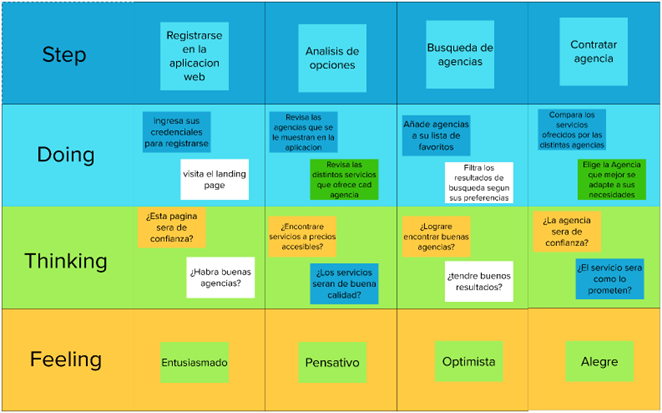
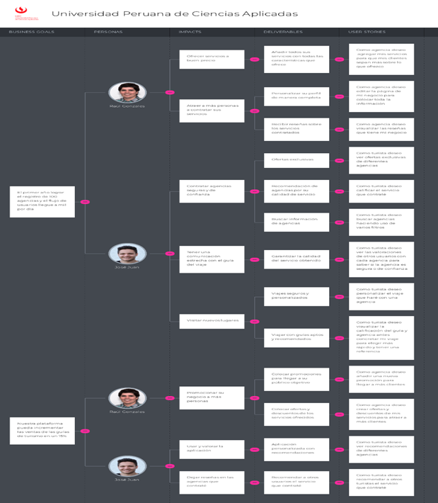

# Capítulo III: Requirements Specification

## 3.1. To-Be Scenario Mapping.
Son mapas que al igual que los As-is Scenario maps describen las acciones, pensamientos y sentimientos de nuestros usuarios, con la diferencia que en esta tenemos los pasos que los usuarios siguen en nuestra aplicación web.

- Agencia de alpinismo:  

- Turista aventurero:  

## 3.2. User Stories.

A continuación, se especificarán los epics y los user stories con el objetivo de expresar las necesidades del usuario en funcionalidades para la aplicación.

- Epics:  

| Epic / Story ID | Título                                                                                      | Descripción                                                                                                                                                                                                                                                                        | Criterios de Aceptación                                                                                                                                                                                                                                                                                                                                                                                                                                                                                                                                                                                                                                                                                                                                                              | Relacionado con (Epic ID) |
|-----------------|---------------------------------------------------------------------------------------------|------------------------------------------------------------------------------------------------------------------------------------------------------------------------------------------------------------------------------------------------------------------------------------|--------------------------------------------------------------------------------------------------------------------------------------------------------------------------------------------------------------------------------------------------------------------------------------------------------------------------------------------------------------------------------------------------------------------------------------------------------------------------------------------------------------------------------------------------------------------------------------------------------------------------------------------------------------------------------------------------------------------------------------------------------------------------------------|---------------------------|
| US001           | Añadir servicio                                                       | Como agencia deseo agregar mis servicios para que mis clientes sepan más sobre lo que ofrezco                                                                                                                 | SCENARIO 1: Agencia desea añadir un nuevo servicio. Dado que la agencia ha validado sus credenciales en la plataforma Cuando la agencia hace clic en el botón para crear un nuevo servicio. SCENARIO 2: Agencia desea programar la creación de un nuevo servicio Dado que la agencia ha validado sus credenciales en la plataforma Y quiere programar la creación de un servicio Cuando presione en agregar servicio E ingrese la información del servicio SCENARIO 3: Agencia desea añadir un nuevo servicio, pero no completa todos los campos del formulario Dado que la agencia se encuentra en el formulario de creación de un nuevo servicio Cuando la agencia no completa todos los campos requeridos Entonces la aplicación web le resalta los campos que aún faltan completar en color rojo y no le permite crear dicho servicio.                                                                                                                                                                                                     | EP001                     |
| US002           | Personalizar viaje                                                     | Como turista deseo personalizar el viaje que haré con una agencia, modificando aspectos del viaje para tener una mejor experiencia                                                                                                             | SCENARIO 1: Turista quiera comprar varios paquetes para disfrutar del servicio en grupo. Dado que se encuentra en el inicio de la plataforma. Cuando seleccione un servicio de interés. Y presione en el botón llamado “personas” Entonces se mostrará una lista de opciones donde podrá seleccionar la cantidad de personas que desean adquirir los paquetes.  SCENARIO 2: Turista quiere proponer una fecha para la realización del servicio adquirido Dado que se encuentra en el inicio de la plataforma Cuando seleccione un servicio de interés Y presión en el botón llamado “fecha de salida” Entonces se abrirá un menú donde podrá indicar la fecha en que quiere realizar su viaje. SCENARIO 3: Turista quiere reservar un viaje, pero no completa algunos campos obligatorios.Dado que se encuentra en el menú de reserva de una agencia Cuando no complete algunos campos obligatorios como número de personas o fecha del viaje Entonces la aplicación web le resalta en rojo dichos campos y no le permite concluir con la reserva                                                                                                                                                                                                                                                                                                          | EP002                     |
| US003           | Visualizar reseña Real                                                  | Como agencia deseo visualizar las reseñas que tiene mi negocio para saber que puedo mejorar o agregar.                                                                                   | SCENARIO 1: Agencia quiere ver las reseñas de sus serviciosDado que la agencia ya ha cumplido con varios servicios Y los turistas han realizado reseñas sobre alguno de sus servicios Cuando la agencia ingrese a su perfil Entonces en la parte final podrá visualizar la reseña que los usuarios han realizado en base a su experiencia.   SCENARIO 2: Agencia no tiene reseña de sus servicios Dado que la agencia aun no cuenta con servicios realizados Cuando ingrese a su perfil Y se encuentre en la sección de reseñas Entonces el sitio le indica que el servicio aun no cuenta con reseñas.                                                                                                                                                                                                                                                | EP003                     |
| US004           | Ver ofertas                                               | Como turista deseo ver ofertas y paquetes recomendados de diferentes agencias para escoger la mejor opción que se acomode a lo que necesito.                                                                                        | SCENARIO 1: Turista quiere ver paquetes en ofertas Dado que el turista quiere emprender un nuevo viaje Y entra a la aplicación web Cuando entre a la página principal de la aplicación web Entonces el sitio le muestra en la primera sección las ofertas disponibles.   SCENARIO 2: Turista quiere ver los paquetes que le recomienda la aplicación web Dado que el turista quiere emprender un nuevo viaje Y entra a la aplicación web Cuando entre a la página principal de la aplicación web Entonces el sitio le muestra secciones donde hallará paquetes en base a su popularidad, cercanía y viajes anteriores.                                                                                                                                                                              | EP003                     |
| US005           | Crear ofertas                                                      | Como agencia deseo crear ofertas y descuentos de mis servicios para atraer a más clientes.                              | SCENARIO 1: Agencia ingresa la información completa para crear la oferta Dado que he validado mis credenciales Y me encuentro en mi perfil Cuando de click en el botón agregar servicio Y complete los datos del servicio Entonces debajo del precio habrá un botón el cual habilitará el formulario para ingresar una oferta.    SCENARIO 2: Agencia no ingresa la información completa para crear la oferta Dado que he valido mis credenciales Y me encuentro en mi perfil Cuando de click en el botón agregar servicio  Y habilite el formulario de oferta y no ingrese la información solicitada Entonces se hará un foco de color rojo en los campos que falte rellenar.                                                                                                                                                                        | EP001                     |
| US006           | Buscar agencias                                                               | Como turista deseo buscar agencias haciendo uso de varios filtros para escoger la mejor agencia según lo que necesito.                                                                                         | SCENARIO 1: Turista desea filtrar su búsqueda por el nombre del servicio Dado que el turista quiere realizar un viaje en alguna agencia Cuando el turista hace clic en “Buscar” Y escriba el nombre del servicio de interés Entonces le aparecerá las distintas agencias que ofrecen estos servicios juntos con sus precios y valoraciones.   SCENARIO 2: Turista desea filtrar su búsqueda por un intervalo de precios Dado que el turista quiere realizar un viaje con alguna agencia Y solo quiera ver las opciones con unos determinados precios Cuando escriba el servicio que quiera, le dé a buscar e ingrese los precios mínimos y máximos Entonces aparecerá los servicios que ofrecen precios en dicho intervalo.  SCENARIO 3: Turista desea filtrar su búsqueda por la valoración del servicio Dado que el turista quiere realizar un viaje con alguna agencia Y solo quiera ver las opciones con determinadas calificaciones por servicio Cuando escriba el servicio que quiera, le dé a buscar e ingrese la valoración deseada  Entonces aparecerá los servicios que estén en el rango de valoración seleccionada por el filtro. SCENARIO 4: Turista desea filtrar su búsqueda por la valoración de la agencia que la ofrece Dado que el turista quiere realizar un viaje con alguna agencia Y solo quiera ver las opciones con determinadas calificaciones por agencia organizadora Cuando escriba el servicio que quiera, le dé a buscar e ingrese la valoración deseada  Entonces aparecerá los servicios que estén en el rango de valoración seleccionada por el filtro.                                                                                                                                                                                                                                           | EP002                     |
| US007           | Ver valoraciones                                                             | Como turista deseo ver las valoraciones de otros usuarios con cada agencia para saber si la agencia es segura o de confianza.                                                                                                  | SCENARIO 1: Ver valoraciones de una agencia que tiene calificaciones Dado que el turista desea ver valoraciones de alguna agencia Y hace click en el sitio de la agencia Entonces en la sección de reseñas podrá visualizar la valoración que tiene dicha agencia. SCENARIO 2: Ver valoraciones de una agencia que aún no tiene calificaciones Dado que el turista desea ver valoraciones de alguna agencia Y hace click en el sitio de la agencia Entonces en la sección de reseñas podrá visualizar las puntuaciones en el nivel más bajo (0.0 estrellas).                                                                                                                                        | EP003                     |
| US008           | Editar página de negocio                                                          | Como agencia deseo editar la página de mi negocio para colocar toda mi información y los medios de contacto.                                                                 | SCENARIO 1: Agencia quiere editar su información e ingresa todos los campos obligatorios Dado que la agencia ha cambiado la información Y quiere dar a conocer a sus clientes sobre estos nuevos cambios Cuando ingrese a la página de su negocio Y le da clic en “Editar información”  Entonces la agencia podrá editar los distintos campos de datos que haya cambiado su negocio. SCENARIO 2:  Agencia quiere editar su información y no ingresa todos los campos obligatorios Dado que la agencia ha dado click a editar información Cuando edite la información deseada Y le haya faltado ingresar algún valor de un campo obligatorio Entonces el sistema le muestra un foco de color rojo en la casilla donde falta ingresar información.                                                                                                                                                                                                  | EP004                    |
| US009           | Cambiar plan de suscripción                                               | Como agencia deseo cambiar mi plan de suscripción para ofrecer más servicios a mis clientes.                                                                    | SCENARIO 1: Agencia desea cambiar de plan de suscripción e ingrese todos los campos Dado que la agencia ha validado sus credenciales Y posea actualmente un plan de suscripción Cuando haga click en cambiar plan E ingrese la información de pago y seleccione el nuevo plan Entonces el sistema mostrara un mensaje de confirmación del cambio del plan. SCENARIO 2: Agencia desea cambiar de plan de suscripción, pero no ingresa todos los campos Dado que la agencia ha validado sus credenciales Y posea actualmente un plan de suscripción Cuando haga click en cambiar plan  Y le falta ingresar o seleccionar algún campo Entonces el sistema le mostrara el error con un color rojo.                                      | EP004                   |
| US010           | Crear promociones                                                            | CComo agencia deseo crear campañas de promoción para llegar a más clientes.                                                                       | SCENARIO 1: Agencia quiere promocionar un servicio nuevo Dado que la agencia quiere llegar a más clientes  Y decida promocionar un servicio nuevo Cuando le da click en la opción de añadir servicio E ingresa la información solicitada y presione en “Continuar” Entonces el sistema le mostrará el formulario para poder promocionar el servicio. SCENARIO 2:  Agencia quiere promocionar un servicio anteriormente creado Dado que la agencia quiere llegar a más clientes Y decida promocionar un servicio que ya ha creado Cuando le da click en editar el servicio de interés Y presione en continuarEntonces podrá visualizar el formulario el cual tendrá que rellenar para promocionar el servicio.                                                                                                                                                                 | EP001                     |
| US011           | Calificar servicio                                                         | Como turista deseo calificar el servicio que contraté para mostrar mi agrado o desagrado y más usuarios sepan sobre el mismo                                                                              | SCENARIO 1: Turista desea calificar un servicio que aún no ha sido calificado por él o ella Dado que el viaje del turista ha finalizado Y quiere calificar el servicio que se le brindó Cuando ingrese a la sección de “Servicios contratados” Y presione en “Calificar servicio” Entonces el turista podrá visualizar el formulario para calificar el servicio contratado.  Escenario 2: Turista desea calificar un servicio que ya ha sido calificado por él o ella Dado que el viaje del turista ha finalizado Y quiere calificar nuevamente el servicio Cuando ingrese a la sección de “Servicios contratados” Entonces el sistema muestra el botón de “Calificar servicio” bloqueado.                                                                                                                                                                                                                                | EP002                    |
| US012           | Monitorear clientes                                                        | Como agencia deseo tener control del estado del servicio ofrecido a mis clientes para indicar cuando un servicio se ha cumplido satisfactoriamente.                                                                                                 | SCENARIO 1: Agencia posee clientes en estado de pendiente. Dado que la agencia se encuentra en su perfil Y accede a la sección de clientes Cuando presione sobre el estado de pendiente de un cliente Y lo cambie por activo Entonces se mostrará que el servicio ha iniciado. SCENARIO 2: Agencia posee clientes en estado de activo. Dado que la agencia se encuentra en su perfil Y accede a la sección de clientes Cuando presione sobre el estado de activo de un cliente Y lo cambie por finalizado Entonces se mostrará que el servicio ha concluido satisfactoriamente. SCENARIO 3: Agencia posee clientes en estado de finalizado. Dado que la agencia se encuentra en su perfil Y accede a la sección de clientes Cuando presione sobre el estado de finalizado de un cliente Entonces la aplicación no permitirá realizar el cambio de estado.                                                                                                                                                                              | EP004                     |
| US013           | Ver servicio                                                           | Como turista deseo acceder a los detalles de un servicio ofrecido por una agencia para decidir si adquirirlo o no                                                                                             | SCENARIO 1: Turista cuenta con conexión estable de internet Dado que el turista se encuentra sobre el anuncio de un servicio Cuando presione sobre este Entonces el sistema le mostrará los detalles del servicio incluyendo fotos referenciales y descripción del servicio. SCENARIO 2:  Turista no cuenta con conexión a internet Dado que el turista se encuentra sobre el anuncio de un servicio Cuando presione sobre la agencia que lo distribuye Entonces el sistema mostrará una pantalla de error al establecer conexión de internet.                                                                                                                                                                   | EP003                     |
| US014           | Ver portada                                              | Como usuario deseo visualizar una portada en landing page para poder captar mi atención y sea atractiva al momento de leer el contenido                                                           | SCENARIO 1: Usuario vista la landing page Dado que el usuario entra a la landing page Cuando cargue la landing page Entonces la página mostrará una portada que capte la atención del usuario                                                                                                                                                                               | EP005                    |
| US015           | Información de la aplicación                                          | Como usuario deseo ver información acerca de la aplicación para poder saber las funcionalidades que ofrece la aplicación                                         | SCENARIO 1: Escenario 1: Usuario lee información acerca de la aplicación Dado que el usuario entra a la sección “About Go2Climb” Cuando llegue a la sección de “About Go2Climb” Entonces la página mostrará información acerca de la aplicación                                                                                                                                                                                                                                                                        | EP005                    |
| US016           | Motivos por el cual unirnos                                                 | Como usuario deseo ver motivos por el cual unirnos a la aplicación para poder saber los beneficios que ofrece la aplicación                           | SCENARIO 1: Escenario 1: Usuario lee los beneficios acerca de la aplicación Dado que el usuario entra a la sección “Why you should join” Cuando llegue a la sección de “Why you should join”Entonces la página mostrará los beneficios de la aplicación                                                                                                                                                                    | EP005                     |
| US017           | Redirección a la aplicación                                                | Como usuario deseo que haya un call-to-action para poder entrar a la aplicación                                                                                                | SCENARIO 1: Usuario entra a la aplicación mediante un call-to-action Dado que el usuario entra a la sección “What are you waiting for?” Cuando llegue a la sección de “What are you waiting for?” Entonces la página mostrará un call-to-action que redireccionará aplicación                                                                                                                                                                                        | EP005                     |
| US018           | Footer de la landing page                                             | Como usuario deseo que haya un footer para poder ver las redes sociales y los contactos de la aplicación                                                                                | SCENARIO 1:  Usuario entra al footer de la landing page Dado que el usuario llega al final de la página Cuando llegue al footer de la página Entonces la página mostrará una información de contacto y de redes sociales                                                                                                                                                         | EP005                     |
| US019           | About the product                                            | Como usuario deseo que haya un video acerca de la aplicación para poder ver las funcionalidades que tiene de una manera más visual.                                                                                                    | SCENARIO 1:  Usuario mira la aplicación en un video Dado que el usuario entra a la sección “About the product” Cuando llegue a la sección  de “About the product” Entonces la página mostrará un video acerca de las funcionalidades de la aplicación                                                                                                                                                                                                                                                                                   | EP005                     |
| US020           | Responsive design                                   | Como usuario deseo que la aplicación sea responsiva para poder visualizar la landing page desde cualquier dispositivo.                                                                                    | SCENARIO 1: Usuario entra a la landing page desde cualquier dispositivo Dado que el usuario entra a la landing page Cuando cargue la landing page Entonces la página adecuará el contenido a la pantalla del dispositivo.                                                                                                                        | EP005                    |
| US021           | Acceso al aplicativo (Interoperabilidad y Portabilidad)                                                   | Como usuario de “Go2Climb” Quiero poder utilizar la aplicación desde diferentes navegadores Para poder buscar agencias y servicios de alpinismo sin estar limitado a un navegador.                                                                                                 | SCENARIO 1: Usuario entra a la aplicación mediante un call-to-action Dado que el usuario entra a la sección “What are you waiting for?” Cuando llegue a la sección de “What are you waiting for?” Entonces la página mostrará un call-to-action que redireccionará aplicación                                                                                                                                                                                                                              | EP001                     |
| US022           | Velocidad de carga (Atributo de calidad: rendimiento )                                                   | Como usuario de la plataforma Quiero que la velocidad de carga de la aplicación sea rápida y eficiente, Para poder acceder rápidamente a la información de las agencias y servicios  sin demoras.                                                                                                   | SCENARIO 1: Velocidad de carga en diferentes momentos del día. Dado que soy un usuario de "Go2Climb", Cuando navegue por la plataforma en diferentes momentos del día, Entonces la velocidad de carga se mantendrá constante y será de menos de 3 segundos. SCENARIO 2: Velocidad eficiente ante las  actualizaciones del aplicativo. Dado que soy un usuario de "Go2Climb", Cuando la plataforma presente actualizaciones. Entonces el tiempo de carga no se incrementará.                                                                                                                                                                               | EP006                     |
| US023           | Interfaz interactiva y deductiva (Atributo de calidad: Usabilidad)                                                                            | Como usuario Quiero poder buscar y reservar vuelos y hoteles de manera rápida y sencilla Para que pueda planificar mis viajes sin problemas                                                                               | SCENARIO 1: Un usuario quiere buscar un vuelo de ida y vuelta desde Lima a Nueva York.Dado que estoy en la página de inicio Cuando busco un vuelo de ida y vuelta desde Lima a Nueva York Entonces puedo encontrar y reservar un vuelo de ida y vuelta desde Lima a Nueva York en menos de 5 minutos SCENARIO 2: Un usuario quiere reservar una habitación de hotel en Cancún para dos personas. Dado que estoy en la página de inicio Cuando busco una habitación de hotel en Cancún para dos personas  Entonces puedo encontrar y reservar una habitación de hotel en Cancún para dos personas en menos de 5 minutos                                                                                                                                                                          | EP003                   |
| US024           | Protección de data (Atributo de calidad: Seguridad)                                                           | Como usuario Quiero que mi información personal y financiera esté protegida contra el acceso no autorizado o el robo Para que pueda reservar vuelos y hoteles con confianza                                                                                      | SCENARIO 1: Un usuario quiere reservar un vuelo internacional con su tarjeta de crédito. Dado que quiero reservar un vuelo internacional con mi tarjeta de crédito Cuando ingreso mi información personal y financiera en la aplicación Entonces la aplicación debe cumplir con los estándares de seguridad relevantes, como SSL / TLS, para proteger mi información personal y financiera SCENARIO 2: Un usuario quiere ver su historial de reservas anteriores. Dado que quiero ver mi historial de reservas anteriores Cuando accedo a mi historial de reservas anteriores Entonces puedo ver mi historial de reservas anteriores sin comprometer la seguridad o privacidad de mi información personal.                                                                                                                                                                              | EP006                     |
| US025           | Actualización sencilla (Atributo de calidad: Mantenibilidad)                                                    | Como desarrollador Quiero poder mantener y actualizar la aplicación fácilmente a lo largo del tiempo Para que pueda seguir siendo útil y relevante a medida que cambian las necesidades del negocio                                                                                                                       | SCENARIO 1: Un desarrollador necesita agregar una nueva función a la aplicación. Dado que necesito agregar una nueva función a la aplicación Cuando agrego la nueva función a la aplicación Entonces la nueva función debe agregarse sin afectar la funcionalidad o el rendimiento existentes SCENARIO 2: Un desarrollador necesita actualizar la base de datos subyacente utilizada por la aplicación. Dado que necesito actualizar la base de datos subyacente utilizada por la aplicación Cuando actualizo la base de datos subyacente utilizada por la aplicaciónEntonces puedo actualizarla sin afectar la estabilidad o seguridad existentes.                                                                                         | EP006                     |
| US026           | Comentarios para las actividades                                                       | Como turista de la plataforma, quiero poder compartir mis comentarios y opiniones sobre las actividades proporcionadas por las empresas, para que otros usuarios puedan tomar decisiones informadas sobre su participación en esas actividades.                                                                                                   | SCENARIO 1:Publicar un Comentario en una Actividad Dado que soy un usuario autenticado en la plataforma. Cuando accedo a la página de detalles de una actividad en la plataforma. Entonces debería ver un formulario de comentarios que incluye campos para ingresar un título, un cuerpo descriptivo y una calificación de la actividad. Escenario 2: Ver Comentarios en una Actividad Dado que soy un usuario que está explorando la plataforma. Cuando accedo a la página de detalles de una actividad. Entonces debería ver una lista de comentarios sobre la actividad. Escenario 3: Editar un Comentario Propio Dado que soy un usuario autenticado y he publicado un comentario en una actividad. Cuando accedo a la página de detalles de la actividad y veo mi propio comentario. Entonces debería tener la opción de editar mi comentario.                                                                                                      | EP003                     |
| US027           | Monitorear datos del turista                                                    | Como agencia, quiero saber la situación  en la que se encuentran mis clientes para darles un mejor servicio                                                                                                          | SCENARIO 1: Visualiza datos de actividad en tiempo real Dado que el turista está autenticado en la plataforma, cuando accede a la página de su perfil o área de monitoreo en la aplicación durante una actividad, entonces visualiza los datos de actividad (pasos, latidos del corazón, temperatura y ubicación) en tiempo real de manera clara y comprensible.                                                                                                       | EP002                     |
| US028           | Ver datos de turistas por agencia                                                      | Como agencia quiero visualizar los datos importantes de mis clientes para poder empatizar mejor con ellos                                                                                                   | SCENARIO 1: Acceso a datos de actividad de los turistas
Dado que la agencia de turismo está autenticada en la plataforma, cuando un turista ha contratado uno de sus servicios, entonces accede a los datos de actividad del turista (pasos, latidos del corazón, temperatura, ubicación) durante el periodo del servicio.                                                                                            | EP002                     |

- Requisitos no funcionales

    

## 3.3. Impact Mapping.

El impact map nos permite analizar los business goal para ciertos User Stories en específico y así formar un Product backlog. De esta manera, vemos cómo podemos solucionar las necesidades de cada usuario con nuestra aplicación.

    

## 3.4. Product Backlog.

### SEGMENTO OBJETIVO – Dueños de Mascotas

| #Orden | Código | Título                                           | Descripción                                                                                                                                                                                  | Story Point (1/2/3/5/8) |
| ------ | ------ | ------------------------------------------------ | -------------------------------------------------------------------------------------------------------------------------------------------------------------------------------------------- | ----------------------- |
| 1      | US-14  | Ver portada                      | Como usuario deseo visualizar una portada en landing page para poder captar mi atención y no me aburra al momento de leer el contenido                           | 3                       |
| 2      | US-15  | Información de la aplicación               | Como usuario deseo ver información acerca de la aplicación para poder saber las funcionalidades que ofrece la aplicación                              | 3                       |
| 3      | US-16  | Motivos por el cual unirnos              | Como usuario deseo ver motivos por el cual unirnos a la aplicación para poder saber los beneficios que ofrece la aplicación                                  | 3                       |
| 4      | US-17  | Redirección a la aplicación                    | Como usuario deseo que haya un call-to-action para poder entrar a la aplicación                                                                   | 3                       |
| 5      | US-18  | Footer de la landing page                 | Como usuario deseo que haya un footer para poder ver las redes sociales y los contactos de la aplicación                                                                           | 3                       |
| 6      | US-19  | About the product                  | Como usuario deseo que haya un video acerca de la aplicación para poder ver las funcionalidades que tiene de una manera más visual.                                                     | 3                       |                       |
| 7      | US-20  | Responsive design               | Como usuario deseo que la aplicación sea responsiva para poder visualizar la landing page desde cualquier dispositivo                                                         | 3                       |
| 8      | US-01  | Añadir servicio | Como agencia deseo agregar mis servicios para que mis clientes sepan más sobre lo que ofrezco.                         | 8                       |
| 9     | US-05  | Crear ofertas                   | Como turista deseo ver ofertas y paquetes recomendados de diferentes agencias para escoger la mejor opción que se acomode a lo que necesito.                                                      | 8                       |
| 10     | US-11  | Monitorear clientes               | Como agencia deseo tener control del estado del servicio ofrecido a mis clientes para indicar cuando un servicio se ha cumplido satisfactoriamente.                                                         | 8                       |
| 11     | US-13  | Ver servicio       | Como turista deseo acceder a los detalles de un servicio ofrecido por una agencia para decidir si adquirirlo o no.                                                  | 5                       |
| 12     | US-06  | Buscar agencias            | Como dueño de una mascota, quiero establecer objetivos de salud para mi mascota, basados en la actividad, el peso y la frecuencia cardíaca, para mejorar y mantener su bienestar.            | 3                       |
| 13     | US-02  | Personalizar viaje            | Como turista deseo personalizar el viaje que haré con una agencia, modificando aspectos del viaje para tener una mejor experiencia.                                                              | 8                       |
| 14     | US-03  | Visualizar reseña                  | Como agencia deseo visualizar las reseñas que tiene mi negocio para saber que puedo mejorar o agregar.                                        | 5                       |
| 15     | US-07  | Ver valoraciones                | Como turista deseo ver las valoraciones de otros usuarios con cada agencia para saber si la agencia es segura o de confianza.| 5                       |
| 16     | US-08  | Editar página de negocio                         | Como agencia deseo editar la página de mi negocio para colocar toda mi información y los medios de contacto.                                     | 3                       |
| 17     | US-05  | Crear ofertas               | Como agencia deseo crear ofertas y descuentos de mis servicios para atraer a más clientes.                                                                        | 3                       |
| 18     | US-11  | Calificar servicio     | Como turista deseo calificar el servicio que contraté para mostrar mi agrado o desagrado y más usuarios sepan sobre el mismo.                                           | 3                       |
| 19     | US-09  | Cambiar plan de suscripción            | Como agencia deseo cambiar mi plan de suscripción para ofrecer más servicios a mis clientes.                                                                            | 8                       |
| 20     | US-10  | Crear promociones             | Como agencia deseo crear campañas de promoción para llegar a más clientes.                                                                          | 5                       |
| 21     | US-21  | Acceso al aplicativo             | Como usuario de “Go2Climb” Quiero poder utilizar la aplicación desde diferentes navegadores
Para poder buscar agencias y servicios de alpinismo sin estar limitado a un navegador.                                                                           | 3                       |
| 22     | US-22  | Interfaz interactiva y deductiva            | Como usuario de la plataforma Quiero que la velocidad de carga de la aplicación sea rápida y eficiente, Para poder acceder rápidamente a la información de las agencias y servicios  sin demoras.                                                                         | 3                      |
| 23     | US-23  | Visualización del Historial de Salud             | Como usuario Quiero poder buscar y reservar vuelos y hoteles de manera rápida y sencilla Para que pueda planificar mis viajes sin problemas                                                                            | 3                       |
| 24     | US-24  | Protección de data             | Como usuario Quiero que mi información personal y financiera esté protegida contra el acceso no autorizado o el robo Para que pueda reservar vuelos y hoteles con confianza                                                                            | 5                       |
| 25     | US-25  | Comentarios para las actividades            | Como turista de la plataforma, quiero poder compartir mis comentarios y opiniones sobre las actividades proporcionadas por las empresas, para que otros usuarios puedan tomar decisiones informadas sobre su participación en esas actividades.                                                                            | 5                       |
| 26     | US-26  | Monitorear datos del turista             | Como turista deseo revisar mis datos de actividad (pasos, latidos del corazón, temperatura y ubicación) obtenidos a través de mis botas o reloj durante mi experiencia de alpinismo para poder monitorear mi estado físico y condiciones durante la actividad.                                                                            | 8                       |
| 27     | US-27  | Ver datos de turistas por agencia             | Como agencia de turismo deseo poder acceder a los datos de actividad de los turistas que han utilizado mis servicios, para poder monitorear su progreso y ofrecer recomendaciones de seguridad                                                                           | 8                       |
