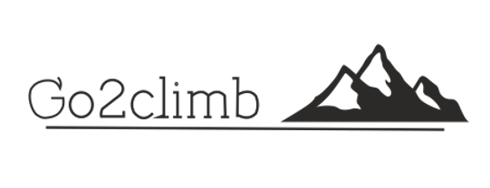
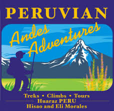
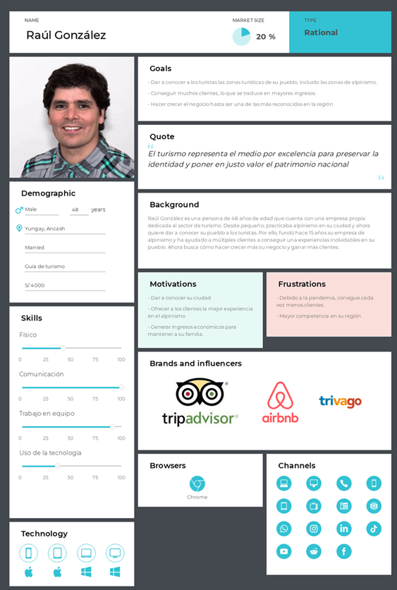
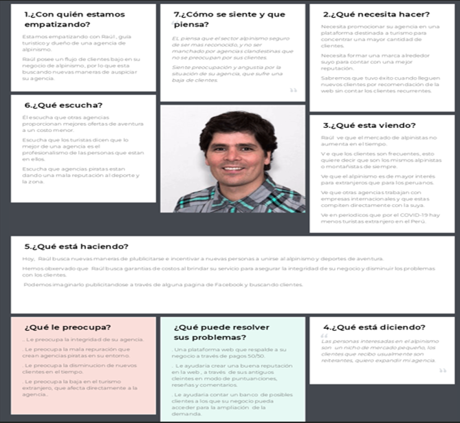
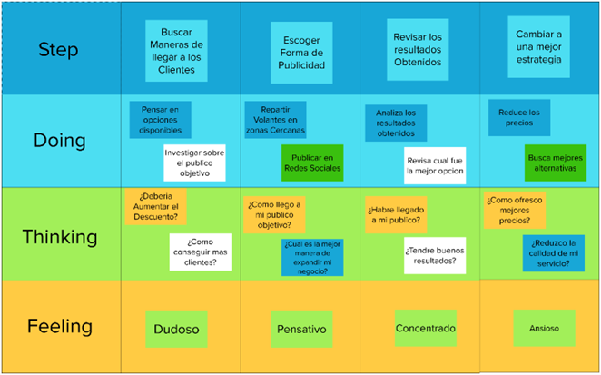

# Capítulo II: Requirements Elicitation & Analysis

## 2.1. Competidores.
Se ha identificado tres principales competidores directos, los cuáles son los siguientes:
**Casa de Guías**
Son organizadores de eventos de alpinismo que ofrecen clases de alpinismo y cursos en general relacionados al alpinismo. Además, organizan escaladas de montañas y tracking para personas mayores de edad.
**Peruvian Andes Aventureros**
Son organizadores de eventos de alpinismo que ofrecen tours de montañismo, fogatas y turismo en los Andes peruanos con experimentados guías profesionales locales y certificados por la UIAGM a turistas de todas partes del mundo a un precio económico
**Tripadvisor**
Una aplicación web en donde se muestran opiniones del usuario de diferentes actividades y lugares turísticos de todo el mundo. En base a estas opiniones, cuando los turistas vayan a visitar cierto lugar, estarán mayor informados sobre la calidad y precio de los lugares donde vayan a visitar.

### 2.1.1. Análisis competitivo.
A continuación, se realiza un análisis competitivo de los tres competidores seleccionados y nuestra aplicación en un cuadro comparativo para diferenciar las oportunidades y debilidades de cada uno de ellos.
<!-- Sección de Encabezado y Preguntas Clave -->
<table>
  <tr>
    <th colspan="2">Competitive Analysis Landscape</th>
  </tr>
  <tr>
    <td rowspan="2">¿Por qué llevar a cabo este análisis?</td>
  </tr>
  <tr>
    <td>Este análisis se está llevando a cabo para especificar la diferencia entre nosotros y los principales competidores encontrados.</td>
  </tr>
</table>

<!-- Espacio entre tablas para simular la división como en las imágenes -->
 

<!-- Sección de Análisis Competitivo -->
<table>
  <tr>
    <th colspan="2"></th>
    <th>
      

        
      

      

        Go2Climb
      

    </th>
    <th>
      

        
      

      

        Casa de Guías
      

    </th>
    <th>
      

        
      

      

        Peruvian Andes Aventureros
      

    </th>
    <th>
      

        
      

      

        Tripadvisor
      

    </th>
  </tr>
  <tr>
    <td rowspan="2"><strong>Perfil</strong></td>
    <td>Overview</td>
    <td>App web para búsqueda y contratación de servicios de alpinismo.</td>
    <td>Organizadores de eventos de alpinismo</td>
    <td>Organizadores de eventos de alpinismo</td>
    <td>App web que brinda recomendaciones de actividades y lugares</td>
  </tr>
  <tr>
    <td>Ventaja competitiva ¿Qué valor ofrece a los clientes?</td>
    <td>Además de poder facilitar la contratacion de servicios, ofrece un sistema de monitoreo en tiempo real</td>
    <td>Clases de alpinismo y cursos en general relacionados al alpinismo. Además, organizan escaladas de montañas y tracking.</td>
    <td>Ofrecen tours de montañismo, fogatas y turismo</td>
    <td>Amplia variedad de recomendaciones de todos los lugares y actividades del mundo</td>
  </tr>
  <tr>
    <td rowspan="2"><strong>Perfil Marketing</strong></td>
    <td>Mercado Objetivo</td>
    <td>Personas relacionadas al alpinismo y montañismo entre 18 a 40 años</td>
    <td>Mayores de edad que realizan alpinismo</td>
    <td>Mayores de edad que realizan alpinismo</td>
    <td>Mayores de edad que deseen viajar</td>
  </tr>
  <tr>
    <td>Estrategias de marketing</td>
    <td>App web con interfaz amigable, con interfaz fácil e intuitiva, seguridad al seleccionar agencias de alpinismo y convenios con influencers conocidos</td>
    <td>Ofertas para personas que se inscriban con anticipación a sus clases</td>
    <td>Paquete de ofertas si ingresan en grupos</td>
    <td>Página #1 de recomendaciones de eventos y lugares turísticos</td>
  </tr>
  <tr>
    <td rowspan="3"><strong>Perfil de Producto</strong></td>
    <td>Productos & Servicios</td>
    <td>Intermediarios entre alpinistas y empresas/agencias de alpinismo</td>
    <td>Ofrecen cursos de alpinismo e idiomas</td>
    <td>Turismo y tour</td>
    <td>Información de tours</td>
  </tr>
  <tr>
    <td>Precios & Costos</td>
    <td>Las membresías tienen costos desde 25 soles mensuales y el costo del par de botas inteligentes es 150 dólares para las agencias y para los turistas es gratis</td>
    <td>640 soles</td>
    <td>600 soles</td>
    <td>Gratis</td>
  </tr>
  <tr>
    <td>El canal de distribución será web</td>
    <td>Web</td>
    <td>Web</td>
    <td>Web y Móvil</td>
    <td>Web y Móvil</td>
  </tr>
  <tr>
    <td rowspan="5"><strong>Análisis SWOT</strong></td>
    <td colspan="5">Realice esto para su startup y sus competidores. Sus fortalezas deberían apoyar sus oportunidades y contribuir a lo que ustedes definen como su posible ventaja competitiva.</td>
  </tr>
  <tr>
    <td>Fortalezas</td>
    <td>App web con interfaz amigable y siempre actualizada.</td>
    <td>Ofrecen tanto eventos de montañismo y alpinismo como cursos </td>
    <td>Variedad de actividades</td>
    <td>Amplia información de los lugares y actividades turísticos</td>
  </tr>
  <tr>
    <td>Debilidades</td>
    <td>Ser una empresa emergente con una lista de socios (empresas de alpinismo) escasa</td>
    <td>Precios altos</td>
    <td>Interfaz web poco intuitiva, no tan llamativa</td>
    <td>Posibilidad de tener opiniones falsas o manejadas.</td>
  </tr>
  <tr>
    <td>Oportunidades</td>
    <td>Poder incentivar a jóvenes por la interfaz moderna</td>
    <td>Al enseñar pueden obtener clientes potenciales para sus propios eventos de alpinismo</td>
    <td>Seguridad, dado que tienen pruebas fotográficas de cada tour </td>
    <td>Permite obtener dinero al promocionar eventos turísticos</td>
  </tr>
  <tr>
    <td>Amenazas</td>
    <td>No somos organizadores de estos eventos para alpinismo</td>
    <td>Responsables si sus alumnos sufren accidentes</td>
    <td>Desarrollo deficiente en su App web</td>
    <td>Posible cierre del turismo de un país</td>
  </tr>
</table>

### 2.1.2. Estrategias y tácticas frente a competidores.
En base al análisis competitivo de nuestros competidores que elaboramos previamente, hemos identificado las fortalezas, debilidades, oportunidades y amenazas de nuestros competidores. Donde aplicaremos estrategias y tácticas para afrontarlo.

**Liderazgo en costes**
Las agencias de alpinismo podrán promocionar sus tours a un bajo costo. Además, los turistas de aventura podrán contratar los tours a precios especiales si lo realizan desde nuestra plataforma. 
**Estrategia de diferenciación**
Nuestra aplicación ofrece la innovativa idea de ofrecer a los turistas de aventuras una serie de tours organizadas por las agencias de alpinismo. Del mismo modo, las agencias de alpinismo podrán tener otra vía en donde se puedan promocionar. Este modelo de negocio nos permite diferenciarnos de la competencia debido a que no nos centramos en un solo segmento objetivo, sino que, al juntar los turistas con las agencias, nos permitirá contar con un mejor posicionamiento del mercado. 
**Estrategia de enfoque**
Actualmente las personas utilizan mucho la tecnología para poder obtener información sobre algo que desean. Por ello, hemos decidido crear una aplicación para que en una sola página, puedan obtener todos los tours que se ofrecen y ellos sin mayor esfuerzo puedan decidir que tour obtener.incluir **Táctica de expansión**.
Si la aplicación logra tener mucho éxito, se planea no solo ofrecer tours de alpinismo, sino cualquier variedad de tours como city tour, eventos, entre otros. De esta manera, ampliamos nuestro segmento objetivo lo que conlleva a más clientes y un mejor posicionamiento en el mercado.

## 2.2. Entrevistas.
En esta sección se va a realizar las entrevistas a representantes de cada segmento objetivo para conocer el mercado que se está abordando. Para ello, se va a realizar el diseño de las entrevistas y luego un análisis de las respuestas de los entrevistados.
### 2.2.1. Diseño de entrevistas.
#### Preguntas principales y complementarias para entrevistas
Como parte del análisis needfinding del proyecto, un paso importante que hay que seguir es la realización de entrevistas a los segmentos objetivos para la captación de necesidades y oportunidad de enfatizar con ellos en busca de la creación de la mejor solución software.
A continuación, se presenta la línea de secuencias y la lista de preguntas a realizar a nuestros usuarios.
##### Segmento de agencias de alpinismo
**Bienvenida** 

Hola buenas (días/tardes/noches), estoy trabajando en una idea de negocio que pretende ayudar a mejorar la experiencia de alpinismo en un ambiente mucho más social y conociendo personas qué también disfruten este deporte. Tenemos una serie de teorías respecto a los problemas que se enfrentan los turistas de aventura al momento de buscar empresas de alpinismo confiables y quisiera contrastarlas contigo para ver si estamos en lo cierto o no. Si te parece comenzaré con algunas preguntas a continuación y al finalizar te cuento de qué va el proyecto.

**Datos demográgicos** 

¿Podrías contarnos un poco más de ti? (Un poco de tu historia, quien eres, tu edad, dónde vives, estudios, si es que trabajas actualmente, responsabilidades cotidianas, hobbies, etc.)
La Personas debe responder lo siguiente, de lo contrario preguntar sobre estos tópicos:
- Nombre
- Edad
- Distrito de residencia
- Estado civil
- Familia
- Ocupación
- Hobbies
Ahora a manera dinámica, mencionaré algunas frases y responde como mejor creas conveniente (esta parte realizar como un tipo de ping pong de preguntas y respuestas):
- Programas de televisión de la infancia
- Carro particular o transporte público
- Android o Apple
- Windows, Linux o Mac
- Aprendizaje guiado o autodidacta
- Ver una película o leer un libro
- Redes sociales más utilizadas
- Menciona 2 otras Apps (diferente a redes sociales, pueden ser juegos de celular también) que utilices frecuentemente
- Plan telefónico prepago o postpago
- Banco preferido

**Principales problemas**
- ¿Cuánta experiencia tienes como guía en alpinismo?
- ¿Has utilizado servicios de publicidad para incrementar el flujo de clientes? ¿Qué servicios has utilizado? ¿Cuán efectivos han sido?
- ¿Qué medios utilizas para comunicarte con tus clientes? ¿Cuál es tu favorito?
- ¿Has tenido alguna mala experiencia con tus clientes cuando contratan tus - servicios? ¿Cómo fue?
- ¿Cómo gestionas los pagos de tus servicios con tus clientes?
- ¿Qué crees que buscan los turistas cuando buscan contratar algún servicio de alpinismo?
- ¿Cuántas personas en promedio anual usan tu servicio? 
- ¿Consideras que hay una comunidad grande de personas que realizan montañismo o alpinismo? (la respuesta será no así que.) ¿Cómo crees que se podría cambiar eso?
- ¿Qué crees que es lo que el cliente valora más del servicio?
- ¿Crees que publicándolos en una plataforma enfocada en montañismo aumentaría o disminuiría el alcance que tienes actualmente? ¿Por qué?

**Breve Pitch**
Estamos desarrollando una plataforma web enfocada en ofrecer servicios de alpinismo. Las empresas podrán publicitarse en la plataforma, junto con los precios, rutas, itinerarios, horarios y experiencias. Asimismo, los turistas podrán seleccionar la empresa de su preferencia, reaccionar a las experiencias y calificar a la empresa. 

**Compromiso**

¿Qué te ha parecido? ¿Tienes alguna recomendación para nosotros?
Gracias por habernos concedido esta entrevista, tus respuestas son valiosas para nosotros
Como último punto, nos gustaría pedirte una reunión otra vez de aquí a unas cuantas semanas, donde te podremos mostrarte cómo va el desarrollo de nuestra idea, donde podremos mostrarte el prototipo de nuestra aplicación y obtener retroalimentación de ti una vez más.

##### Segmento de turistas de aventura
**Bienvenida**

Hola buenas (días/tardes/noches), estoy trabajando en una idea de negocio que pretende ayudar a mejorar la experiencia de alpinismo en un ambiente mucho más social y conociendo personas qué también disfruten este deporte. Tenemos una serie de teorías respecto a los problemas que se enfrentan los turistas de aventura al momento de buscar empresas de alpinismo confiables y quisiera contrastarlas contigo para ver si estamos en lo cierto o no. Si te parece comenzaré con algunas preguntas a continuación y al finalizar te cuento de qué va el proyecto.
**Datos demográgicos**
¿Podrías contarnos un poco más de ti? (Un poco de tu historia, quien eres, tu edad, dónde vives, estudios, si es que trabajas actualmente, responsabilidades cotidianas, hobbies, etc.)
La Personas debe responder lo siguiente, de lo contrario preguntar sobre estos tópicos:
- Nombre
- Edad
- Distrito de residencia
- Estado civil
- Ocupación
- Hobbies
Ahora a manera dinámica, mencionaré algunas frases y responde como mejor creas conveniente (esta parte realizar como un tipo de ping pong de preguntas y respuestas):
- Programas de televisión de la infancia
- Programas de televisión de la actualidad
- Carro particular o transporte público
- Android o Apple
- Windows, Linux o Mac
- Aprendizaje guiado o autodidacta
- Ver una película o leer un libro
- Redes sociales más utilizadas
- Menciona 2 otras Apps (diferente a redes sociales, pueden ser juegos de celular también) que utilices frecuentemente
- Plan telefónico prepago o postpago
- Banco preferido

**Principales problemas**

- ¿A qué se dedica? ¿Qué proyectos está desarrollando actualmente? (Tal vez ya mencionó algo de esto antes, pero hay que tratar de que cuente más sobre lo que hace)
- ¿Cuentas con experiencia previa en el montañismo?
- ¿Fuiste por tu cuenta o contrataste un servicio de guía de montaña?
- Si contrataste un servicio, ¿Qué medio utilizaste para hacerlo?
- ¿Qué criterios tienes en cuenta antes de contratar un guía?
- ¿Qué garantía tenías de que el servicio era confiable?
- ¿Alguna vez tuviste una mala experiencia con un servicio? ¿Cómo fue?
- ¿Qué es lo que más valoras en tu experiencia?
- ¿Cómo sería un servicio ideal de alpinismo?
- ¿Qué información acerca de la empresa de alpinismo es relevante para ti?

**Breve Pitch**

Estamos desarrollando una plataforma web enfocada en ofrecer servicios de alpinismo. Las empresas podrán publicitarse en la plataforma, junto con los precios, rutas, itinerarios, horarios y experiencias. Asimismo, los turistas podrán seleccionar la empresa de su preferencia, reaccionar a las experiencias y calificar a la empresa. 

### 2.2.2. Registro de entrevistas.
A continuación, se registra las entrevistas realizadas, así como los resúmenes de las mismas por cada segmento objetivo:

**Agencias de alpinismo**
1. Entrevista 1
_Nombres y Apellidos:_ Miguel Fernandez 
_Edad:_ 29 años  
_Distrito:_ Lima   
_Evidencia de la reunión:_  
 
 [URL del video ](https://upcedupe-my.sharepoint.com/:v:/g/personal/u20191d928_upc_edu_pe/ER7GV75NnPJLvkwslZks9QsBR6O4RCoUHN4zGCrllrkXuQ?e=VYQ94o&nav=eyJwbGF5YmFja09wdGlvbnMiOnsic3RhcnRUaW1lSW5TZWNvbmRzIjoxLjY3fX0%3D ) 
 _Timing y duración:_ 3:34  
_Resumen sobre la entrevista:_
Miguel tiene 5 años trabajando como guía de alpinismo y ha utilizado la publicidad para aumentar sus clientes. Además, usa Instagram, Twitter y WhatsApp para contactar a sus clientes. Utiliza más Instagram porque utiliza el chat y publicidad a la vez. Los pagos que se realiza son bancarios. Los turistas van a aprobar nuevas experiencias y les gusta mirar la naturaleza. Anualmente, van 1700 turistas aproximadamente. Los turistas valoran como los tratan los guías y las actividades que realizan. Por último, una página web donde puedan publicar sus actividades y tour les ayudarían a conseguir más clientes.

2. Entrevista 2
_Nombres y Apellidos:_ Anthony Poma 
_Edad:_ 23 años  
_Distrito:_ Ancash   
_Evidencia de la reunión:_  
 
 [URL del video ](https://upcedupe-my.sharepoint.com/:v:/g/personal/u201910669_upc_edu_pe/ETIxF3tx1hFKoOYkBE2Edq8BeGeSIA2Ogyxy_OtkHI6_pA?e=LH0xhf) 
 _Timing y duración:_ 08:48 
_Resumen sobre la entrevista:_
El entrevistado llamado Anthony, nos indica que realizó alpinismo más de una vez en el nevado Huaytapallana, siempre hubo los personajes llamados “jaladores” para adquirir clientes, lo cual le resulta molesto al momento de ir en cada oportunidad y tomar el servicio. “Las agencias no se interesan en el bienestar del cliente”, menciona él, “solo buscan dar el más mínimo precio sin importar la buena estadía o importancia del aventurero”, “tratan de bajar al más mínimo precio con tal de llamar la atención del cliente y los elijan en lugar de las demás agencias competidoras”. Todas las frases dichas por él, reflejan la importancia del precio del servicio, la atención, el valor agregado que debería de haber, el desconocimiento que los turistas podrían tener al momento de buscar agencias, y la buena experiencia que el aventurero cliente debería de sentir al visitar un lugar turístico de alpinismo y alta montaña. “Todos los turistas nacionales e internacionales deberían de tener un buen centro de reunión de todos los servicios de las agencias aventureras de alpinismo y alta montaña en cada parte del Perú”, fin de la entrevista.

**Segmento: Turistas de aventura**

1. Entrevista 1
_Nombres y Apellidos:_ Sebastián Andre Ramírez Mendez 
_Edad:_ 21 años  
_Distrito:_ La Victoria   
_Evidencia de la reunión:_  
 
 [URL del video ](https://drive.google.com/file/d/1EjnNiZVlBCHAXOTVOutou847M-yQrY5Z/view?usp=sharing)   
 _Timing y duración:_ 6:26 
_Resumen sobre la entrevista:_
Sebastián es un estudiante universitario que tiene como hobby montar bicicleta. Ha realizado circuitos en el morro solar en bicicleta, al principio, contrató un servicio para conocer el lugar, por Facebook, conoció el servicio. Considera que un servicio es de confianza cuando se ha publicitado, que tenga bastante actividad y cuente con referencias. No ha tenido malas experiencias con el servicio, aunque ha escuchado de algunas referencias malas. Considera que un buen servicio de alpinismo desde un principio debe evaluar las capacidades físicas de cada uno como para tomar el servicio, recibir pautas sobre qué hacer, tener un kit médico para emergencias en el camino.

2. Entrevista 2
_Nombres y Apellidos:_ Nilda Sharol Flores Ramirez
_Edad:_ 23 años  
_Distrito:_ Breña   
_Evidencia de la reunión:_  
 
 [URL del video ](https://drive.google.com/file/d/1genVCJ0k061ZB1JBHSYZwbMMnX0Iq5Dl/view?usp=share_link)   
 _Timing y duración:_ 04:24  
_Resumen sobre la entrevista:_  
Nilda Sharol es un estudiante de Química Farmacéutica y egresado de la carrera técnica en farmacia, actualmente estudia y trabaja en su especialidad. Su principal pasatiempo es realizar actividades deportivas y realizar viajes a lugares turísticos en sus vacaciones. Usualmente Nilda usa las redes sociales con frecuencia para realizar sus actividades diarias. Ella nos cuenta que tiene experiencia en montañismo y contrató una empresa de servicio de guía de montañismo mediante las redes sociales y página web. Los criterios relevantes que considera para contratar a un guía con experiencia en la materia y recomendación de los usuarios que ya contrataron. Nunca tuvo una mala experiencia por el momento porque Nilda es muy cuidadosa antes de contratar a un guía de montañismo y el lugar a elegir. Ella valora de forma muy relevante en su experiencia el tiempo, dinero y el lugar elegido. Finalmente, nos indica que el servicio ideal de alpinismo se adapte a las posibilidades del usuario y los servicios importantes de una empresa sean seguridad y confianza.

3. Entrevista 3
_Nombres y Apellidos:_  Laura Cardenas
_Edad:_ 30 años  
_Distrito:_ Miraflores   
_Evidencia de la reunión:_  
 
 [URL del video ](https://upcedupe.sharepoint.com/:v:/s/open/Eb54tn_QlpJEhly4vrNQjrYBHwlR_o7i4WJvkddYZLC2Eg?e=U1ZB6H)   
 _Timing y duración:_ 10:06  
_Resumen sobre la entrevista:_  
La entrevistada, Laura, nos indica que de entre todos los puntos existentes a tomar en cuenta al contratar un servicio de alpinismo, más allá del precio o cantidad de personas que estén incluidas en la expedición, le interesan tres puntos específicos: las certificaciones del guía, la experiencia en la ruta y que tan efectiva es la comunicación con el guía. Las certificaciones de una manera dan fidelidad de que es un servicio serio y seguro. La experiencia, este es el punto más primordial para Laura, porque más allá de las certificaciones como tal se tiene que tener la seguridad de qué el guía conoce la ruta por la que se dirigen, de tal manera que se eviten accidentes y contratiempos en la montaña. Por último, para Laura es muy importante el tema de la comunicación, porque esto ayuda a entrar en confianza con él guía, de tal manera que se puede tener una mejor experiencia.

### 2.2.3. Análisis de entrevistas.
#### Agencias de alpinismo
El rango de edades de gerentes de guías de agencias se encuentra entre los 25 a 40 años, con un promedio simple de 34 años. Estas personas se encuentran influenciadas por redes sociales como Facebook e Instagram, en menor medida por Tripadvisor, utilizan celulares con sistema operativo Android y computadoras con Windows. Muestran una personalidad amable y abierta a nuevas maneras de publicitarse. Son personas con experiencia en el montañismo. En la actualidad, priorizan la publicitación por redes sociales o la captación. Para las agencias, no es una buena época para el alpinismo puesto que se ven apartadas por agencias más grandes o en caso contrario por agencias piratas y de mala reputación que disminuyen el negocio. Para ellos, es un gran problema que no exista nueva entrada de clientes, y que solo se mantengan viejos conocidos.   
#### Turista aventurero
El rango de edades de los turistas se sitúa entre los 20 a 35 años, con un promedio simple de 28 años. Estas personas se encuentran constantemente influenciadas por las redes sociales, en especial por las principales tales como Facebook, Instagram y Twitter, poseen una personalidad, mayoritariamente, extrovertida y amigable, además, se muestran como personas amantes de los viajes y aventuras. Los dispositivos que más utilizan son celulares y laptops, en la que predomina el sistema operativo Windows y Android. Para acceder a un servicio de montañismo o alpinismo, en su mayoría, se guían por la reputación local de la empresa, precios y comparativa general con negocios aledaños (experiencia y costos). Un criterio que se toma en cuenta es el precio del servicio, pues se considera que mientras mayor sea, es mayor la fiabilidad. Lo que más se valora de un servicio es el profesionalismo, la amabilidad del guía y apartado de seguridad. Para elegir consideran necesario tener recomendación y tener experiencia por los tiempos de presencia en el servicio al cliente.  
## 2.3. Needfinding.
En esta sección, se va a analizar toda la información recolectada de las entrevistas realizadas en distintos artefactos con el objetivo de que los requerimientos de la aplicación se aproximen lo más posibles a las necesidades de los segmentos objetivo.
### 2.3.1. User Personas.
Los user personas nos permite recopilar las principales características de cada segmento objetivo representados en una persona. En este caso, la información se recopiló de las entrevistas realizadas en las secciones previas.

- Agencia de alpinismo:  
  
- Turista aventurero:  
 

### 2.3.2. User Task Matrix.
Los User Task Matrix describen las tareas de usuario que va a tener la aplicación a desarrollar y por cada segmento objetivo, se coloca la frecuencia e importancia que va a incidir sobre ellas, con el objetivo de validar la importancia de cada funcionalidad de la aplicación 

 

### 2.3.3. User Journey Mapping.
Los User Journey Maps describen el camino que siguen los usuarios para encontrar la solución software que le ayudará a cumplir sus metas. En este caso, nuestros segmentos objetivos realizarán las siguientes actividades:

- Turista aventurero 
 

- Turista aventurero 
 

### 2.3.4. Empathy Mapping.
Lo siguiente a evaluar como parte del needfinding es a nuestros segmentos objetivos a través de Empathy Maps, con el objetivo de conocer mejor a los usuarios a los que está destinado Go2Climb en busca de mejorar, nuevos enfoques y herramientas necesarias.
- Agencia de alpinismo:  

- Turista aventurero:  

### 2.3.5. As-is Scenario Mapping.
Otro recurso que utilizaremos es el As-is Scenario maps, debido a que nos ayuda en el proceso de needfinding, definiendo a través de una serie de pasos lo que nuestros usuarios hacen, piensan y sienten en cada paso del logro de sus actividades. 
- Agencia de alpinismo:  

- Turista aventurero:  

## 2.4. Ubiquitous Language.
- **Aclimatación**   
Definición: La adaptación fisiológica del cuerpo humano a un estrés externo que provoca una tolerancia mayor a ese estrés. Se trata de una adaptación de corto tiempo que se pierde si no se está en ese estrés.
- **Adaptación**   
Cambios en la estructura del organismo o sus procesos fisiológicos que le permiten ajustarse al medio. Se refiere uno a la adaptación cuando es permanente.
- **Albedo**  
Definición: (del latín: albedo, blancura) En física y astronomía, número que indica la proporción de la luz incidente (u otra radiación) que es reflejada por una superficie. 
- **Alópatas**   
Definición: . La alopatía es el método terapéutico cuyos medicamentos producen, en un organismo sano, fenómenos diferentes de los que caracterizan las enfermedades en que se emplean: debe distinguirse entre alopatía y homeopatía
- **Andinismo**  
Definición: Se dice del montañismo practicado en la Cordillera de los Andes, en América del Sur.
- **Anaeróbico**  
Definición: Que se produce sin la presencia del oxígeno. En entrenamiento, se refiere a que no se utilice el oxígeno para producir el movimiento.
- **Astrolabio**  
Definición: Un astrolabio es un instrumento que permite determinar las posiciones de las estrellas sobre la bóveda celeste.
- **Azimut**   
Definición: Angulo medido horizontalmente respecto al norte geográfico. Se mide en grados, minutos y segundos de arco. 
- **Campismo**  
Definición: Actividad que tiene como objetivo exclusivo pernoctar en algún lado fuera y lejos de las ciudades o de otras poblaciones. 
- **CIME**   
Definición: Siglas para el Curso de Introducción al Montañismo y la Exploración.
- **Col**   
Definición: En alta montaña, collado, puerto.
- **Crampones** (Atención de Emergencia):
Definición: Herramienta metálica que se coloca en la planta de las botas para tener agarre en superficies de nieve y hielo
