# Capítulo IV: Solution Software Design
## 4.1. Strategic-Level Domain-Driven Design.
### 4.1.1. Design Purpose.
Para el desarrollo de la aplicación que conectará a alpinistas y personas que practican deportes extremos con agencias que brinden servicios destinados a estas actividades, se busca implementar la arquitectura de microservicios. Esto se debe a que representa una mejor organización de los servicios, facilitando la gestión, el mantenimiento y el desarrollo de las aplicaciones al ser más pequeños y autónomos. Además, permite la resistencia a fallos y la capacidad de escalar la aplicación en función de sus necesidades. Otra parte esencial es la flexibilidad tecnológica que esto representa, ya que cada microservicio puede estar implementado en diversos lenguajes y frameworks

### 4.1.2. Context Mapping.
Esta sección se enfoca en identificar distintos tipos de información clave que guían las decisiones de diseño que son fundamentales para asegurarnos de que la arquitectura del sistema cumpla tanto con los requisitos funcionales como con los de calidad. Aquí explicamos tres tipos principales de inputs que intervienen en el proceso de ADD: los requisitos funcionales, los atributos de calidad y las restricciones de diseño que nos aporta información crucial que moldea la estructura y el comportamiento del sistema.

#### 4.1.2.1. Primary Functionality
Para esta sección utilizaremos los historias de usuario más importantes

 

#### 4.1.2.2. Quality attribute Scenarios
De acuerdo a las user stories seleccionadas, se seleccionaron los atributos de calidad: Seguridad, Disponibilidad, Rendimiento para asegurar que la aplicación cumpla con los estándares de calidad esperados

<table border="1">
  <tr>
    <th>Atributo</th>
    <th>Fuente</th>
    <th>Estimulo</th>
    <th>Artefacto</th>
    <th>Entorno</th>
    <th>Respuesta</th>
    <th>Medida</th>
  </tr>
  <tr>
    <td>Seguridad</td>
    <td>Usuario</td>
    <td>Ingreso de información personal y financiera </td>
    <td>Aplicación web</td>
    <td>Operación normal</td>
    <td>La aplicación debe cifrar la información utilizando estándares de seguridad</td>
    <td>La información personal y financiera es cifrada y transmitida de manera segura, sin ser accesible a terceros no autorizados.</td>
  </tr>
  <tr>
    <td>Disponibilidad</td>
    <td>Turista</td>
    <td>Ingresar al anuncio de un servicio</td>
    <td>Aplicación web</td>
    <td>Conexión estable de internet</td>
    <td>La aplicación debe mostrar los detalles del servicio</td>
    <td>Los detalles del servicio se muestran en menos de 2 segundos, asegurando que la información esté disponible de manera rápida y confiable.</td>
  </tr>
  <tr>
    <td>Rendimiento</td>
    <td>Agencia</td>
    <td>Acceder a l estado de pendiente de un cliente</td>
    <td>Aplicación web</td>
    <td>Operación normal</td>
    <td>La aplicación debe actualizarse y mostrar el estado del servicio en tiempo real</td>
    <td>El estado del servicio se actualiza y se muestra en menos de 1 segundo, permitiendo a la agencia indicar rápidamente cuando un servicio se ha cumplido satisfactoriamente</td>
  </tr>
  <tr>
    <td>Rendimiento</td>
    <td>Turista </td>
    <td>Acceso a la vista perfil o área de monitoreo en la aplicación durante una actividad</td>
    <td>Aplicación web</td>
    <td>Operación normal</td>
    <td>La aplicación muestra los datos de actividad (pasos, latidos del corazón, temperatura y ubicación) en tiempo real de manera clara y comprensible.</td>
    <td>Los datos se actualizan y se muestran en menos de 1 segundo, asegurando una visualización en tiempo real</td>
  </tr>
  <tr>
    <td>Disponibilidad</td>
    <td>Agencia</td>
    <td>Solicitud de acceso a los datos de actividad del turista</td>
    <td>Aplicación web</td>
    <td>Operación normal</td>
    <td>La aplicación proporciona los datos de actividad del turista</td>
    <td>Los datos se proporcionan en menos de 2 segundos, asegurando un acceso rápido y eficiente.</td>
  </tr>
</table>

#### 4.1.2.3. Constraints
<table border="1">
  <tr>
    <th>ID</th>
    <th>Constraints</th>
  </tr>
  <tr>
    <td>CON-01</td>
    <td>Restricciones relacionadas con la disponibilidad y accesos de datos como información de rutas, ubicaciones.</td>
  </tr>
  <tr>
    <td>CON-02</td>
    <td>Limitaciones con la capacidad de escalabilidad de la infraestructura relacionada con el alojamiento de la plataforma.</td>
  </tr>
  <tr>
    <td>CON-03</td>
    <td>Las actividades de alpinismo y montañismo dependen de las condiciones climáticas.</td>
  </tr>
  <tr>
    <td>CON-04</td>
    <td>La plataforma depende de la disponibilidad de las agencias. </td>
  </tr>
  <tr>
    <td>CON-05</td>
    <td>Limitaciones de tiempo del desarrollo de la plataforma.</td>
  </tr>
</table>

### 4.1.3. Architectural Drivers Backlog.

### 4.1.4. Architectural Design Decisions.

### 4.1.5. Quality Attribute Scenario Refinements.

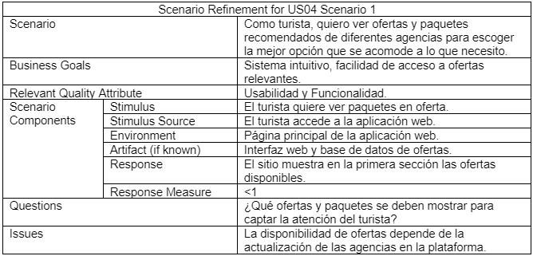 

 

## 4.2. Tactical-Level Domain-Driven Design

Se aplicó una metodología visual y colaborativa que facilitó la creación de un modelo adecuado para nuestro dominio. A lo largo de este proceso, abordamos las fases de Candidate Context Discovery, Domain Message Flows Modeling y el desarrollo de Bounded Context Canvases.

### 4.2.1. EventStorming

- Unstructured Exploration 
Llevamos a cabo una fase inicial en la que exploramos diversas ideas y conocimientos relacionados con el dominio del negocio. Esto nos permitió establecer las bases necesarias para el modelado en las siguientes fases del proceso.

- Pain Points  
Se identificaron las áreas que representaban desafíos en el flujo de trabajo, permitiendo así enfocarnos en soluciones que optimizaran los procesos y la colaboración efectiva dentro del equipo.

- Timelines 
Desarrollamos varios "timelines" para coordinar y gestionar nuestras actividades clave. Estos nos ayudaron a mantener una visión clara de los hitos importantes y a asegurar que las tareas críticas se alinearan con los plazos establecidos
 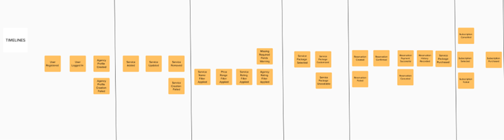
 

- Pivotal  Points  
Detectamos puntos clave dentro del proyecto que nos permitieron ajustar nuestras decisiones estratégicas en momentos cruciales para garantizar el éxito en la ejecución.

- Commands  
Se identificaron las áreas que representaban desafíos en el flujo de trabajo, permitiendo así enfocarnos en soluciones que optimizaran los procesos y la colaboración efectiva dentro del equipo.
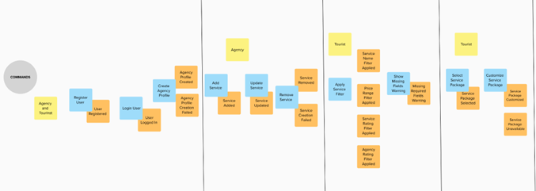

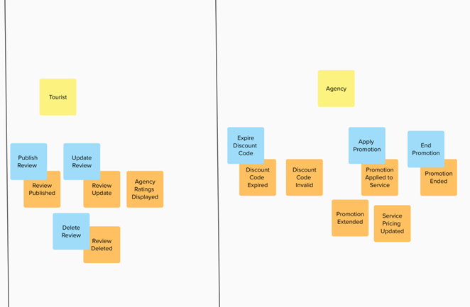

- Policies 
Definimos y aplicamos diversas políticas dentro del sistema que sirvieron como reglas guía para la toma de decisiones y la coherencia en los comportamientos. Estas políticas fueron esenciales para mantener la estabilidad y seguridad en las operaciones.

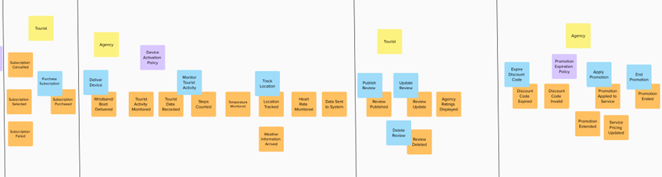

- Read Models 
Definimos y aplicamos diversas políticas dentro del sistema que sirvieron como reglas guía para la toma de decisiones y la coherencia en los comportamientos. Estas políticas fueron esenciales para mantener la estabilidad y seguridad en las operaciones.

- External Systems 
Se identificaron los sistemas externos necesarios para la integración y operación del proyecto, que aportaron fuentes de datos externas o servicios complementarios cruciales para el éxito del sistema

- Aggregates 
Analizamos los elementos y entidades del dominio para identificar aquellos que tienen un significado específico en el contexto, garantizando que las reglas de negocio sean consistentes dentro de estos agregados.

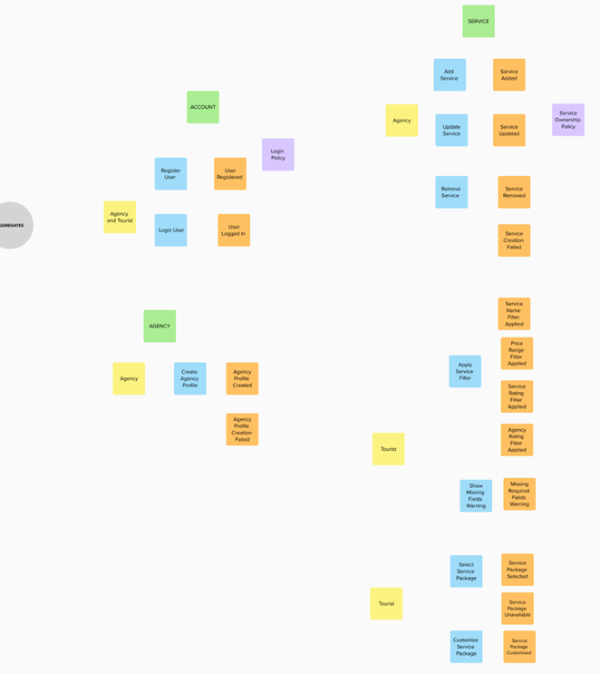

- Bounded Contexts 
Definimos varios "bounded contexts" para delimitar áreas funcionales específicas dentro del sistema, estableciendo fronteras claras entre los diferentes componentes y asegurando una correcta separación de responsabilidades

Enlace: https://app.mural.co/t/psyhelp9597/m/psyhelp9597/1688592463381/cd42d30ff1cc621e5aafb32cc6ec1c2f98d66ff3?sender=uf19e2134468e05a2ff112512 

### 4.2.2. Candidate Context Discovery.

1. Account Context
Este contexto gestiona todo lo relacionado con el registro y la autenticación de los usuarios, ya sean turistas o agencias. Incluye eventos como el registro de nuevos usuarios, el inicio de sesión, y la aplicación de políticas de autenticación.

1. Account Context
Este contexto gestiona todo lo relacionado con el registro y la autenticación de los usuarios, ya sean turistas o agencias. Incluye eventos como el registro de nuevos usuarios, el inicio de sesión, y la aplicación de políticas de autenticación.

2. Agency Context  
Este contexto está enfocado en la creación y gestión de perfiles de agencias. Los eventos relevantes incluyen la creación de perfiles de agencias y el manejo de errores en este proceso. Los elementos clave son: 
- Crear Perfil de Agencia: Proceso de registro de una agencia en el sistema.
- Perfil de Agencia Creado: Confirma la creación exitosa del perfil.
- Fallo en la Creación del Perfil: Maneja errores durante el proceso de registro de la agencia.

3. Service Context
Este es uno de los contextos más importantes, pues gestiona los servicios ofrecidos por las agencias y las acciones relacionadas con estos servicios. Aquí se controlan acciones como la adición, actualización y remoción de servicios, junto con la aplicación de filtros para mejorar la experiencia del usuario:
- Añadir Servicio, Actualizar y Remover Servicio: Gestiona el ciclo de vida de los servicios que las agencias ofrecen.
- Aplicar Filtros de Servicio: Permite a los turistas buscar y filtrar servicios según varios criterios como nombre, precio o calificación.
- Política de Propiedad del Servicio: Define las reglas de propiedad sobre los servicios añadidos. 

4. Reservation Context  
Este contexto cubre la funcionalidad de gestión de reservas, desde la creación de una reserva hasta su confirmación o cancelación. Los eventos incluyen el manejo de pagos y el historial de reservas: 
- Crear, Confirmar y Cancelar Reservas: Procesos de gestión de reservas desde la perspectiva del turista.
- Historial de Reservas y Pagos Exitosos: Rastreo de reservas realizadas y los pagos asociados a las mismas.
- Política de Cancelación de Reservas: Reglas que regulan las cancelaciones de reservas y sus efectos

5. IoT Monitoring Context  
Este contexto está diseñado para manejar la integración de dispositivos IoT que monitorean las actividades de los turistas. Aquí se gestionan eventos como la entrega de dispositivos y el monitoreo de datos en tiempo real:
- Entrega de Dispositivos (Botas, Pulseras): Gestión de los dispositivos que serán usados para monitorear la actividad del turista.
- Monitoreo de Actividades: Seguimiento de la ubicación, pasos, ritmo cardíaco y otros indicadores vitales del turista.
- Política de Activación de Dispositivos: Define las reglas sobre cómo y cuándo se activan los dispositivos IoT. 

6. Subscription Context
Este contexto se enfoca en la gestión de suscripciones dentro del sistema. Los eventos incluyen la compra, renovación y cancelación de suscripciones:
- Compra y Cancelación de Suscripción: Procesos para que los turistas adquieran o cancelen suscripciones a servicios.
- Política de Gestión de Suscripciones: Reglas que guían el comportamiento de las suscripciones. 

7. Review Context
En este contexto se gestiona el sistema de reseñas de los servicios por parte de los turistas. Los eventos clave incluyen la publicación, actualización y eliminación de reseñas: 
- Publicación y Actualización de Reseñas: Permite a los turistas compartir sus experiencias con los servicios ofrecidos.
- Eliminación de Reseñas: Proceso para gestionar la eliminación de reseñas por parte de los usuarios.
- Visualización de Calificaciones de Agencias: Gestión de las calificaciones otorgadas a las agencias por los usuarios

8. Promotions Context
Este contexto está enfocado en la gestión de promociones y descuentos que las agencias ofrecen a los turistas. Los eventos incluyen la aplicación, expiración y finalización de promociones: 
- Aplicar y Expirar Código de Descuento: Gestión de los códigos de descuento aplicados por los turistas.
- Finalización y Extensión de Promociones: Procesos para manejar el ciclo de vida de las promociones ofrecidas por las agencias.
- Política de Expiración de Promociones: Define las reglas que determinan cuándo expiran las promociones.

### 4.2.3. Domain Message Flows Modeling.
- Escenario 1: Registro y autenticación de usuario

- Escenario 2: Creación de un servicio

- Escenario 3: Creación y cancelación de una reserva
En este escenario, los turistas utilizan la aplicación web para crear, confirmar o cancelar una reserva. Al solicitar una reserva, el sistema procesa el pago a través de un servicio externo y, tras su confirmación, genera la reserva correspondiente. Si el proceso de creación de la reserva es exitoso o si ocurre algún error, el sistema envía una notificación al turista informándole del estado de su solicitud y actualizando su historial de reservas.
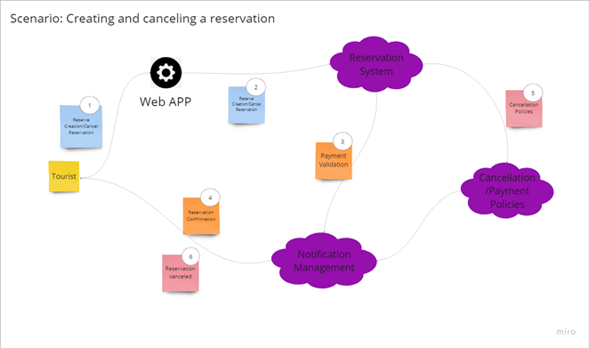

- Escenario 4: Creación de un servicio

- Escenario 5: Creación de un servicio

### 4.2.4. Bounded Context Canvases
- Account Context 
El Bounded Context “Account” gestiona el registro y autenticación de usuarios, asegurando un sistema seguro. Los turistas y agencias autenticados envían solicitudes de registro y login, que el sistema procesa y confirma. Solo los usuarios autenticados pueden acceder a ciertas funcionalidades, siguiendo políticas de seguridad estrictas.

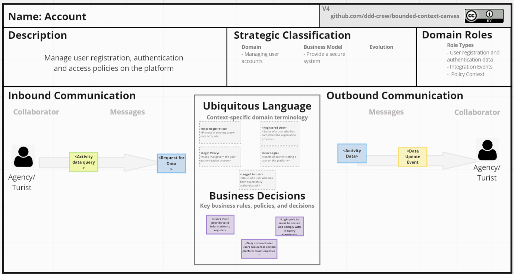
    
- Agency Context 
Este Bounded Context, muestra cómo se comunican los diferentes actores dentro del sistema. Dentro, el turista autenticado en la plataforma envía una solicitud de datos de actividad en tiempo real. Esta solicitud se representa con un ícono de turista y un ícono de solicitud de datos, indicando que el turista está consultando su información de actividad, luego el sistema de servicio procesa esta solicitud y envía los datos de actividad actualizados a la agencia

    
- Service Context 
Este Bounded Context muestra cómo interactúan los diferentes actores en la gestión de servicios. Dentro, una agencia autenticada en la plataforma envía una solicitud para añadir, actualizar o remover un servicio. Esta solicitud se representa con un ícono de agencia y un ícono de gestión de servicios, indicando que la agencia está realizando cambios en su catálogo de servicios. Luego, el sistema de servicio procesa la solicitud y actualiza el catálogo, notificando a otros sistemas relevantes sobre los cambios realizados.

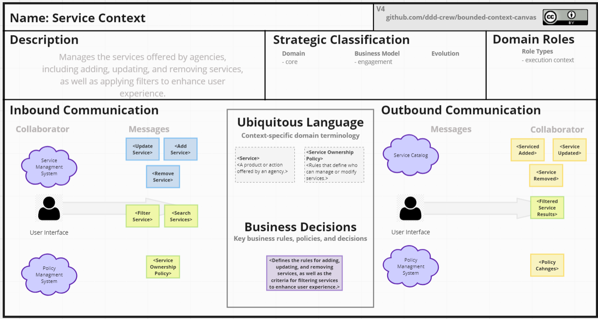
    
- Reservation Context 
Este Bounded Context muestra cómo interactúan los diferentes actores en la gestión de reservas. Dentro, un turista autenticado en la plataforma envía una solicitud para crear, confirmar o cancelar una reserva. Esta solicitud se representa con un ícono de turista y un ícono de gestión de reservas, indicando que el turista está interactuando con el sistema para gestionar su reserva. Luego, el sistema de reservas procesa la solicitud, actualiza el historial de reservas, y envía notificaciones sobre pagos y cambios a otros sistemas relevantes.

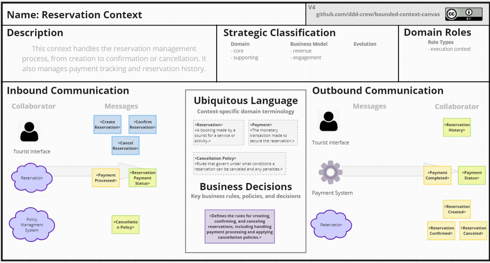
    
- IoT Monitoring Context 
- Subscription Context 
Este Bounded Context muestra cómo interactúan los diferentes actores en la gestión de suscripciones. Dentro, un turista autenticado en la plataforma envía una solicitud para comprar, renovar o cancelar una suscripción. Esta solicitud se representa con un ícono de turista y un ícono de gestión de suscripciones, indicando que el turista está interactuando con el sistema para administrar su suscripción. Luego, el sistema de suscripciones procesa la solicitud, actualiza el historial de suscripciones y notifica a otros sistemas relevantes sobre los cambios realizados.

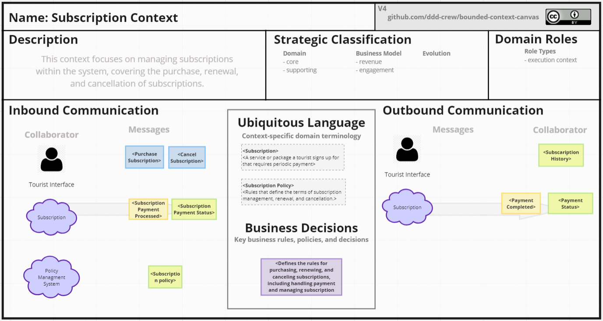
    
- Review Context
Este contexto se encarga de gestionar las reseñas de los usuarios sobre los paquetes turísticos. Los turistas pueden enviar, editar o eliminar sus reseñas sobre sus experiencias. Estas reseñas son fundamentales para determinar la calificación general de un paquete turístico, influyendo en las decisiones de otros posibles clientes.

    
- Promotions Context
Este contexto gestiona las promociones y descuentos disponibles para los servicios turísticos ofrecidos en la plataforma. Se encarga de la creación, activación y expiración de promociones, permitiendo que las agencias apliquen códigos de descuento para atraer a más clientes y aumentar el compromiso con los servicios.

    
### 4.2.5. Context Mapping
Context Mapping es un paso crucial dentro del Domain-Driven Design que se enfoca en entender cómo los diferentes bounded contexts (contextos delimitados) dentro de un sistema interactúan y se conectan entre sí. Este proceso permite identificar las relaciones y dependencias entre los distintos dominios o subdominios que componen el proyecto

## 4.3. Software Architecture

### 4.3.1. Software Architecture System Landscape Diagram. 

### 4.3.2. Software Architecture Context Level Diagrams. 

### 4.3.3. Software Architecture Container Level Diagrams. 
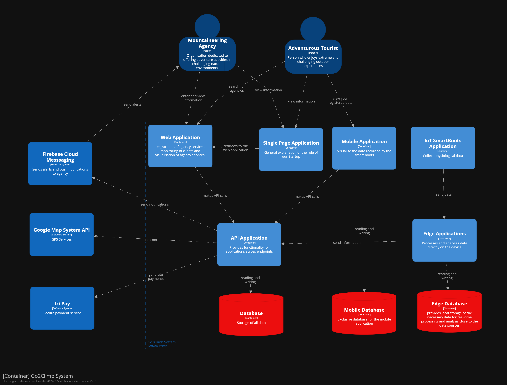

### 4.3.4. Software Architecture Deployment Diagrams 
En el contexto de la aplicación de turismo que integra servicios de montañismo, los contenedores de software están desplegados en la nube de Azure y en dispositivos físicos a través de un sistema IoT (botas y relojes). La arquitectura de despliegue muestra cómo los diferentes componentes interactúan entre sí, destacando las siguientes características:
- Landing Page: Desplegada en la nube de Azure, permite a los usuarios acceder a la aplicación web principal y redirigir hacia ella.
- Aplicación Web y Aplicación Móvil: Desplegadas en Azure Cloud, estas aplicaciones permiten a los usuarios (turistas y agencias) interactuar con los servicios de montañismo, realizar reservas y revisar datos en tiempo real.
- API Application: Desplegada en Azure Cloud, esta aplicación gestiona las interacciones entre la aplicación web/móvil, la base de datos y los dispositivos IoT.
- MySQL Database: La base de datos que almacena información crítica, como detalles de los servicios y los datos de los turistas, también está desplegada en Azure Cloud.
- Sistema IoT: Dispositivos físicos como botas y relojes conectados a la plataforma Azure IoT Cloud, que recopilan datos de los turistas en tiempo real (pasos, latidos del corazón, ubicación, temperatura) y envían esta información a la API para su procesamiento y almacenamiento.
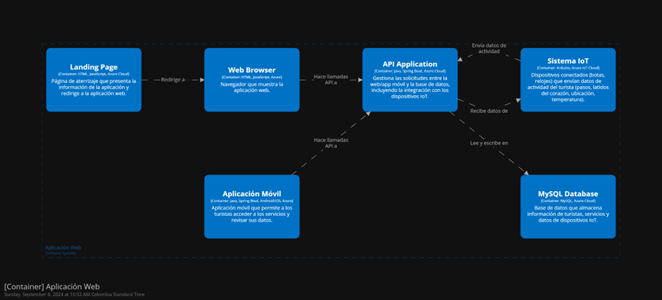

## Conclusiones
Outsiders, la Startup encargada de distribuir servicios de turismo a todas las personas del mundo, garantiza a un mejor precio y una experiencia inolvidable, cuenta con un diseño eficiente que permite al sistema de la empresa registrar, guardar y presentar al cliente una mejor visualización de los servicios, a su vez es de fácil interacción para cualquier usuario.
Cabe resaltar que en el desarrollo el proyecto se inició con una idea de negocio y para realizar la implementación se fue presentando previos avances, y para el trabajo final como las entregas realizadas, se pensó que era conveniente revisar y realizar las mejoras continúas, hecho que benefició a gran medida a nuestro servicio, porque es cauteloso, y bien refinado.
