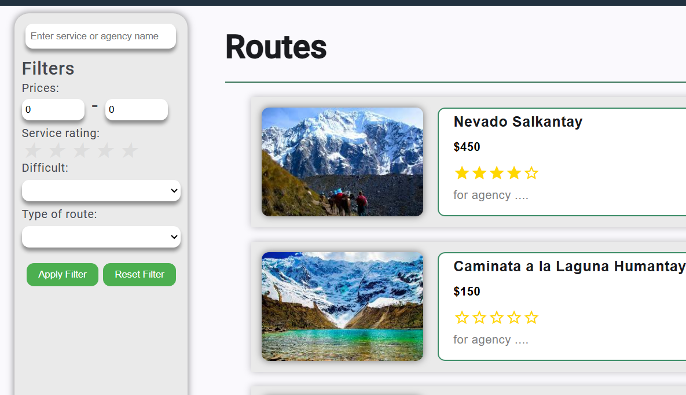

# Capitulo VII: Product Implementation, Validation & Deployment
En esta sección, como equipo, explicamos y evidenciamos el proceso de implementar, comprobar, desplegar y validar la solución compuesta por los productos digitales que forman parte del alcance. Este capítulo abarca secciones para la organización del proceso de trabajo en Sprints, la descripción y prácticas asociadas a Software Configuration Management, el Video About-The-Product y las evidencias de Implementation, Testing, Deployment y Validations para cada uno de los productos, en términos del producto en sí y la colaboración por Sprint.
## 7.1. Software Configuration Management
En esta sección, como equipo, establecemos las decisiones y convenciones que permitirán mantener la consistencia durante el ciclo de vida del proyecto. Incluimos secciones internas para Source Code Management, Development Environment Configuration y Deployment Configuration, asegurando que todos los aspectos del desarrollo y despliegue del software estén bien organizados y documentados.
### 7.1.1. Software Development Environment Configuration.
En esta sección, como equipo, especificamos y describimos los productos de software que utilizaremos en el proyecto, indicando su propósito y cómo acceder a ellos. Esto incluye herramientas para Project Management, Requirements Management, Product UX/UI Design, Software Development, Software Testing, Software Deployment y Software Documentation. Nuestro objetivo es asegurar que todos los miembros del equipo tengan acceso a las herramientas necesarias para colaborar eficazmente en el ciclo de vida del proyecto.

**Project Management:**
1. **Markdown**

    -   **Propósito:** Crear y organizar la documentación del proyecto en archivos .md, permitiendo una fácil segmentación por capítulos. Facilita la generación de informes en PDF para entregas académicas.
    - **Ruta:** Sintaxis básica de escritura y formato en GitHub

2. **Git & GitHub**

    - **Propósito:** Sistema de control de versiones distribuido para rastrear cambios en el código fuente y facilitar la colaboración entre los miembros del equipo.
    - **Ruta de descarga Git:** https://git-scm.com/downloads
    - **Ruta GitHub:** https://github.com/

3. **Discord**

    - **Propósito:** Plataforma de comunicación y colaboración para llamadas, chat en tiempo real y compartir archivos entre los miembros del equipo.
    - **Ruta:** https://discord.com/download

4. **Trello**

    - **Propósito:** Herramienta de gestión de proyectos basada en tableros Kanban para organizar tareas, asignar responsabilidades y hacer seguimiento del progreso del proyecto.
    - **Ruta:** https://trello.com/

**Product UX/UI Design:**

5. **Miro**

    - **Propósito:** As-Is y To-Be Scenario Maps
    - **Ruta:** https://miro.com/es/

6. **Figma**

    - **Propósito:** Diseño colaborativo de interfaces de usuario, creación de wireframes, mockups y prototipos interactivos.
    - **Ruta:** https://www.figma.com/

7. **Lucidchart**

    - **Propósito:** Creación de diagramas de flujo, mapas mentales y diagramas de arquitectura para visualizar procesos y estructuras del proyecto.
    - **Ruta:** https://www.lucidchart.com/

8. **Vertabelo**

    - **Propósito:** Herramienta gratuita para la elaboración de diagramas de base de datos.
    - **Ruta:** https://vertabelo.com/

9. **Structurizr**

    - **Propósito:** Elaboración de diagramas C4.
    - **Ruta:** https://structurizr.com/

10. **UXPressia**

    - **Propósito:** Elaboración de User Personas, Empathy Maps, Journey Maps e Impact Maps.
    - **Ruta:** https://uxpressia.com/

**Software Development:**

11. Visual Studio Code

    - **Propósito:** Editor de código principal para el desarrollo del frontend y backend, con extensiones para mejorar la productividad.
    - **Ruta de descarga:** https://code.visualstudio.com/

12. **Angular CLI**

    - **Propósito:** Framework para el desarrollo del frontend de la aplicación web, facilitando la creación de componentes y servicios.
    - **Instalación:** Ejecutar npm install -g @angular/cli después de instalar Node.js

13. **Spring Boot**

    - **Propósito:** Framework para el desarrollo del backend, proporcionando un entorno preconfigurado para aplicaciones Java.
    - **Ruta:** https://spring.io/projects/spring-boot

**Software Deployment:**

14. **GitHub Pages**

    - **Propósito:** Desplegar la landing Page.
    - **Ruta:** https://pages.github.com/

15. **Netify**

    - **Propósito:** Desplegar la Aplicacion Web
    - **Ruta:** https://www.netlify.com

**Software Documentation:**

16. **Swagger UI**
    - **Propósito:** Herramienta para documentar y probar APIs RESTful generadas con Spring Boot.
    - **Configuración:** Integrada en el proyecto Spring Boot mediante dependencias Maven.

### 7.1.2. Source Code Management.
Nuestro equipo ha adoptado GitHub como plataforma principal para el control de versiones y la gestión del código fuente. Implementamos una estrategia de ramificación basada en GitFlow, adaptada a nuestras necesidades específicas, para garantizar un flujo de trabajo eficiente y una gestión de código robusta.

**Repositorios de GitHub**

Hemos establecido los siguientes repositorios para nuestros productos:

1. **Landing Page:** https://github.com/Xtreme-Arqui/landing-page-Aventurero

2. **Frontend Web Application:** https://github.com/Xtreme-Arqui/Frontend

3. **Documentación del Proyecto:** https://github.com/Xtreme-Arqui/upc-pre-202402-si728-sw82-xtreme-report

4. **Backend Aplication:** https://github.com/Xtreme-Arqui/back

**Implementación de GitFlow**

Nuestra implementación de GitFlow se basa en el modelo propuesto por Vincent Driessen, con algunas adaptaciones para optimizar nuestro flujo de trabajo:

1. **Rama Principal (main):**

    - **Denominación:** main
    - **Propósito:** Representa el estado de producción actual.
    - **Características:** Siempre estable y lista para despliegue.

2. **Rama de Desarrollo (develop):**

    - **Denominación:** develop
    - **Propósito:** Integra las últimas características desarrolladas.
    - **Características:** Punto de partida para nuevas funcionalidades, sometida a pruebas continuas.

3. **Ramas de Funcionalidades (feature branches):**

    - **Denominación:** feature/nombre-de-la-funcionalidad
    - **Propósito:** Desarrollo aislado de nuevas características.
    - **Características:** Se ramifican desde develop y se fusionan de vuelta a ella.

4. **Ramas de Lanzamiento (release branches):**

    - **Denominación:** release/v{X.Y.Z}
    - **Propósito:** Preparación para un nuevo lanzamiento de producción.
    - **Características:** Permite ajustes finales y correcciones menores antes del lanzamiento.

5. **Ramas de Corrección Urgente (hotfix branches):**

    - **Denominación:** hotfix/v{X.Y.Z+1}
    - **Propósito:** Correcciones críticas en producción.
    - **Características:** Se ramifican desde main y se fusionan tanto en main como en develop.

**Convenciones de Nomenclatura**

1. **Ramas de Funcionalidades:**

    - **Formato:** feature/breve-descripcion-de-la-funcionalidad
    - **Ejemplo:** feature/integracion-sensor-temperatura

2. **Ramas de Lanzamiento:**

    - **Formato:** release/vX.Y.Z
    - **Ejemplo:** release/v1.2.0

3. **Ramas de Corrección Urgente:**

    - **Formato:** hotfix/vX.Y.Z
    - **Ejemplo:** hotfix/v1.2.1

**Versionado Semántico**

Adoptamos el Versionado Semántico 2.0.0 para nuestros lanzamiento:

- **X (Major):** Cambios incompatibles con versiones anteriores
- **Y (Minor):** Nuevas funcionalidades compatibles con versiones anteriores
- **Z (Patch):** Correcciones de errores compatibles con versiones anteriores

**Convenciones para Commits**

Seguimos las directrices de Conventional Commits para mantener un historial de cambios claro y estructurado:

    <tipo>[alcance opcional]: <descripción>

    [cuerpo opcional]

    [notas de pie opcionales]

Tipos de commits más comunes:

- `feat`: Nueva funcionalidad
- `fix`: Corrección de errores
- `docs`: Cambios en la documentación
- `style`: Cambios que no afectan el significado del código (espacios en blanco, formato, etc.)
- `refactor`: Cambio de código que no corrige un error ni añade una característica
- `test`: Adición o modificación de pruebas
- `chore`: Cambios en el proceso de construcción o herramientas auxiliares

Ejemplos:

- `feat(auth): implementar autenticación de dos factores`
- `fix(sensor): corregir lectura errónea del sensor de altitud`
- `docs(README): actualizar instrucciones de instalación  `  

**Flujo de Trabajo**

1. Los desarrolladores crean ramas de funcionalidades desde develop.
2. Al completar una funcionalidad, se crea un Pull Request para fusionar con develop.
3. Las ramas de lanzamiento se crean desde develop cuando se prepara una nueva versión.
4. Tras las pruebas finales, la rama de lanzamiento se fusiona en main y develop.
5. Si se detectan errores críticos en producción, se crea una rama de corrección urgente desde main.

Esta estructura nos permite mantener un desarrollo ordenado, facilitar la colaboración entre miembros del equipo y garantizar la estabilidad de nuestras versiones de producción.
### 7.1.3. Source Code Style Guide & Conventions.
Para mantener la consistencia y legibilidad de nuestro código a lo largo del proyecto, hemos adoptado las siguientes guías de estilo y convenciones para los diferentes lenguajes y tecnologías que utilizamos. Estas pautas se basan en las mejores prácticas de la industria y se adaptan a las necesidades específicas de nuestro proyecto.

**HTML**

Seguimos las recomendaciones del "HTML Style Guide and Coding Conventions" de W3Schools y el "Google HTML/CSS Style Guide":

1. **Declaración del tipo de documento:**

    -   Siempre incluir al inicio del documento: `<!DOCTYPE html>`

2. **Uso de minúsculas:**

    -   Utilizar minúsculas para todos los nombres de elementos y atributos.
    - Ejemplo: `<body>, <section>, <div class="container">`

3. **Comillas en atributos:**

    - Usar comillas dobles para los valores de los atributos.
    - Ejemplo: ``

4. **Indentación:**

    - Utilizar 2 espacios para la indentación.
    - Mantener una estructura clara y jerárquica.

5. **Comentarios:**

- Usar comentarios para explicar secciones complejas o no evidentes.
- Formato: `<!-- Comentario -->`

**CSS**

Adoptamos las siguientes convenciones basadas en el "Google HTML/CSS Style Guide":

1. **Nomenclatura de clases:**

    - Usar kebab-case para los nombres de clases.
    - Ejemplo: `.header-navigation`, `.user-profile`

2. **Selectores:**

    - Evitar selectores demasiado específicos para mejorar la reutilización.
    - Preferir clases sobre IDs para estilos reutilizables.

3. **Propiedades:**

    - Ordenar las propiedades alfabéticamente dentro de cada regla.
    - Usar notación abreviada cuando sea posible.
    - Ejemplo: `margin: 10px 20px;` en lugar de definir cada lado por separado.

4. **Valores:**

    - Omitir unidades para valores cero: `margin: 0;` en lugar de margin: 0px;
    - Usar notación hexadecimal de 3 caracteres cuando sea posible: `#fff` en lugar de `#ffffff`

**JavaScript/TypeScript**

Seguimos las directrices del "Google JavaScript Style Guide" y "Google TypeScript Style Guide":

1. **Nomenclatura:**

    - Variables y funciones: camelCase
    - Clases y tipos: PascalCase
    - Constantes: UPPER_SNAKE_CASE

2. **Declaración de variables:**

    - Preferir `const` sobre `let.` Usar `let` solo cuando sea necesario reasignar.
    - Evitar `var.`

3. **Funciones:**

    - Preferir funciones de flecha para funciones anónimas.
    - Ejemplo: `const suma = (a, b) => a + b;`

4. **Semicolons:**

    - Usar punto y coma al final de cada declaración.

5. **Comillas:**

    - Preferir comillas simples para strings.
    - Usar comillas invertidas para template literals.

**Angular (TypeScript)**

Adoptamos las recomendaciones de la "Angular Style Guide":

1. **Estructura de archivos:**

    - Un componente por archivo.
    - Nombrar archivos siguiendo el patrón: feature-name.type.ts
    - Ejemplo: `user-profile.component.ts, authentication.service.ts`

2. **Componentes:**

    - Usar el decorador @Component con un selector en kebab-case.
    - Ejemplo: `selector: 'app-user-profile'`

3. **Servicios:**

    - Usar el decorador `@Injectable` con `providedIn: 'root'` para servicios singleton.

4. **Módulos:**

    - Agrupar funcionalidades relacionadas en módulos.
    - Nombrar módulos con el sufijo Module.
    - Ejemplo: `UserModule`, `AuthenticationModule`

**Java (Spring Boot)**

Seguimos las convenciones del "Google Java Style Guide" y las recomendaciones de "Spring Boot Features":

1. **Nomenclatura:**

    - Clases: PascalCase
    - Métodos y variables: camelCase
    - Constantes: UPPER_SNAKE_CASE

2. **Organización de paquetes:**

    - Estructura basada en funcionalidades.
    - Ejemplo: `com.iotecnicos.usermanagement`, `com.iotecnicos.authentication`

3. **Anotaciones de Spring:**

    - Usar anotaciones apropiadas: `@RestController`, `@Service`, `@Repository`
    - Configurar componentes con `@Autowired` para inyección de dependencias.

4. **API RESTful:**

    - Usar `@GetMapping`, `@PostMapping`, etc., para definir endpoints.
    - Seguir principios RESTful en el diseño de la API.

**Gherkin (para archivos .feature)**

Adoptamos las "Gherkin Conventions for Readable Specifications":

1. **Estructura:**

    - Usar el formato "Given-When-Then" para los escenarios.
    - Utilizar "And" para pasos adicionales dentro de cada sección.

2. **Lenguaje:**

    - Escribir en inglés, usando un lenguaje claro y conciso.
    - Evitar jerga técnica en las descripciones de escenarios.

3. **Escenarios:**

    - Comenzar cada escenario con "Scenario:" seguido de un título descriptivo.
    - Mantener los escenarios cortos y enfocados en una sola funcionalidad.

Ejemplo:

```gherkin
Feature: User Authentication

Scenario: Successful login
  Given the user is on the login page
  When they enter valid credentials
  And they click the login button
  Then they should be redirected to the dashboard
```

Estas convenciones y guías de estilo nos ayudarán a mantener un código limpio, consistente y fácil de mantener a lo largo de todo el proyecto. Todos los miembros del equipo deben adherirse a estas pautas para asegurar la calidad y uniformidad del código.
### 7.1.4. Software Deployment Configuration.
En esta seccion se mostrara la configuracion que se realizo para el landing page, frontend y backend
1. **Landing Page**
- Primero ingresar al repositorio del Landing Page e ingresar en Settings


- Segundo seleccionar Pages y escoger la rama main y guardar


2. **Frontend**
- Primero, ingresar a Netlify y sincronizar nuestra cuenta de github, para acceder a nuestro repositorio


- Segundo, otorgar permisos para que Netlify acceda a nuestro repositorio


- Tercero, seleccionar el repositorio donde se encuentra el frontend e instalar


- Finalmente, se muestra el frontend desplegado


3. **Backend**

- Primero, creamos la base de datos en railway 


- Segundo, conectamos la base de datos local a railway


- Tercero, creamos el backend en Azure, indicando el nombre y la suscripcion


- Cuarto, indicamos la version de Java y la region


- Quinto, verificamos que la informacion otorgada sea correcta y vamos a deployment


- Sexto, sincronizamos nuestra cuenta de Github con Azure para acceder al repositorio y colocamos los campos requeridos


- Septimo, una vez creado nos mostrara si se creo correctamente


- Octavo, verificamos en Github Actions el deploy en Azure


- Finalmente, podremos acceder al backend desplegado

  
## 7.2. Solution Implementation.
### 7.2.1. Sprint 1
#### 7.2.1.1. Sprint Planning 1.

| Sprint \# | Sprint 1 |
| :---- | :---- |
| **Sprint Planning Background ** |  |
| Date | 2024-10-21 |
| Time | 21:20 PM |
| Location | Virtual (Plataforma Discord) |
| Prepared By | Arnol Caceres |
| Attendees (to planning meeting) | Arnol Caceres, Emerson Quispe, Fiorella Valencia, Franco Surco y Piero Stefano |
| Sprint n-1 Review Summary | No se aplica para esta entrega |
| Sprint n-1 Retrospective Summary | No se aplica para esta entrega |
| **Sprint Goal & User Stories ** |  |
| Sprint 1 Goal | \- Corregir los puntos de documentación de la entrega anterior \- Desplegar landing page de Turistas y Agencias \- Desplegar primera versión de frontend \- Desplegar primera versión de backend |
| Sprint 1 Velocity | Para este sprint calculamos que podemos aceptar 130 Story Points |
| Sum of Story Points | 127 |

#### 7.2.1.2. Sprint Backlog 1.
| Sprint \# | Sprint 1 |  |  |  |  |  |  |
| ----- | ----- | ----- | ----- | ----- | :---- | :---- | :---- |
| User Story |  | Work-Item / Task |  |  |  |  |  |
|  Id | Título | id | Descripcion | Estimation (Hours) |  | Assigned To | Status(To-do / InProcess / ToReview / Done) |
| US-14 | Ver portada | US-14-1 | **Como** usuario **deseo** visualizar una portada en landing page **para** poder captar mi atención y no me aburra al momento de leer el contenido | 3 | Franco Surco \- Arnol Caceres |  | Done |
| US-15 | Información de la aplicación | US-15-1 | **Como** usuario **deseo** ver información acerca de la aplicación **para** poder saber las funcionalidades que ofrece la aplicación | 3 | Franco Surco \- Arnol Caceres |  | Done |
| US-16 | Motivos por el cual unirnos | US-16-1 | **Como** usuario **deseo** ver motivos por el cual unirnos a la aplicación **para** poder saber los beneficios que ofrece la aplicación | 3 | Franco Surco \- Arnol Caceres |  | Done |
| US-17 | Redirección a la aplicación | US-17-1 | **Como** usuario **deseo** que haya un call-to-action **para** poder entrar a la aplicación | 3 | Franco Surco \- Arnol Caceres |  | Done |
| US-18 | Footer de la landing page | US-18-1 | **Como** usuario **deseo** que haya un footer **para** poder ver las redes sociales y los contactos de la aplicación | 3 | Franco Surco \- Arnol Caceres |  | Done |
| US-19 | About the product | US-19-1 | **Como** usuario **deseo** que haya un video acerca de la aplicación **para** poder ver las funcionalidades que tiene de una manera más visual. | 3 | Franco Surco \- Arnol Caceres |  | Done |
| US-20 | Responsive design | US-20-1 | **Como** usuario **deseo** que la aplicación sea responsiva **para** poder visualizar la landing page desde cualquier dispositivo. | 3 | Franco Surco \- Arnol Caceres |  | Done |
| US-01 | Añadir servicio | US-01-1 | **Como** agencia **deseo** agregar mis servicios **para que** mis clientes sepan más sobre lo que ofrezco. | 8 | Emerson Quispe \- Fiorella Valencia \- Piero Stefano |  | Done |
| US-05 | Crear ofertas | US-05-1 | **Como** turista **deseo** ver ofertas y paquetes recomendados de diferentes agencias **para** escoger la mejor opción que se acomode a lo que necesito. | 8 | Emerson Quispe \- Fiorella Valencia \- Piero Stefano |  | Done |
| US-11 | Monitorear clientes  | US-11-1 | **Como** agencia **deseo** tener control del estado del servicio ofrecido a mis clientes **para** indicar cuando un servicio se ha cumplido satisfactoriamente. | 8 | Emerson Quispe \- Fiorella Valencia \- Piero Stefano |  | Done |
| US-13 | Ver servicio | US-13-1 | **Como** turista **deseo** acceder a los detalles de un servicio ofrecido por una agencia **para** decidir si adquirirlo o no. | 5 | Emerson Quispe \- Franco Surco |  | Done |
| US-06 | Buscar agencias | US-06-1 | **Como** turista **deseo** buscar agencias haciendo uso de varios filtros **para** escoger la mejor agencia según lo que necesito. | 5 | Emerson Quispe \- Franco Surco |  | Done |
| US-02 | Personalizar viaje | US-02-1 | **Como** turista **deseo** personalizar el viaje que haré con una agencia, modificando aspectos del viaje **para** tener una mejor experiencia. | 8 | Emerson Quispe \- Fiorella Valencia \- Piero Stefano |  | Done |
| US-03 | Visualizar reseña | US-03-1 | **Como** agencia **deseo** visualizar las reseñas que tiene mi negocio **para** saber que puedo mejorar o agregar. | 5 | Emerson Quispe \- Arnol Caceres |  | Done |
| US-07 | Ver valoraciones | US-07-1 | **Como** turista **deseo** ver las valoraciones de otros usuarios con cada agencia **para** saber si la agencia es segura o de confianza. | 5 | Emerson Quispe \- Franco Surco |  | Done |
| US-08 | Editar página de negocio | US-08-1 | **Como** agencia **deseo** editar la página de mi negocio **para** colocar toda mi información y los medios de contacto. | 3 | Emerson Quispe \- Arnol Caceres |  | Done |
| US-05 | Crear ofertas | US-05-1 | **Como** agencia **deseo** crear ofertas y descuentos de mis servicios **para** atraer a más clientes. | 3 | Fiorella Valencia \- Piero Stefano |  | Done |
| US-11 | Calificar servicio | US-11-1 | **Como** turista **deseo** calificar el servicio que contraté **para** mostrar mi agrado o desagrado y más usuarios sepan sobre el mismo. | 3 | Fiorella Valencia \- Piero Stefano |  | Done |
| US-09 | Cambiar plan de suscripción | US-09-1 | **Como** agencia **deseo** cambiar mi plan de suscripción **para** ofrecer más servicios a mis clientes. | 8 | Fiorella Valencia \- Piero Stefano |  | Done |
| US-10 | Crear promociones | US-10-1 | **Como** agencia **deseo** crear campañas de promoción **para** llegar a más clientes. | 5 | Franco Surco \- Arnol Caceres |  | Done |
| US-21 | Acceso al aplicativo | US-21-1 | **Como** usuario de “Go2Climb**” Quiero** poder utilizar la aplicación desde diferentes navegadores **Para** poder buscar agencias y servicios de alpinismo sin estar limitado a un navegador. | 3 | Piero Stefano |  | Done |
| US-22 | Velocidad de carga | US-22-1 | **Como** usuario de la plataforma  **Quiero** que la velocidad de carga de la aplicación sea rápida y eficiente**, Para** poder acceder rápidamente a la información de las agencias y servicios  sin demoras.  | 3 | Piero Stefano |  | Done |
| US-23 | Interfaz interactiva y deductiva | US-23-1 | **Como** usuario **Quiero** poder buscar y reservar vuelos y hoteles de manera rápida y sencilla **Para** que pueda planificar mis viajes sin problemas | 3 | Emerson Quispe |  | Done |
| US-24 | Protección de data | US-24-1 | **Como** usuario **Quiero** que mi información personal y financiera esté protegida contra el acceso no autorizado o el robo **Para** que pueda reservar vuelos y hoteles con confianza  | 5 | Fiorella Valencia \- Piero Stefano |  | In-Process |
| US-26 | Comentarios para las actividades | US-26-1 | **Como** turista de la plataforma, **quiero** poder compartir mis comentarios y opiniones sobre las actividades proporcionadas por las empresas, **para** que otros usuarios puedan tomar decisiones informadas sobre su participación en esas actividades. | 5 | Fiorella Valencia \-  Emerson Quispe  |  | Done |
| US-27 | Monitorear datos del turista | US-27-1 | **Como** turista deseo revisar mis datos de actividad (pasos, latidos del corazón, temperatura y ubicación) obtenidos a través de mis botas o reloj durante mi experiencia de alpinismo **para** poder monitorear mi estado físico y condiciones durante la actividad. | 8 | Fiorella Valencia \- Emerson Quispe \- Franco Surco |  | In-Process |
| US-28 | Ver datos de turistas por agencia | US-28-1 | **Como** agencia de turismo deseo poder acceder a los datos de actividad de los turistas que han utilizado mis servicios, **para** poder monitorear su progreso y ofrecer recomendaciones de seguridad. | 8 | Fiorella Valencia \-  Emerson Quispe |  | In-Process |
#### 7.2.1.3. Development Evidence for Sprint Review.
#### 7.2.1.4. Testing Suite Evidence for Sprint Review.
#### 7.2.1.5. Execution Evidence for Sprint Review.
#### 7.2.1.6. Services Documentation Evidence for Sprint Review.
#### 7.2.1.7. Software Deployment Evidence for Sprint Review.
#### 7.2.1.8. Team Collaboration Insights during Sprint.
## 7.3. Validation Interviews.
### 7.3.1. Diseño de Entrevistas
# Entrevista de Validación para la Aplicación de Turismo de Alpinismo

## Preguntas de Datos Personales
1. ¿Podría decirme su nombre completo?
2. ¿Qué edad tiene?
3. ¿Cuál es su lugar de residencia actual?
4. ¿Tiene alguna experiencia previa en turismo de montaña o actividades al aire libre?
5. ¿Con qué frecuencia suele realizar actividades como alpinismo o senderismo?

## Preguntas Principales para la Validación de la Aplicación

### Diseño e Interfaz
- ¿Cómo percibe la apariencia de la página principal de la aplicación? ¿Le resulta visualmente atractiva y organizada?
- ¿Diría que la interfaz es intuitiva y fácil de manejar? ¿Por qué o por qué no?

### Contenido y Proceso de Registro
- ¿El contenido presentado en la página de inicio le incita a registrarse? ¿Qué aspectos le resultan más llamativos o relevantes?
- ¿Qué opina sobre el monitoreo que se realiza con dispositivos IoT para obtener datos como la temperatura, localización, latidos del corazón, entre otros? ¿Le parece útil esta funcionalidad?

### Utilidad y Funcionalidades
- ¿Considera que las funciones de la aplicación son útiles para planificar y realizar actividades de alpinismo? ¿Por qué?
- ¿Hay alguna funcionalidad que le gustaría ver añadida para mejorar su experiencia?

### Sugerencias de Mejora
- ¿Hay algún aspecto de la aplicación que piense que necesita ajustes o mejoras? ¿Cuál sería su sugerencia?
- ¿Alguna función adicional le resultaría útil para mejorar su experiencia como usuario de la aplicación?

### Planes de Pago
- ¿Estaría dispuesto a adquirir un plan de pago para acceder a funciones avanzadas? ¿Qué tipo de características o beneficios le motivarían a pagar?

### Opinión General
- ¿Cree que la aplicación cubre las necesidades de las personas interesadas en actividades de alpinismo?
- ¿Recomendaría esta aplicación a otros que comparten el interés por el alpinismo y actividades de aventura? ¿Por qué?

### 7.3.2. Registro de Entrevistas.
### 7.3.3. Evaluaciones según heurísticas.
# Evaluación según Heurísticas de UX
**Usabilidad – Diseño Inclusivo – Arquitectura de la Información**  
**APLICACIÓN**: TrailSync  

### TAREAS EVALUADAS
- **Inicio de Sesión**
- **Publicación de un servicio de montañismo**
- **Edición de un Servicio**
- **Búsqueda de servicios o agencias**
- **Filtrado de servicios**

### TAREAS EXCLUIDAS
- **Cerrar Sesión**
- **Editar publicación de una agencia**
- **Publicar comentario**
- **Calificar servicio**
  
### ESCALA DE SEVERIDAD
| Nivel | Descripción                                                                 |
|-------|-----------------------------------------------------------------------------|
| **1** | Problema leve: el usuario puede superarlo fácilmente o ocurre raramente.    |
| **2** | Problema menor: ocurre con cierta frecuencia y puede ser más molesto.       |
| **3** | Problema significativo: sucede regularmente o es difícil de superar. Se debe dar prioridad. |
| **4** | Problema crítico: impide que el usuario continúe. Necesita solución urgente antes del lanzamiento. |

### TABLA RESUMEN
| #  | Problema                                                                                      | Severidad | Heurística/Principio Violado                   |
|----|-----------------------------------------------------------------------------------------------|-----------|------------------------------------------------|
| 1  | La interfaz de inicio de sesión no proporciona retroalimentación sobre errores de entrada     | 2         | Usabilidad: Ayuda para reconocer y recuperarse de errores |
| 2  | Al publicar o editar un servicio, no se muestra una confirmación de éxito                    | 3         | Usabilidad: Visibilidad del estado del sistema |
| 3  | Los filtros de búsqueda de servicios no son intuitivos y limitan las opciones del usuario    | 3         | Usabilidad: Flexibilidad y eficiencia de uso   |

---

### DESCRIPCIÓN DE LOS PROBLEMAS

#### PROBLEMA #1: La interfaz de inicio de sesión no proporciona retroalimentación sobre errores de entrada
- **Severidad**: 2
- **Heurística violada**: Usabilidad - Ayuda para reconocer y recuperarse de errores
- **Descripción**: Cuando los usuarios ingresan información incorrecta en el inicio de sesión (como una contraseña o nombre de usuario incorrecto), no reciben una retroalimentación clara o inmediata sobre el error específico, lo cual dificulta el proceso de autenticación.
- **Recomendación**: Agregar mensajes de error claros para ayudar a los usuarios a entender qué campo está incorrecto (usuario o contraseña) y cómo pueden corregirlo. Esto mejorará la experiencia al reducir la frustración y ayudar a los usuarios a iniciar sesión con más facilidad.


#### PROBLEMA #2: Al publicar o editar un servicio, no se muestra una confirmación de éxito
- **Severidad**: 3
- **Heurística violada**: Usabilidad - Visibilidad del estado del sistema
- **Descripción**: Cuando los usuarios crean o editan un servicio de montañismo, la aplicación no muestra ningún mensaje de confirmación que indique que la acción se realizó con éxito. Esto puede hacer que los usuarios no estén seguros de si el servicio fue publicado o los cambios se guardaron.
- **Recomendación**: Implementar un mensaje de confirmación claro que aparezca después de publicar o editar un servicio. Esto mejorará la confianza del usuario en la aplicación y proporcionará una retroalimentación inmediata de sus acciones.


#### PROBLEMA #3: Los filtros de búsqueda de servicios no son intuitivos y limitan las opciones del usuario
- **Severidad**: 3
- **Heurística violada**: Usabilidad - Flexibilidad y eficiencia de uso
- **Descripción**: La función de filtrado para buscar servicios de montañismo no es intuitiva; además, carece de opciones suficientes para refinar las búsquedas de manera eficiente. Esto dificulta que los usuarios encuentren rápidamente el servicio o agencia que buscan.
- **Recomendación**: Mejorar la función de filtrado agregando opciones más detalladas y relevantes para los usuarios. También sería útil rediseñar la interfaz de los filtros para que sea fácil de entender y utilizar, facilitando una búsqueda más rápida y personalizada.



## 7.4. Video About-the-Product
