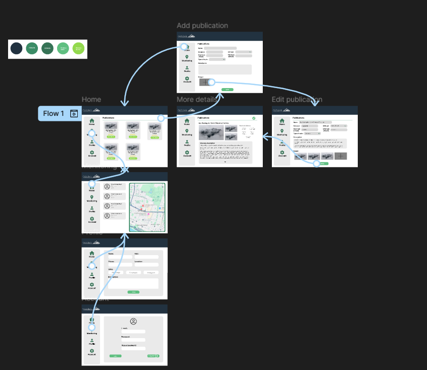
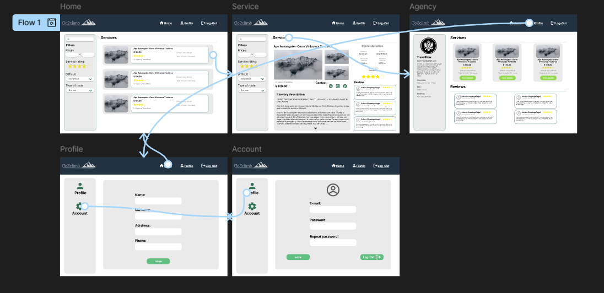

# Capitulo VI: Solution UX Design
## 6.1. Style Guidelines
### 6.1.1. General Style Guidelines
### 6.1.2. Web, Mobile & Devices Style Guidelines
## 6.2. Information Architecture
### 6.2.2. Labeling Systems
### 6.2.3. Searching Systems
### 6.2.4. SEO Tags and Meta Tags
### 6.2.5. Navigation Systems
## 6.3. Landing Page UI Design
### 6.3.1. Landing Page Wireframe
- Wireframe Agencia:  

- Wireframe Turista:

### 6.3.2. Landing Page Mock-up
- Mock-up Agencia:  

- Mock-up Turista:

## 6.4. Applications UX/UI Design
### 6.4.1. Applications Wireframes
- Aplicacion web para Agencias
    - Vista Home: Esta la vista al entrar en la aplicacion y es donde se pueden ver todas los servicios que ofrece la agencia.
    
    - Vista Monitoring: En este apartado la agencia puede monitorear la ubicacion de los turistas
    
    - Vista Profile: En esta apartado las agencias pueden ver toda su informacion registrada y tambien pueden editar y guardarla.
    
    - Vista Account: Aqui las agencias pueden editar la informacion de su cuenta, como el correo y la contraseña, además de poder cambiar su foto.
    

- Aplicacion web para Turistas
    - Vista Home: Esta la vista al entrar en la aplicacion y es donde se pueden ver todas los servicios de alpinismo, además de poder buscar mediante filtros.
    
    - Vista Service: En este apartado pueden ver los servicios con mayor detalle, como más fotos, la agencia que lo brinda, su descripcion, 
    
    - Vista Agency: Aqui se puede ver la informacion de las agencias, como ubicacion, RUC, telefono, todos los servicios que ofrecen, su valoracion y comentarios.
    
    - Vista Profile: En esta apartado los turistas pueden ver toda su informacion registrada y tambien pueden editar y guardarla.
    
    - Vista Account: Aqui los turistas pueden editar la informacion de su cuenta, como el correo y la contraseña, además de poder cambiar su foto.
    

-Aplicacion mobil para turistas
    En la aplicacion movil las personas podran sincronizar el modelo de las botas que esten usando con su celular para que puedan ver los datos que estan registrando en tiempo real como la cantidad de pasos, la distancia recorrida y su frecuencia cardiaca. Ademas, podran ver y editar su informacion personal e informacion sobre su cuenta.
      
      

### 6.4.2. Applications Wireflow Diagrams
- Sector Agencia
    - Añadir un nuevo servicio
     
    - Ver y editar un servicio
     
    - Monitorear la ubicacion de los turistas
     
    - Ver y editar información de la agencia
     
    - Ver y editar información de la cuenta
     

- Sector Turista
    - Aplicacion web
     
    - Aplicacion movil
    

### 6.5. Applications Prototyping
Se presenta el prototipo que se realizó en base a los mockups que se documentaron en puntos anteriores. El prototype nos permite evidenciar algunos flujos que se llevarán al desarrollo en código.

 

 
