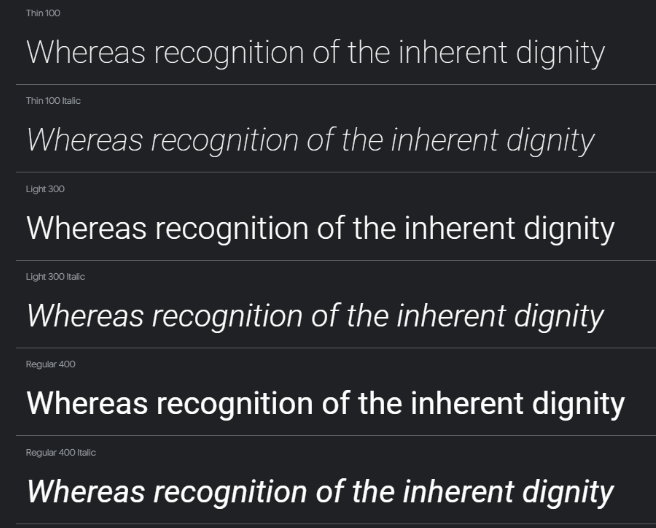
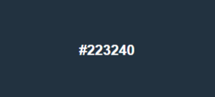
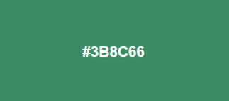
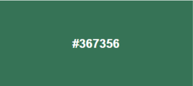
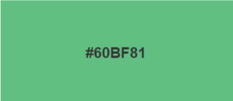
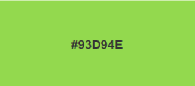

# Capitulo VI: Solution UX Design
## 6.1. Style Guidelines
### 6.1.1. General Style Guidelines
- Branding

En esta sección, definiremos el logotipo de nuestra aplicación con el objetivo de darla a conocer a los usuarios. Nuestro propósito principal es generar percepciones favorables, añadir valor a nuestros servicios y posicionar nuestra marca de manera efectiva en el mercado. A través de un diseño distintivo y coherente, buscamos crear una identidad visual que refleje la innovación y eficiencia de nuestros servicios.

- Typography

En esta sección, se definen las tipografías que serán el diferencial de nuestra aplicación. La elección de la tipografía es crucial para transmitir la personalidad y los valores de nuestra marca. Para ello, hemos seleccionado la tipografía Roboto, conocida por su legibilidad y modernidad, que complementa perfectamente la identidad visual de nuestra aplicación.

Roboto es una tipografía sans-serif que ofrece una apariencia limpia y profesional, ideal para interfaces digitales. Su diseño equilibrado y geométrico facilita la lectura en pantallas de diferentes tamaños, mejorando así la experiencia del usuario. Además, su versatilidad permite utilizarla en diversos contextos, desde títulos y encabezados hasta cuerpos de texto y botones de navegación.

- Roboto - Google Fonts

- Colors

En esta sección, se mostrará la paleta de colores que utilizaremos para la aplicación y se explicará dónde se aplicarán cada uno de ellos. La elección de estos colores no es arbitraria; cada uno ha sido seleccionado cuidadosamente para transmitir los valores de nuestra marca y mejorar la experiencia del usuario.

- Color general:
    - #223240
      Este color se utilizará en el header de la aplicación web y será el color principal de la aplicación móvil. Hemos elegido este tono oscuro y profesional para transmitir confianza y estabilidad.

- Fondos:
    - #3B8C66
      Este color se utilizará para el fondo de la landing page. El verde oscuro simboliza crecimiento y eficiencia.
      
- Iconos:
    - #367356
      Este color se aplicará a los iconos de la aplicación web y móvil. Un verde más suave que el de los fondos, este tono asegura que los iconos sean fácilmente reconocibles y visualmente agradables,                    mejorando la usabilidad sin distraer al usuario.
      
- Botones solos:
    - #60BF81
      Este color se utilizará para los botones dentro de la sección de perfil del usuario. Un verde vibrante que destaca sobre el fondo, facilitando la interacción del usuario con elementos importantes de la interfaz.
      
- Botones dentro:
        - #93D94E: Este color se utilizará para los botones de “ver detalles” en las secciones de servicios y publicaciones. Un verde claro y llamativo que invita a la acción, asegurando que los usuarios no pasen por alto estas opciones importantes.
      

- Spacing
En esta sección, se define el espaciado de los componentes de la aplicación para asegurarnos de que la interfaz sea agradable y fácil de usar para los usuarios. Un espaciado adecuado mejora la legibilidad y la navegación, creando una experiencia de usuario más cómoda y eficiente.

- Navbar:
        - Padding: 10px
        - Margin (arriba y abajo): 10px
        - Margin (derecha e izquierda): 20px

- Título:
        - Padding: 10px
        - Margin (abajo): 22px

- Perfil:
        - Margin (derecha e izquierda): 120px
        - Padding: 30px
  
- Dimensions

- Agencia

Para  las agencias adoptamos un tono claro y profesional. Nos enfocamos en proporcionar información detallada y precisa. Presentamos datos y ejemplos concretos que demuestran la eficiencia y los beneficios económicos de nuestra propuesta. Queremos que estas agencias vean en nosotros un socio confiable que les ayudará a mejorar su operativa y a ofrecer un mejor servicio a sus clientes.

- Aventurero

Para los usuarios aventureros, adoptamos un tono vibrante y emocionante. Queremos inspirar a estos viajeros a descubrir nuevas experiencias y a vivir aventuras inolvidables. Utilizamos un lenguaje sencillo y atractivo que resalta las oportunidades de exploración y diversión que ofrecemos. Nos esforzamos por crear una conexión emocional, transmitiendo la emoción y la pasión por los viajes y la aventura.

### 6.1.2. Web, Mobile & Devices Style Guidelines
-  Web Style Guidelines

   - Web Responsive
 
Se establece un diseño responsivo para que la aplicación pueda adaptarse a varias pantallas para garantizar una experiencia óptima para el usuario independientemente del dispositivo que utilice. La adaptabilidad del diseño incluye ajustes automáticos en el tamaño de los elementos, la disposición del contenido y la navegación, asegurando que la interfaz sea siempre accesible y funcional.
Navbar: Se utiliza una navbar para que el usuario pueda navegar por la aplicación de manera intuitiva

        
- Mobile Style Guidelines

- Accesibilidad

Se debe asegurar que la aplicación pueda estar disponible para todos los usuarios asegurando su funcionamiento la mayoría de los dispositivos móviles.
Navbar: En dispositivos móviles, la navbar se convierte en un menú desplegable para ahorrar espacio y mantener la interfaz limpia y ordenada.

## 6.2. Information Architecture
### 6.2.2. Labeling Systems
- Home

En esta sección, la agencia puede visualizar todas las publicaciones añadidas. Esta vista centralizada permite a los usuarios acceder rápidamente a las últimas actualizaciones y contenidos relevantes.

- Monitoring

En esta sección, la agencia puede visualizar el estado y el recorrido de los usuarios. Esta funcionalidad es crucial para el seguimiento y análisis del comportamiento del usuario, permitiendo a la agencia tomar decisiones informadas basadas en datos en tiempo real.

- Profile

En esta sección, la agencia puede visualizar y actualizar su perfil. Aquí, los usuarios pueden modificar su información personal, ajustar configuraciones y gestionar sus preferencias, asegurando que su perfil esté siempre actualizado y refleje sus necesidades actuales.

- Services

En esta sección, el usuario puede visualizar y elegir los servicios publicados por las agencias. Esta área está diseñada para ser intuitiva y fácil de navegar, permitiendo a los usuarios explorar y seleccionar los servicios que mejor se adapten a sus necesidades.

### 6.2.3. Searching Systems
- Barra de búsqueda

En esta sección, el usuario puede introducir el nombre del servicio que desea encontrar. La barra de búsqueda está diseñada para ser intuitiva y eficiente, permitiendo a los usuarios localizar rápidamente los servicios específicos que necesitan.

### 6.2.4. SEO Tags and Meta Tags
- Alt Text

Utiliza la etiqueta alt para describir las imágenes en las tarjetas de publicaciones.Esto ayuda a los motores de búsqueda a entender el contenido de las imágenes.
- Aria-Labels

Utiliza aria-label para describir la función de los botones. Para mejorar la accesibilidad de los usuarios que utilizan lectores de pantalla.
- Title

Añade la etiqueta title a los enlaces de navegación para proporcionar información adicional cuando el usuario pasa el cursor sobre ellos. 
- Header Tags

Utiliza etiquetas de encabezado adecuadas para las secciones principales.

### 6.2.5. Navigation Systems
- Menú desplegable

Será el principal sistema de búsqueda, a través del menú desplegable se accederá a las principales funciones de la aplicación, esta se mostrará en todo momento con el usuario, de tal manera que sepa donde se encuentra en cualquier momento.

## 6.3. Landing Page UI Design
### 6.3.1. Landing Page Wireframe
- Wireframe Agencia:  

- Wireframe Turista:

### 6.3.2. Landing Page Mock-up
- Mock-up Agencia:  

- Mock-up Turista:

## 6.4. Applications UX/UI Design
### 6.4.1. Applications Wireframes
- Aplicacion web para Agencias
    - Vista Home: Esta la vista al entrar en la aplicacion y es donde se pueden ver todas los servicios que ofrece la agencia.
    
    - Vista Monitoring: En este apartado la agencia puede monitorear la ubicacion de los turistas
    
    - Vista Profile: En esta apartado las agencias pueden ver toda su informacion registrada y tambien pueden editar y guardarla.
    
    - Vista Account: Aqui las agencias pueden editar la informacion de su cuenta, como el correo y la contraseña, además de poder cambiar su foto.
    

- Aplicacion web para Turistas
    - Vista Home: Esta la vista al entrar en la aplicacion y es donde se pueden ver todas los servicios de alpinismo, además de poder buscar mediante filtros.
    
    - Vista Service: En este apartado pueden ver los servicios con mayor detalle, como más fotos, la agencia que lo brinda, su descripcion, 
    
    - Vista Agency: Aqui se puede ver la informacion de las agencias, como ubicacion, RUC, telefono, todos los servicios que ofrecen, su valoracion y comentarios.
    
    - Vista Profile: En esta apartado los turistas pueden ver toda su informacion registrada y tambien pueden editar y guardarla.
    
    - Vista Account: Aqui los turistas pueden editar la informacion de su cuenta, como el correo y la contraseña, además de poder cambiar su foto.
    

-Aplicacion mobil para turistas
    En la aplicacion movil las personas podran sincronizar el modelo de las botas que esten usando con su celular para que puedan ver los datos que estan registrando en tiempo real como la cantidad de pasos, la distancia recorrida y su frecuencia cardiaca. Ademas, podran ver y editar su informacion personal e informacion sobre su cuenta.
      
      

### 6.4.2. Applications Wireflow Diagrams
- Sector Agencia
    - Añadir un nuevo servicio
     
    - Ver y editar un servicio
     
    - Monitorear la ubicacion de los turistas
     
    - Ver y editar información de la agencia
     
    - Ver y editar información de la cuenta
     

- Sector Turista
    - Aplicacion web
     
    - Aplicacion movil
    

### 6.5. Applications Prototyping
Se presenta el prototipo que se realizó en base a los mockups que se documentaron en puntos anteriores. El prototype nos permite evidenciar algunos flujos que se llevarán al desarrollo en código.

 

 
