

    

**Universidad Peruana de Ciencias Aplicadas**

**Ingeniería de Software**

Ciclo: 2024-2

Curso: Arquitecturas de Software Emergentes

Sección: SW82

Profesor: Rojas Malasquez, Royer Edelwer

---

# Informe del TB1

## Xtream

### Go2Climb

#### Team Members

| Integrante                               | Código     |
| ---------------------------------------- | ---------- |
| Caceres Bueno, Arnol Omar                | U20201B338 |
| Quispe Villegas, Emerson Gerardo         | U20181G936 |
| Stefano Márquez, Piero                   | U201816402 |
| Surco Reyes, Franco Marcelo Manuel       | U202015132 |
| Valencia Rivera, Fiorella Viviana        | U20201B944 |

<Septiembre 2024>

 
 

# Tabla de contenidos

- [Capítulo I: Introducción](#capítulo-i-introducción)
    - [1.1. Startup Profile](#11-startup-profile)
        - [1.1.1. Descripción de la Startup](#111-descripción-de-la-startup)
        - [1.1.2. Perfiles de integrantes del equipo](#112-perfiles-de-integrantes-del-equipo)
    - [1.2. Solution Profile](#12-solution-profile)
        - [1.2.1 Antecedentes y problemática](#121-antecedentes-y-problemática)
        - [1.2.2 Lean UX Process](#122-lean-ux-process)
            - [1.2.2.1. Lean UX Problem Statements](#1221-lean-ux-problem-statements)
            - [1.2.2.2. Lean UX Assumptions](#1222-lean-ux-assumptions)
            - [1.2.2.3. Lean UX Hypothesis Statements](#1223-lean-ux-hypothesis-statements)
            - [1.2.2.4. Lean UX Canvas](#1224-lean-ux-canvas)
    - [1.3. Segmentos objetivos](#13-segmentos-objetivos)
- [Capítulo II: Requirements Elicitation & Analysis](#capítulo-ii-requirements-elicitation--analysis)
    - [2.1. Competidores](#21-competidores)
        - [2.1.1. Análisis competitivo](#211-análisis-competitivo)
        - [2.1.2. Estrategias y tácticas frente a competidores](#212-estrategias-y-tácticas-frente-a-competidores)
    - [2.2. Entrevistas](#22-entrevistas)
        - [2.2.1. Diseño de entrevistas](#221-diseño-de-entrevistas)
        - [2.2.2. Registro de entrevistas](#222-registro-de-entrevistas)
        - [2.2.3. Análisis de entrevistas](#223-análisis-de-entrevistas)
    - [2.3. Needfinding](#23-needfinding)
        - [2.3.1. User Personas](#231-user-personas)
        - [2.3.2. User Task Matrix](#232-user-task-matrix)
        - [2.3.3. User Journey Mapping](#233-user-journey-mapping)
        - [2.3.4. Empathy Mapping](#234-empathy-mapping)
        - [2.3.5. As-is Scenario Mapping](#235-as-is-scenario-mapping)
    - [2.4. Ubiquitous Language](#24-ubiquitous-language)
- [Capítulo III: Requirements Specification](#capítulo-iii-requirements-specification)
    - [3.1. To-Be Scenario Mapping](#31-to-be-scenario-mapping)
    - [3.2. User Stories](#32-user-stories)
    - [3.3. Impact Mapping](#33-impact-mapping)
    - [3.4. Product Backlog](#34-product-backlog)
- [Capítulo IV: Solution Software Design](#capítulo-iv-solution-software-design)
    - [4.1. Strategic-Level Domain-Driven Design](#41-strategic-level-domain-driven-design)
        - [4.1.1. Design Purpose](#411-design-purpose)
        - [4.1.2. Context Mapping](#412-context-mapping)
            - [4.1.2.1. Primary Functionality](#4121-primary-functionality)
            - [4.1.2.2. Quality attribute Scenarios](#4122-quality-attribute-scenarios)
            - [4.1.2.3. Constraints](#4123-constraints)
        - [4.1.3. Architectural Drivers Backlog](#413-architectural-drivers-backlog)
        - [4.1.4. Architectural Design Decisions](#414-architectural-design-decisions)
        - [4.1.5. Quality Attribute Scenario Refinements](#415-quality-attribute-scenario-refinements)
    - [4.2. Tactical-Level Domain-Driven Design](#42-tactical-level-domain-driven-design)
        - [4.2.1. EventStorming](#421-eventstorming)
        - [4.2.2. Candidate Context Discovery](#422-candidate-context-discovery)
        - [4.2.3. Domain Message Flows Modeling](#423-domain-message-flows-modeling)
        - [4.2.4. Bounded Context Canvases](#424-bounded-context-canvases)
        - [4.2.5. Context Mapping](#425-context-mapping)
    - [4.3. Software Architecture](#43-software-architecture)
        - [4.3.1. Software Architecture System Landscape Diagram](#431-software-architecture-system-landscape-diagram)
        - [4.3.2. Software Architecture Context Level Diagrams](#432-software-architecture-context-level-diagrams)
        - [4.3.3. Software Architecture Container Level Diagrams](#433-software-architecture-container-level-diagrams)
        - [4.3.4. Software Architecture Deployment Diagrams](#434-software-architecture-deployment-diagrams)
- [Capítulo V: Tactital-Level Software Design](#capítulo-v-tactital-level-software-design)
    - [5.1. Bounded Context Account](#51-bounded-context-account)
        - [5.1.1. Domain Layer](#511-domain-layer)
        - [5.1.2 Interface Layer](#512-interface-layer)
        - [5.1.3 Application Layer](#513-application-layer)
        - [5.1.4 Infrastructure Layer](#514-infrastructure-layer)
        - [5.1.6 Bounded Context Software Architecture Component Level Diagrams](#516-bounded-context-software-architecture-component-level-diagrams)
        - [5.1.7 Bounded Context Software Architecture Code Level Diagrams](#517-bounded-context-software-architecture-code-level-diagrams)
            - [5.1.7.1 Bounded Context Domain Layer Class Diagrams](#5171-bounded-context-domain-layer-class-diagrams)
            - [5.1.7.2 Bounded Context Database Design Diagram](#5172-bounded-context-database-design-diagram)
    - [5.2 Bounded Context Agency](#52-bounded-context-agency)
        - [5.2.1 Domain Layer](#521-domain-layer)
        - [5.2.2 Interface Layer](#522-interface-layer)
        - [5.2.3 Application Layer](#523-application-layer)
        - [5.2.4 Infrastructure Layer](#524-infrastructure-layer)
        - [5.2.6 Bounded Context Software Architecture Component Level Diagrams](#526-bounded-context-software-architecture-component-level-diagrams)
        - [5.2.7 Bounded Context Software Architecture Code Level Diagrams](#527-bounded-context-software-architecture-code-level-diagrams)
            - [5.2.7.1 Bounded Context Domain Layer Class Diagrams](#5271-bounded-context-domain-layer-class-diagrams)
            - [5.2.7.2 Bounded Context Database Design Diagram](#5272-bounded-context-database-design-diagram)
    - [5.3 Bounded Context Service](#53-bounded-context-service)
        - [5.3.1 Domain Layer](#531-domain-layer)
        - [5.3.2 Interface Layer](#532-interface-layer)
        - [5.3.3 Application Layer](#533-application-layer)
        - [5.3.4 Infrastructure Layer](#534-infrastructure-layer)
        - [5.3.6 Bounded Context Software Architecture Component Level Diagrams](#536-bounded-context-software-architecture-component-level-diagrams)
        - [5.3.7 Bounded Context Software Architecture Code Level Diagrams](#537-bounded-context-software-architecture-code-level-diagrams)
            - [5.3.7.1 Bounded Context Domain Layer Class Diagrams](#5371-bounded-context-domain-layer-class-diagrams)
            - [5.3.7.2 Bounded Context Database Design Diagram](#5372-bounded-context-database-design-diagram)
    - [5.4 Bounded Context Reservation](#54-bounded-context-reservation)
        - [5.4.1 Domain Layer](#541-domain-layer)
        - [5.4.2 Interface Layer](#542-interface-layer)
        - [5.4.3 Application Layer](#543-application-layer)
        - [5.4.4 Infrastructure Layer](#544-infrastructure-layer)
        - [5.4.6 Bounded Context Software Architecture Component Level Diagrams](#546-bounded-context-software-architecture-component-level-diagrams)
        - [5.4.7 Bounded Context Software Architecture Code Level Diagrams](#547-bounded-context-software-architecture-code-level-diagrams)
            - [5.4.7.1 Bounded Context Domain Layer Class Diagrams](#5471-bounded-context-domain-layer-class-diagrams)
            - [5.4.7.2 Bounded Context Database Design Diagram](#5472-bounded-context-database-design-diagram)
    - [5.5 Bounded Context IoT Monitoring](#55-bounded-context-iot-monitoring)
        - [5.5.1 Domain Layer](#551-domain-layer)
        - [5.5.2 Interface Layer](#552-interface-layer)
        - [5.5.3 Application Layer](#553-application-layer)
        - [5.5.4 Infrastructure Layer](#554-infrastructure-layer)
        - [5.5.6 Bounded Context Software Architecture Component Level Diagrams](#556-bounded-context-software-architecture-component-level-diagrams)
        - [5.5.7 Bounded Context Software Architecture Code Level Diagrams](#557-bounded-context-software-architecture-code-level-diagrams)
            - [5.5.7.1 Bounded Context Domain Layer Class Diagrams](#5571-bounded-context-domain-layer-class-diagrams)
            - [5.5.7.2 Bounded Context Database Design Diagram](#5572-bounded-context-database-design-diagram)
    - [5.6 Bounded Context Subscription](#56-bounded-context-subscription)
        - [5.6.1 Domain Layer](#561-domain-layer)
        - [5.6.2 Interface Layer](#562-interface-layer)
        - [5.6.3 Application Layer](#563-application-layer)
        - [5.6.4 Infrastructure Layer](#564-infrastructure-layer)
        - [5.6.6 Bounded Context Software Architecture Component Level Diagrams](#566-bounded-context-software-architecture-component-level-diagrams)
        - [5.6.7 Bounded Context Software Architecture Code Level Diagrams](#567-bounded-context-software-architecture-code-level-diagrams)
            - [5.6.7.1 Bounded Context Domain Layer Class Diagrams](#5671-bounded-context-domain-layer-class-diagrams)
            - [5.6.7.2 Bounded Context Database Design Diagram](#5672-bounded-context-database-design-diagram)
- [Capítulo V: Tactital-Level Software Design](#capitulo-vi-solution-ux-design)
    - [6.1. Style Guidelines](#61-style-guidelines)
        - [6.1.1. General Style Guidelines](#611-general-style-guidelines)
        - [6.1.2. Web, Mobile & Devices Style Guidelines](#612-web-mobile--devices-style-guidelines)
    - [6.2. Information Architecture](#62-information-architecture)
        - [6.2.2. Labeling Systems](#622-labeling-systems)
        - [6.2.3. Searching Systems](#623-searching-systems)
        - [6.2.4. SEO Tags and Meta Tags](#624-seo-tags-and-meta-tags)
        - [6.2.5. Navigation Systems](#625-navigation-systems)
    - [6.3. Landing Page UI Design](#63-landing-page-ui-design)
        - [6.3.1. Landing Page Wireframe](#631-landing-page-wireframe)
        - [6.3.2. Landing Page Mock-up](#632-landing-page-mock-up)
    - [6.4. Applications UX/UI Design](#64-applications-uxui-design)
        - [6.4.1. Applications Wireframes](#641-applications-wireframes)
        - [6.4.2. Applications Wireflow Diagrams](#642-applications-wireflow-diagrams)
- [Conclusiones]()

# Capítulo I: Introducción

## 1.1. Startup Profile
### 1.1.1. Descripción de la Startup
Existe una creciente comunidad de personas apasionadas por el montañismo y las caminatas de larga distancia, quienes disfrutan de la adrenalina que trae explorar terrenos elevados y desafiantes. En respuesta a sus necesidades, hemos desarrollado una solución innovadora que combina la tecnología IoT con la experiencia al aire libre. Nuestro proyecto se centra en mejorar la seguridad de los deportes de aventura, específicamente en el alpinismo y montañismo, mediante el uso de tecnología avanzada. 
Hemos desarrollado una aplicación web destinada a agencias especializadas, donde pueden cargar información sobre sus servicios y conectar con clientes que buscan experiencias seguras y emocionantes en terrenos montañosos.
La clave de nuestra propuesta son las botas inteligentes, equipadas con tecnología IoT que permite a las agencias monitorear en tiempo real la ubicación, cantidad de pasos, distancia recorrida, y la frecuencia cardíaca de los grupos que contraten sus servicios. Esto proporciona una capa adicional de seguridad, permitiendo a las agencias seguir el progreso de sus clientes y reaccionar rápidamente ante cualquier emergencia o situación de riesgo. Por su parte, los clientes pueden utilizar la plataforma para explorar una amplia gama de agencias afiliadas y, además, visualizar en sus dispositivos móviles los datos que las botas inteligentes están registrando mientras las llevan puestas, brindando una experiencia tanto segura como personalizada.

Nuestro enfoque garantiza que tanto las agencias como los aventureros puedan disfrutar de estas actividades con tranquilidad, sabiendo que cuentan con herramientas tecnológicas que priorizan su seguridad en cada paso.

**Nuestra misión** Proporcionar una experiencia de alpinismo y montañismo segura y confiable mediante el uso de tecnología avanzada, ofreciendo a las agencias y aventureros herramientas innovadoras como las botas inteligentes, que permiten monitorear en tiempo real la ubicación y estado físico de los usuarios. Nos comprometemos a brindar tranquilidad a las agencias y garantizar la seguridad de los clientes en cada aventura.

**Nuestra visión** Convertirnos en la plataforma líder global para agencias de montañismo y deportes de aventura, reconocidos por integrar tecnología de punta que revoluciona la seguridad en actividades al aire libre. Aspiramos a ser el estándar de seguridad en la industria, ofreciendo soluciones innovadoras que transformen cómo las personas exploran el mundo de manera segura y conectada.
### 1.1.2. Perfiles de integrantes del equipo

#### Arnol Omar Caceres Bueno  

+ Soy un estudiante del quinto año de la carrera de Ingeniería de Software y practicante de Analista de datos. Me considero fan de la tecnología y el aprendizaje continuo, estoy siempre buscando aportar de manera positiva y significativa al desarrollo y mejora constante de las actividades propuestas.

#### Emerson Gerardo Quispe Villegas

+ Soy estudiante de la carrera de ingeniería de software. Me gusta mucho la música y casi siempre realizo mis actividades escuchando canciones. Me gusta trabajar en equipo, ya que todos los integrantes podemos proponer ideas y corregir errores del otro para lograr nuestro objetivo. Una de mis cualidades es ser responsable, paciente, puntual y tener compromiso con los trabajos que me designen.

#### Piero Stefano Márquez

+

#### Franco Marcelo Manuel Surco Reyes

+

#### Valencia Rivera Fiorella Viviana

+ Estudiante de la carrera de Ingeniería de Software en la Universidad Peruana de Ciencias Aplicadas (UPC). Mi enfoque se centra en el desarrollo backend y la ciencia de datos. Poseo conocimiento en lenguajes de programación como Java, Python y C#. Además, tengo un interés particular en el campo de la ciberseguridad. 

## 1.2. Solution Profile
### 1.2.1 Antecedentes y problemática
**Antecedente**  
En los últimos años, el turismo de aventura, en especial actividades como el alpinismo y el montañismo, ha crecido de manera significativa a nivel mundial. Según la Adventure Travel Trade Association (ATTA), el sector ha mostrado una tasa de crecimiento anual constante. Esto se debe a que los turistas buscan experiencias más extremas y desafiantes, también crece la demanda de soluciones que proporcionen una mayor sensación de seguridad y control. Según estudios de seguridad en actividades de montaña, uno de los principales problemas es la falta de seguimiento en tiempo real de los excursionistas, lo que dificulta la rápida respuesta en caso de emergencias, ya que, el montañismo es un deporte de alto riesgo, con desafíos como el clima extremo, terrenos accidentados y la fatiga física, que pueden poner en peligro la seguridad de los participantes.

**Problematica**  
*What?*  
Desarrollar una bota inteligente que ayude a monitorear en tiempo real el estado de los turistas
*Why?*  
Para mejorar el cuidado de los turistas y garantizar un viaje placentero
*Who?*  
El equipo se encargará del desarrollo de la aplicación web y móvil  y de la bota inteligente para monitorear el estado de los viajeros
*When?*  
En los próximos 3 meses  
*Where?*  
El proyecto se puede avanzar de manera online y algunas reuniones se realizarán en la universidad  
*How?*  
Tendremos reuniones y designaremos tareas para el desarrollo del proyecto  
*How Much?*  
El precio estimado no es calculable, debido a que usaremos herramientas gratuitas para el desarrollo de este proyecto  

### 1.2.2 Lean UX Process.
#### 1.2.2.1. Lean UX Problem Statements.
**Agencias de alpinismo**  
Nuestro equipo ha observado que las agencias de alpinismo se encuentran aisladas en el mercado por otras con mayor reconocimiento o por no proporcionar muchos medios de contacto, por lo que se pierde un posible banco de clientes en el sector alpinismo de miles de turistas que llegan a visitar los distintos lugares anualmente.
Por ello, ¿Cómo podemos mejorar la situación de estas empresas para mostrar a posibles clientes las ventajas que poseen frente a su competencia volviéndose más accesibles a una mayor cantidad de público apasionado por los deportes de aventura?

**Turista Aventurero**  
Nuestro equipo ha observado que cientos de turistas recurren anualmente a centros de alpinismo en busca de la mejor opción para sus viajes de aventura de alpinismo y montañismo, en casos, no contando con los mejores estándares de seguridad, costos o experiencias. Esto ocasiona que los turistas no se encuentren satisfechos con los servicios brindados por las agencias.
Por lo que, ¿Cómo podemos ayudar a que los turistas puedan elegir la mejor opción de agencia para sus trayectos de aventura, y a la vez resguardar su seguridad y experiencia?

#### 1.2.2.2. Lean UX Assumptions.
**Business Assumptions**
 - *Creemos que nuestros clientes necesitan* un servicio que les ayude a monitorear su estado en tiempo real cuando realicen actividades extremas
 - *Estas necesidades se pueden resolver* con una bota inteligente que le permita a los encargados de las agencias saber la situación actual de sus clientes
 - *Nuestros clientes iniciales* son las agencias de turismo que quieran implementar novedosos métodos de seguridad para sus clientes
 - *El valor número 1 que un cliente quiere de nuestros servicios* es el compromiso y responsabilidad que tenemos con la funcionalidad de los productos
 - *El cliente también puede obtener estos servicios adicionales:* Poder llegar a más aventureros mediante la aplicación web
 - *Vamos a adquirir la mayoría de mis clientes a través de* publicidad en redes sociales como TikTok, Facebook e Instagram
 - *Haremos dinero a través de* modelos de suscripción y la compra de botas inteligentes
 - *La competencia principal en el mercado es* escaso, ya que no hay otro producto similar en el País que otorgue los mismos servicios.
 - *Lo venceremos debido* a la implementación de métodos novedosos de seguridad que ayuden con el bienestar de los aventureros
 - *Nuestro mayor riesgo es* que no tengamos suficientes afiliaciones de agencias.
 - *Resolveremos esto a través de* pruebas gratuitas en las agencias para que puedan probar este nuevo método de seguridad.

**Business Outcomes**
 - Incremento en la satisfacción del cliente: Aumentar el índice de satisfacción del cliente en un 25% dentro de los primeros 12 meses al proporcionar un servicio de monitoreo en tiempo real de sus clientes, lo que se refleja en encuestas de satisfacción y tasas de retención.

 - Mayor compromiso y responsabilidad con la salud de los aventureros: Incrementar la lealtad de las agencias en un 50% y obtener al menos un 25% de recomendaciones positivas dentro de los primeros 18 meses, enfocándonos en el compromiso y responsabilidad con el correcto de funcionamiento de las aplicaciones y el producto.

 - Mejora en la seguridad de los excursionistas: Reducir en un 50% el tiempo de respuesta ante situaciones de emergencia en actividades de alpinismo y montañismo, y aumentar en un 35% la precisión del monitoreo en tiempo real de la ubicación y estado físico de los participantes dentro del primer año, gracias al uso de las botas inteligentes y la plataforma de seguimiento en tiempo real.

 - Generación de ingresos sostenibles: Lograr un crecimiento mensual del 10% en suscripciones y ventas de botas inteligentes, alcanzando ingresos recurrentes y estables que permitan la mejora continua de nuestros servicios en un plazo de 18 meses.

 - Diferenciación y liderazgo en el mercado nacional: Capturar al menos el 25% del mercado nacional dentro de los primeros 24 meses y posicionarnos como líderes en el sector, siendo reconocidos por al menos el 40% de los clientes potenciales como la opción principal frente a la competencia extranjera.

**User Assumptions**
- *¿Quién es nuestro usuario?*  
Agencias que brinden servicios de alpinismo y montañismo, y personas que realicen actividades deportivas extremas

- *¿Dónde encaja nuestro producto en su vida cotidiana?*  
En las agencias nuestro servicio en el área de trabajo y en los turistas aventureros en sus actividades recreativas

- *¿Qué problemas tiene nuestro producto y cómo se pueden resolver?*  
Tomando en cuenta la economía del país, el costo de obtener los servicios puede ser un poco elevado, pero se puede resolver mostrando su funcionalidad y calidad de los productos, además de dar pruebas gratuitas con los planes de suscripción.

- *¿Cuándo y cómo es usado nuestro producto?*  
Nuestros servicios de aplicaciones para el contacto de las agencias con los aventureros puede ser usado en cualquier momento y el uso de las botas inteligentes puede ser usado cuando los disponga la agencia y se puede usar como medio de monitoreo de su estado actual

- *¿Qué características son importantes?*  
Visualizar el estado de actual de los turistas aventureros, saber su ubicación y poder obtener datos como la cantidad de pasos y distancia recorrida

- *¿Cómo debe verse nuestro producto y cómo debe comportarse?*  
La interfaz de usuario de la aplicación web y móvil debe ser sencilla de comprender, con un diseño de colores atractivos que ayude a identificar cada botón

**User Outcomes**

- Mayor tranquilidad y confianza: Poder manejar la información de sus servicios en la aplicación web de manera eficaz y mantener el correcto funcionamiento del monitoreo en tiempo real, les ayudará a brindar un mejor servicio a sus clientes.

- Correcto funcionamiento de los servicios ofrecidos: Mantener las aplicaciones con una navegación fluida y con una visualización intuitiva, ayudará a las agencias poder manejar la información de los servicios que ofrece y permitirá a los turistas ver toda la información necesaria para su contacto.

- Acciones frente a detecciones anómalas: Desarrollar un sistema de alertas a las agencias cuando las botas inteligentes registren métricas fuera de lo establecido, permitiendo una acción inmediata ante una situación anómala.

- Multiplicidad de suscripciones: Acceso a servicios y productos exclusivos a través de distintos niveles de suscripción. Permitiendo elegir una cantidad necesaria de botas inteligentes para cubrir la demanda de las agencias. Esto ofrece flexibilidad y valor añadido, adaptándose a las necesidades específicas de cada agencia.

- Seguridad y confianza: Mayor confianza en un producto respaldado por influencers y deportistas extremos reconocidos. Las campañas de marketing informativas y educativas aumentan el conocimiento sobre la seguridad y las innovaciones en los equipamientos, ayudando a los usuarios a tomar decisiones informadas y sentir que están eligiendo un servicio líder en el mercado.

**Features**
- Función de monitoreo en tiempo real: Permitir a las agencias monitorear en tiempo real los datos que registran las botas de sus clientes (geolocalización, frecuencia cardiaca, cantidad de pasos y distancia recorrida) a través de la aplicación web con alertas personalizadas.
- Testeos de las aplicaciones: Mantener un periodo de testo de las aplicaciones ofrecidas, ayudará a detectar posibles problemas para poder solucionarlos y evitar inconvenientes al momento que las agencias o aventureros hagan uso de estas.
- Alertas personalizadas: Personalizar las alertas que le lleguen a las agencias por un caso anómalo, les permitirá tener una reacción más rápida con solo verla o escucharla, dependiendo de la métrica que esté registrando datos anormales.
- Modelos de suscripción: Ofrecer múltiples niveles de suscripción con beneficios adicionales, como un plan básico para la publicación de sus agencias hasta planes personalizados con un logo de la agencia en las botas.
- Programa de embajadores y campañas de marketing: Implementar un programa de embajadores de marca que incluya influencers reconocidos que realizan deportes extremos, junto con campañas de marketing en redes sociales y medios tradicionales que destaquen las características únicas del producto y servicio, consolidando la percepción de liderazgo y diferenciación en el mercado.

#### 1.2.2.3. Lean UX Hypothesis Statements.
**Creemos que** el incremento en la satisfacción del cliente **se logrará si** la agencia de alpinismo **obtiene** mayor tranquilidad y confianza **con** la función de monitoreo en tiempo real.

**Creemos que** un mayor compromiso y responsabilidad con la salud de los aventureros **se logrará si** la agencia de alpinismo **obtiene** un correcto funcionamiento de los servicios ofrecidos **con** testeos de las aplicaciones

**Creemos que** la mejora en la seguridad de los excursionistas **se logrará si** la agencia de alpinismo **obtiene** acciones frente a detecciones anómalas **con** alertas personalizadas

**Creemos que** la generación de ingresos sostenibles **se logrará si** la agencia de alpinismo **obtiene** multiplicidad de suscripciones **con** los modelos de suscripción.

**Creemos que** la diferenciación y liderazgo en el mercado nacional **se logrará si** la agencia de alpinismo **obtiene** seguridad y confianza **con** el programa de embajadores y campañas de marketing.

#### 1.2.2.4. Lean UX Canvas.
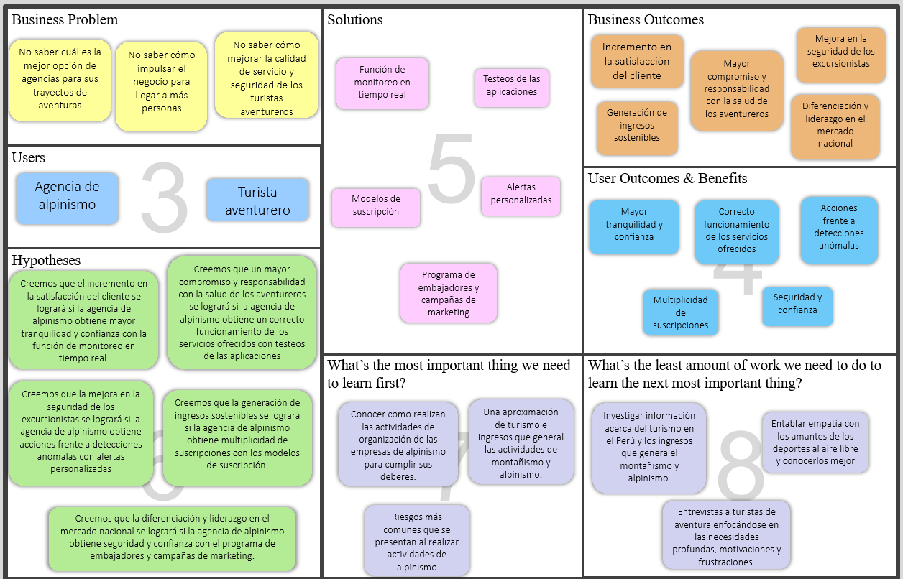

## 1.3. Segmentos objetivos.
Como miembros del equipo, consideramos que es importante tener en cuenta a quienes se dirigirá nuestro proyecto. Por tanto, nos enfocaremos en dos segmentos objetivo:

 - **Agencia de Alpinismo:**
El primer segmento son las agencias de alpinismo o montañismo que organizan las pasantías y cuentan con servicios en su sector, que necesiten incrementar su banco de clientes y darse a conocer. Las agencias de alpinismo son organizaciones dedicadas a ofrecer servicios especializados para personas interesadas en actividades de aventura en entornos naturales desafiantes, como montañas, volcanes o zonas de gran altitud. Estas agencias suelen proporcionar guías expertos, equipos de seguridad y planificación logística para garantizar la experiencia de sus clientes. Su objetivo principal es brindar experiencias seguras y bien organizadas, ofreciendo opciones de rutas y excursiones adaptadas a diferentes niveles de habilidad y condiciones físicas. También buscan destacar en un mercado competitivo y atraer a clientes que valoren tanto la aventura como la seguridad.

 - **Turistas Aventureros:**
El segundo segmento, consta de las personas interesadas en el alpinismo entre los 18 a 40 años que requieran contratar servicios de agencias de alpinismo o montañismo. Los turistas aventureros son personas que disfrutan de experiencias extremas y desafiantes al aire libre. Les motiva la exploración de paisajes naturales inhóspitos, la superación de límites físicos y la conexión con la naturaleza en su estado más puro. Suelen estar en busca de nuevas emociones, ya sea a través del montañismo, senderismo, escalada o actividades similares, y están dispuestos a asumir riesgos calculados para vivir experiencias únicas. Además de la adrenalina, valoran la preparación física, el conocimiento técnico y la planificación para asegurar que su aventura se desarrolle de manera exitosa.

# Capítulo II: Requirements Elicitation & Analysis

## 2.1. Competidores.
Se ha identificado tres principales competidores directos, los cuáles son los siguientes:
**Casa de Guías**
Son organizadores de eventos de alpinismo que ofrecen clases de alpinismo y cursos en general relacionados al alpinismo. Además, organizan escaladas de montañas y tracking para personas mayores de edad.
**Peruvian Andes Aventureros**
Son organizadores de eventos de alpinismo que ofrecen tours de montañismo, fogatas y turismo en los Andes peruanos con experimentados guías profesionales locales y certificados por la UIAGM a turistas de todas partes del mundo a un precio económico
**Tripadvisor**
Una aplicación web en donde se muestran opiniones del usuario de diferentes actividades y lugares turísticos de todo el mundo. En base a estas opiniones, cuando los turistas vayan a visitar cierto lugar, estarán mayor informados sobre la calidad y precio de los lugares donde vayan a visitar.

### 2.1.1. Análisis competitivo.
A continuación, se realiza un análisis competitivo de los tres competidores seleccionados y nuestra aplicación en un cuadro comparativo para diferenciar las oportunidades y debilidades de cada uno de ellos.
<!-- Sección de Encabezado y Preguntas Clave -->
<table>
  <tr>
    <th colspan="2">Competitive Analysis Landscape</th>
  </tr>
  <tr>
    <td rowspan="2">¿Por qué llevar a cabo este análisis?</td>
  </tr>
  <tr>
    <td>Este análisis se está llevando a cabo para especificar la diferencia entre nosotros y los principales competidores encontrados.</td>
  </tr>
</table>

<!-- Espacio entre tablas para simular la división como en las imágenes -->
 

<!-- Sección de Análisis Competitivo -->
<table>
  <tr>
    <th colspan="2"></th>
    <th>
      

        
      

      

        Go2Climb
      

    </th>
    <th>
      

        
      

      

        Casa de Guías
      

    </th>
    <th>
      

        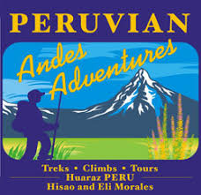
      

      

        Peruvian Andes Aventureros
      

    </th>
    <th>
      

        
      

      

        Tripadvisor
      

    </th>
  </tr>
  <tr>
    <td rowspan="2"><strong>Perfil</strong></td>
    <td>Overview</td>
    <td>App web para búsqueda y contratación de servicios de alpinismo.</td>
    <td>Organizadores de eventos de alpinismo</td>
    <td>Organizadores de eventos de alpinismo</td>
    <td>App web que brinda recomendaciones de actividades y lugares</td>
  </tr>
  <tr>
    <td>Ventaja competitiva ¿Qué valor ofrece a los clientes?</td>
    <td>Además de poder facilitar la contratacion de servicios, ofrece un sistema de monitoreo en tiempo real</td>
    <td>Clases de alpinismo y cursos en general relacionados al alpinismo. Además, organizan escaladas de montañas y tracking.</td>
    <td>Ofrecen tours de montañismo, fogatas y turismo</td>
    <td>Amplia variedad de recomendaciones de todos los lugares y actividades del mundo</td>
  </tr>
  <tr>
    <td rowspan="2"><strong>Perfil Marketing</strong></td>
    <td>Mercado Objetivo</td>
    <td>Personas relacionadas al alpinismo y montañismo entre 18 a 40 años</td>
    <td>Mayores de edad que realizan alpinismo</td>
    <td>Mayores de edad que realizan alpinismo</td>
    <td>Mayores de edad que deseen viajar</td>
  </tr>
  <tr>
    <td>Estrategias de marketing</td>
    <td>App web con interfaz amigable, con interfaz fácil e intuitiva, seguridad al seleccionar agencias de alpinismo y convenios con influencers conocidos</td>
    <td>Ofertas para personas que se inscriban con anticipación a sus clases</td>
    <td>Paquete de ofertas si ingresan en grupos</td>
    <td>Página #1 de recomendaciones de eventos y lugares turísticos</td>
  </tr>
  <tr>
    <td rowspan="3"><strong>Perfil de Producto</strong></td>
    <td>Productos & Servicios</td>
    <td>Intermediarios entre alpinistas y empresas/agencias de alpinismo</td>
    <td>Ofrecen cursos de alpinismo e idiomas</td>
    <td>Turismo y tour</td>
    <td>Información de tours</td>
  </tr>
  <tr>
    <td>Precios & Costos</td>
    <td>Las membresías tienen costos desde 25 soles mensuales y el costo del par de botas inteligentes es 150 dólares para las agencias y para los turistas es gratis</td>
    <td>640 soles</td>
    <td>600 soles</td>
    <td>Gratis</td>
  </tr>
  <tr>
    <td>El canal de distribución será web</td>
    <td>Web</td>
    <td>Web</td>
    <td>Web y Móvil</td>
    <td>Web y Móvil</td>
  </tr>
  <tr>
    <td rowspan="5"><strong>Análisis SWOT</strong></td>
    <td colspan="5">Realice esto para su startup y sus competidores. Sus fortalezas deberían apoyar sus oportunidades y contribuir a lo que ustedes definen como su posible ventaja competitiva.</td>
  </tr>
  <tr>
    <td>Fortalezas</td>
    <td>App web con interfaz amigable y siempre actualizada.</td>
    <td>Ofrecen tanto eventos de montañismo y alpinismo como cursos </td>
    <td>Variedad de actividades</td>
    <td>Amplia información de los lugares y actividades turísticos</td>
  </tr>
  <tr>
    <td>Debilidades</td>
    <td>Ser una empresa emergente con una lista de socios (empresas de alpinismo) escasa</td>
    <td>Precios altos</td>
    <td>Interfaz web poco intuitiva, no tan llamativa</td>
    <td>Posibilidad de tener opiniones falsas o manejadas.</td>
  </tr>
  <tr>
    <td>Oportunidades</td>
    <td>Poder incentivar a jóvenes por la interfaz moderna</td>
    <td>Al enseñar pueden obtener clientes potenciales para sus propios eventos de alpinismo</td>
    <td>Seguridad, dado que tienen pruebas fotográficas de cada tour </td>
    <td>Permite obtener dinero al promocionar eventos turísticos</td>
  </tr>
  <tr>
    <td>Amenazas</td>
    <td>No somos organizadores de estos eventos para alpinismo</td>
    <td>Responsables si sus alumnos sufren accidentes</td>
    <td>Desarrollo deficiente en su App web</td>
    <td>Posible cierre del turismo de un país</td>
  </tr>
</table>

### 2.1.2. Estrategias y tácticas frente a competidores.
En base al análisis competitivo de nuestros competidores que elaboramos previamente, hemos identificado las fortalezas, debilidades, oportunidades y amenazas de nuestros competidores. Donde aplicaremos estrategias y tácticas para afrontarlo.

**Liderazgo en costes**
Las agencias de alpinismo podrán promocionar sus tours a un bajo costo. Además, los turistas de aventura podrán contratar los tours a precios especiales si lo realizan desde nuestra plataforma. 
**Estrategia de diferenciación**
Nuestra aplicación ofrece la innovativa idea de ofrecer a los turistas de aventuras una serie de tours organizadas por las agencias de alpinismo. Del mismo modo, las agencias de alpinismo podrán tener otra vía en donde se puedan promocionar. Este modelo de negocio nos permite diferenciarnos de la competencia debido a que no nos centramos en un solo segmento objetivo, sino que, al juntar los turistas con las agencias, nos permitirá contar con un mejor posicionamiento del mercado. 
**Estrategia de enfoque**
Actualmente las personas utilizan mucho la tecnología para poder obtener información sobre algo que desean. Por ello, hemos decidido crear una aplicación para que en una sola página, puedan obtener todos los tours que se ofrecen y ellos sin mayor esfuerzo puedan decidir que tour obtener.incluir **Táctica de expansión**.
Si la aplicación logra tener mucho éxito, se planea no solo ofrecer tours de alpinismo, sino cualquier variedad de tours como city tour, eventos, entre otros. De esta manera, ampliamos nuestro segmento objetivo lo que conlleva a más clientes y un mejor posicionamiento en el mercado.

## 2.2. Entrevistas.
En esta sección se va a realizar las entrevistas a representantes de cada segmento objetivo para conocer el mercado que se está abordando. Para ello, se va a realizar el diseño de las entrevistas y luego un análisis de las respuestas de los entrevistados.
### 2.2.1. Diseño de entrevistas.
#### Preguntas principales y complementarias para entrevistas
Como parte del análisis needfinding del proyecto, un paso importante que hay que seguir es la realización de entrevistas a los segmentos objetivos para la captación de necesidades y oportunidad de enfatizar con ellos en busca de la creación de la mejor solución software.
A continuación, se presenta la línea de secuencias y la lista de preguntas a realizar a nuestros usuarios.
##### Segmento de agencias de alpinismo
**Bienvenida** 

Hola buenas (días/tardes/noches), estoy trabajando en una idea de negocio que pretende ayudar a mejorar la experiencia de alpinismo en un ambiente mucho más social y conociendo personas qué también disfruten este deporte. Tenemos una serie de teorías respecto a los problemas que se enfrentan los turistas de aventura al momento de buscar empresas de alpinismo confiables y quisiera contrastarlas contigo para ver si estamos en lo cierto o no. Si te parece comenzaré con algunas preguntas a continuación y al finalizar te cuento de qué va el proyecto.

**Datos demográgicos** 

¿Podrías contarnos un poco más de ti? (Un poco de tu historia, quien eres, tu edad, dónde vives, estudios, si es que trabajas actualmente, responsabilidades cotidianas, hobbies, etc.)
La Personas debe responder lo siguiente, de lo contrario preguntar sobre estos tópicos:
- Nombre
- Edad
- Distrito de residencia
- Estado civil
- Familia
- Ocupación
- Hobbies
Ahora a manera dinámica, mencionaré algunas frases y responde como mejor creas conveniente (esta parte realizar como un tipo de ping pong de preguntas y respuestas):
- Programas de televisión de la infancia
- Carro particular o transporte público
- Android o Apple
- Windows, Linux o Mac
- Aprendizaje guiado o autodidacta
- Ver una película o leer un libro
- Redes sociales más utilizadas
- Menciona 2 otras Apps (diferente a redes sociales, pueden ser juegos de celular también) que utilices frecuentemente
- Plan telefónico prepago o postpago
- Banco preferido

**Principales problemas**
- ¿Cuánta experiencia tienes como guía en alpinismo?
- ¿Has utilizado servicios de publicidad para incrementar el flujo de clientes? ¿Qué servicios has utilizado? ¿Cuán efectivos han sido?
- ¿Qué medios utilizas para comunicarte con tus clientes? ¿Cuál es tu favorito?
- ¿Has tenido alguna mala experiencia con tus clientes cuando contratan tus - servicios? ¿Cómo fue?
- ¿Cómo gestionas los pagos de tus servicios con tus clientes?
- ¿Qué crees que buscan los turistas cuando buscan contratar algún servicio de alpinismo?
- ¿Cuántas personas en promedio anual usan tu servicio? 
- ¿Consideras que hay una comunidad grande de personas que realizan montañismo o alpinismo? (la respuesta será no así que.) ¿Cómo crees que se podría cambiar eso?
- ¿Qué crees que es lo que el cliente valora más del servicio?
- ¿Crees que publicándolos en una plataforma enfocada en montañismo aumentaría o disminuiría el alcance que tienes actualmente? ¿Por qué?

**Breve Pitch**
Estamos desarrollando una plataforma web enfocada en ofrecer servicios de alpinismo. Las empresas podrán publicitarse en la plataforma, junto con los precios, rutas, itinerarios, horarios y experiencias. Asimismo, los turistas podrán seleccionar la empresa de su preferencia, reaccionar a las experiencias y calificar a la empresa. 

**Compromiso**

¿Qué te ha parecido? ¿Tienes alguna recomendación para nosotros?
Gracias por habernos concedido esta entrevista, tus respuestas son valiosas para nosotros
Como último punto, nos gustaría pedirte una reunión otra vez de aquí a unas cuantas semanas, donde te podremos mostrarte cómo va el desarrollo de nuestra idea, donde podremos mostrarte el prototipo de nuestra aplicación y obtener retroalimentación de ti una vez más.

##### Segmento de turistas de aventura
**Bienvenida**

Hola buenas (días/tardes/noches), estoy trabajando en una idea de negocio que pretende ayudar a mejorar la experiencia de alpinismo en un ambiente mucho más social y conociendo personas qué también disfruten este deporte. Tenemos una serie de teorías respecto a los problemas que se enfrentan los turistas de aventura al momento de buscar empresas de alpinismo confiables y quisiera contrastarlas contigo para ver si estamos en lo cierto o no. Si te parece comenzaré con algunas preguntas a continuación y al finalizar te cuento de qué va el proyecto.
**Datos demográgicos**
¿Podrías contarnos un poco más de ti? (Un poco de tu historia, quien eres, tu edad, dónde vives, estudios, si es que trabajas actualmente, responsabilidades cotidianas, hobbies, etc.)
La Personas debe responder lo siguiente, de lo contrario preguntar sobre estos tópicos:
- Nombre
- Edad
- Distrito de residencia
- Estado civil
- Ocupación
- Hobbies
Ahora a manera dinámica, mencionaré algunas frases y responde como mejor creas conveniente (esta parte realizar como un tipo de ping pong de preguntas y respuestas):
- Programas de televisión de la infancia
- Programas de televisión de la actualidad
- Carro particular o transporte público
- Android o Apple
- Windows, Linux o Mac
- Aprendizaje guiado o autodidacta
- Ver una película o leer un libro
- Redes sociales más utilizadas
- Menciona 2 otras Apps (diferente a redes sociales, pueden ser juegos de celular también) que utilices frecuentemente
- Plan telefónico prepago o postpago
- Banco preferido

**Principales problemas**

- ¿A qué se dedica? ¿Qué proyectos está desarrollando actualmente? (Tal vez ya mencionó algo de esto antes, pero hay que tratar de que cuente más sobre lo que hace)
- ¿Cuentas con experiencia previa en el montañismo?
- ¿Fuiste por tu cuenta o contrataste un servicio de guía de montaña?
- Si contrataste un servicio, ¿Qué medio utilizaste para hacerlo?
- ¿Qué criterios tienes en cuenta antes de contratar un guía?
- ¿Qué garantía tenías de que el servicio era confiable?
- ¿Alguna vez tuviste una mala experiencia con un servicio? ¿Cómo fue?
- ¿Qué es lo que más valoras en tu experiencia?
- ¿Cómo sería un servicio ideal de alpinismo?
- ¿Qué información acerca de la empresa de alpinismo es relevante para ti?

**Breve Pitch**

Estamos desarrollando una plataforma web enfocada en ofrecer servicios de alpinismo. Las empresas podrán publicitarse en la plataforma, junto con los precios, rutas, itinerarios, horarios y experiencias. Asimismo, los turistas podrán seleccionar la empresa de su preferencia, reaccionar a las experiencias y calificar a la empresa. 

### 2.2.2. Registro de entrevistas.
A continuación, se registra las entrevistas realizadas, así como los resúmenes de las mismas por cada segmento objetivo:

**Agencias de alpinismo**
1. Entrevista 1
_Nombres y Apellidos:_ Miguel Fernandez 
_Edad:_ 29 años  
_Distrito:_ Lima   
_Evidencia de la reunión:_  
 
 [URL del video ](https://upcedupe-my.sharepoint.com/:v:/g/personal/u20191d928_upc_edu_pe/ER7GV75NnPJLvkwslZks9QsBR6O4RCoUHN4zGCrllrkXuQ?e=VYQ94o&nav=eyJwbGF5YmFja09wdGlvbnMiOnsic3RhcnRUaW1lSW5TZWNvbmRzIjoxLjY3fX0%3D ) 
 _Timing y duración:_ 3:34  
_Resumen sobre la entrevista:_
Miguel tiene 5 años trabajando como guía de alpinismo y ha utilizado la publicidad para aumentar sus clientes. Además, usa Instagram, Twitter y WhatsApp para contactar a sus clientes. Utiliza más Instagram porque utiliza el chat y publicidad a la vez. Los pagos que se realiza son bancarios. Los turistas van a aprobar nuevas experiencias y les gusta mirar la naturaleza. Anualmente, van 1700 turistas aproximadamente. Los turistas valoran como los tratan los guías y las actividades que realizan. Por último, una página web donde puedan publicar sus actividades y tour les ayudarían a conseguir más clientes.

2. Entrevista 2
_Nombres y Apellidos:_ Anthony Poma 
_Edad:_ 23 años  
_Distrito:_ Ancash   
_Evidencia de la reunión:_  
 
 [URL del video ](https://upcedupe-my.sharepoint.com/:v:/g/personal/u201910669_upc_edu_pe/ETIxF3tx1hFKoOYkBE2Edq8BeGeSIA2Ogyxy_OtkHI6_pA?e=LH0xhf) 
 _Timing y duración:_ 08:48 
_Resumen sobre la entrevista:_
El entrevistado llamado Anthony, nos indica que realizó alpinismo más de una vez en el nevado Huaytapallana, siempre hubo los personajes llamados “jaladores” para adquirir clientes, lo cual le resulta molesto al momento de ir en cada oportunidad y tomar el servicio. “Las agencias no se interesan en el bienestar del cliente”, menciona él, “solo buscan dar el más mínimo precio sin importar la buena estadía o importancia del aventurero”, “tratan de bajar al más mínimo precio con tal de llamar la atención del cliente y los elijan en lugar de las demás agencias competidoras”. Todas las frases dichas por él, reflejan la importancia del precio del servicio, la atención, el valor agregado que debería de haber, el desconocimiento que los turistas podrían tener al momento de buscar agencias, y la buena experiencia que el aventurero cliente debería de sentir al visitar un lugar turístico de alpinismo y alta montaña. “Todos los turistas nacionales e internacionales deberían de tener un buen centro de reunión de todos los servicios de las agencias aventureras de alpinismo y alta montaña en cada parte del Perú”, fin de la entrevista.

**Segmento: Turistas de aventura**

1. Entrevista 1
_Nombres y Apellidos:_ Sebastián Andre Ramírez Mendez 
_Edad:_ 21 años  
_Distrito:_ La Victoria   
_Evidencia de la reunión:_  
 
 [URL del video ](https://drive.google.com/file/d/1EjnNiZVlBCHAXOTVOutou847M-yQrY5Z/view?usp=sharing)   
 _Timing y duración:_ 6:26 
_Resumen sobre la entrevista:_
Sebastián es un estudiante universitario que tiene como hobby montar bicicleta. Ha realizado circuitos en el morro solar en bicicleta, al principio, contrató un servicio para conocer el lugar, por Facebook, conoció el servicio. Considera que un servicio es de confianza cuando se ha publicitado, que tenga bastante actividad y cuente con referencias. No ha tenido malas experiencias con el servicio, aunque ha escuchado de algunas referencias malas. Considera que un buen servicio de alpinismo desde un principio debe evaluar las capacidades físicas de cada uno como para tomar el servicio, recibir pautas sobre qué hacer, tener un kit médico para emergencias en el camino.

2. Entrevista 2
_Nombres y Apellidos:_ Nilda Sharol Flores Ramirez
_Edad:_ 23 años  
_Distrito:_ Breña   
_Evidencia de la reunión:_  
 
 [URL del video ](https://drive.google.com/file/d/1genVCJ0k061ZB1JBHSYZwbMMnX0Iq5Dl/view?usp=share_link)   
 _Timing y duración:_ 04:24  
_Resumen sobre la entrevista:_  
Nilda Sharol es un estudiante de Química Farmacéutica y egresado de la carrera técnica en farmacia, actualmente estudia y trabaja en su especialidad. Su principal pasatiempo es realizar actividades deportivas y realizar viajes a lugares turísticos en sus vacaciones. Usualmente Nilda usa las redes sociales con frecuencia para realizar sus actividades diarias. Ella nos cuenta que tiene experiencia en montañismo y contrató una empresa de servicio de guía de montañismo mediante las redes sociales y página web. Los criterios relevantes que considera para contratar a un guía con experiencia en la materia y recomendación de los usuarios que ya contrataron. Nunca tuvo una mala experiencia por el momento porque Nilda es muy cuidadosa antes de contratar a un guía de montañismo y el lugar a elegir. Ella valora de forma muy relevante en su experiencia el tiempo, dinero y el lugar elegido. Finalmente, nos indica que el servicio ideal de alpinismo se adapte a las posibilidades del usuario y los servicios importantes de una empresa sean seguridad y confianza.

3. Entrevista 3
_Nombres y Apellidos:_  Laura Cardenas
_Edad:_ 30 años  
_Distrito:_ Miraflores   
_Evidencia de la reunión:_  
 
 [URL del video ](https://upcedupe.sharepoint.com/:v:/s/open/Eb54tn_QlpJEhly4vrNQjrYBHwlR_o7i4WJvkddYZLC2Eg?e=U1ZB6H)   
 _Timing y duración:_ 10:06  
_Resumen sobre la entrevista:_  
La entrevistada, Laura, nos indica que de entre todos los puntos existentes a tomar en cuenta al contratar un servicio de alpinismo, más allá del precio o cantidad de personas que estén incluidas en la expedición, le interesan tres puntos específicos: las certificaciones del guía, la experiencia en la ruta y que tan efectiva es la comunicación con el guía. Las certificaciones de una manera dan fidelidad de que es un servicio serio y seguro. La experiencia, este es el punto más primordial para Laura, porque más allá de las certificaciones como tal se tiene que tener la seguridad de qué el guía conoce la ruta por la que se dirigen, de tal manera que se eviten accidentes y contratiempos en la montaña. Por último, para Laura es muy importante el tema de la comunicación, porque esto ayuda a entrar en confianza con él guía, de tal manera que se puede tener una mejor experiencia.

### 2.2.3. Análisis de entrevistas.
#### Agencias de alpinismo
El rango de edades de gerentes de guías de agencias se encuentra entre los 25 a 40 años, con un promedio simple de 34 años. Estas personas se encuentran influenciadas por redes sociales como Facebook e Instagram, en menor medida por Tripadvisor, utilizan celulares con sistema operativo Android y computadoras con Windows. Muestran una personalidad amable y abierta a nuevas maneras de publicitarse. Son personas con experiencia en el montañismo. En la actualidad, priorizan la publicitación por redes sociales o la captación. Para las agencias, no es una buena época para el alpinismo puesto que se ven apartadas por agencias más grandes o en caso contrario por agencias piratas y de mala reputación que disminuyen el negocio. Para ellos, es un gran problema que no exista nueva entrada de clientes, y que solo se mantengan viejos conocidos.   
#### Turista aventurero
El rango de edades de los turistas se sitúa entre los 20 a 35 años, con un promedio simple de 28 años. Estas personas se encuentran constantemente influenciadas por las redes sociales, en especial por las principales tales como Facebook, Instagram y Twitter, poseen una personalidad, mayoritariamente, extrovertida y amigable, además, se muestran como personas amantes de los viajes y aventuras. Los dispositivos que más utilizan son celulares y laptops, en la que predomina el sistema operativo Windows y Android. Para acceder a un servicio de montañismo o alpinismo, en su mayoría, se guían por la reputación local de la empresa, precios y comparativa general con negocios aledaños (experiencia y costos). Un criterio que se toma en cuenta es el precio del servicio, pues se considera que mientras mayor sea, es mayor la fiabilidad. Lo que más se valora de un servicio es el profesionalismo, la amabilidad del guía y apartado de seguridad. Para elegir consideran necesario tener recomendación y tener experiencia por los tiempos de presencia en el servicio al cliente.  
## 2.3. Needfinding.
En esta sección, se va a analizar toda la información recolectada de las entrevistas realizadas en distintos artefactos con el objetivo de que los requerimientos de la aplicación se aproximen lo más posibles a las necesidades de los segmentos objetivo.
### 2.3.1. User Personas.
Los user personas nos permite recopilar las principales características de cada segmento objetivo representados en una persona. En este caso, la información se recopiló de las entrevistas realizadas en las secciones previas.

- Agencia de alpinismo:  
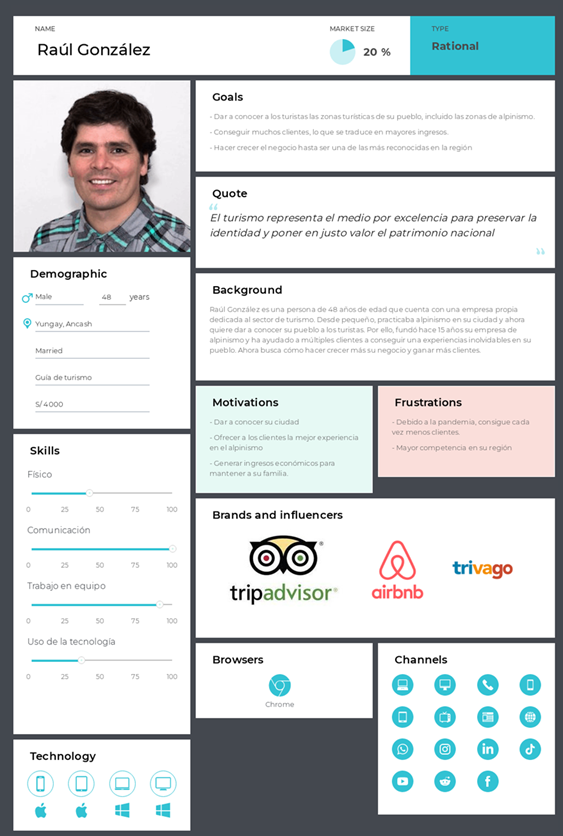  
- Turista aventurero:  
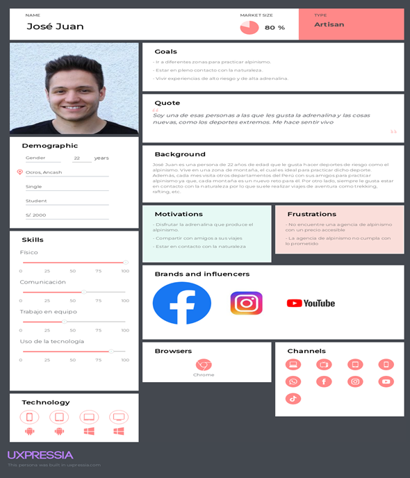 

### 2.3.2. User Task Matrix.
Los User Task Matrix describen las tareas de usuario que va a tener la aplicación a desarrollar y por cada segmento objetivo, se coloca la frecuencia e importancia que va a incidir sobre ellas, con el objetivo de validar la importancia de cada funcionalidad de la aplicación 

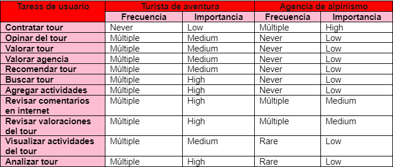 

### 2.3.3. User Journey Mapping.
Los User Journey Maps describen el camino que siguen los usuarios para encontrar la solución software que le ayudará a cumplir sus metas. En este caso, nuestros segmentos objetivos realizarán las siguientes actividades:

- Turista aventurero 
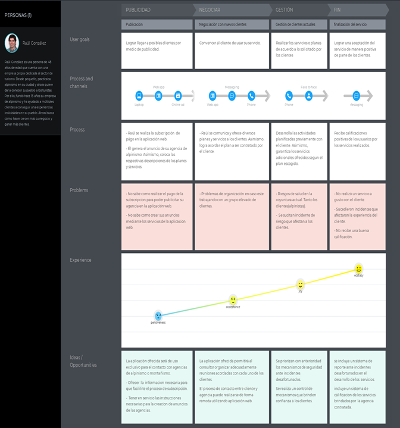 

- Turista aventurero 
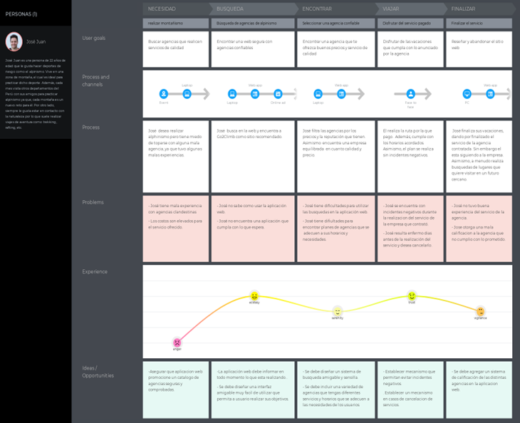 

### 2.3.4. Empathy Mapping.
Lo siguiente a evaluar como parte del needfinding es a nuestros segmentos objetivos a través de Empathy Maps, con el objetivo de conocer mejor a los usuarios a los que está destinado Go2Climb en busca de mejorar, nuevos enfoques y herramientas necesarias.
- Agencia de alpinismo:  
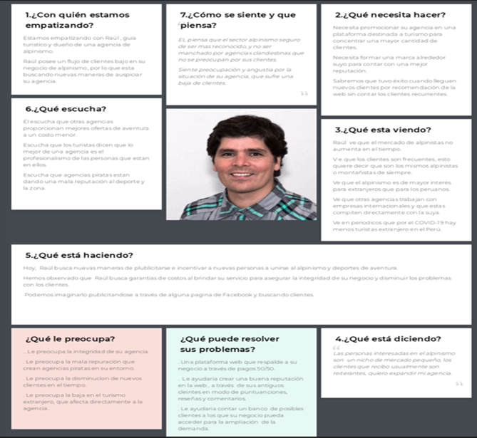
- Turista aventurero:  
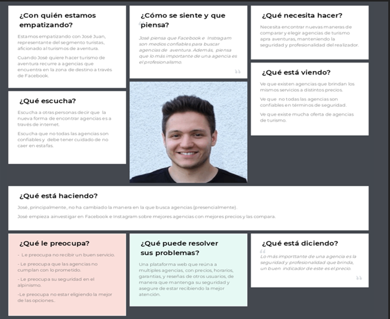

### 2.3.5. As-is Scenario Mapping.
Otro recurso que utilizaremos es el As-is Scenario maps, debido a que nos ayuda en el proceso de needfinding, definiendo a través de una serie de pasos lo que nuestros usuarios hacen, piensan y sienten en cada paso del logro de sus actividades. 
- Agencia de alpinismo:  
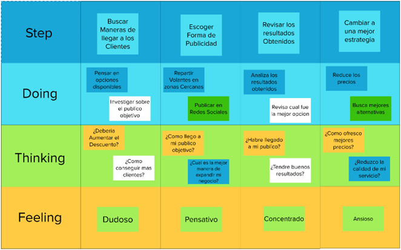
- Turista aventurero:  
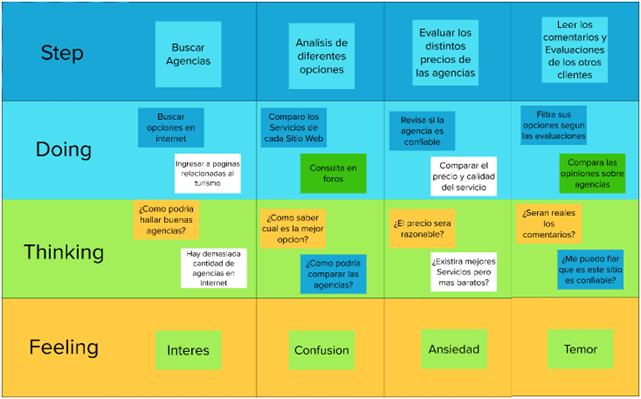

## 2.4. Ubiquitous Language.
- **Aclimatación**   
Definición: La adaptación fisiológica del cuerpo humano a un estrés externo que provoca una tolerancia mayor a ese estrés. Se trata de una adaptación de corto tiempo que se pierde si no se está en ese estrés.
- **Adaptación**   
Cambios en la estructura del organismo o sus procesos fisiológicos que le permiten ajustarse al medio. Se refiere uno a la adaptación cuando es permanente.
- **Albedo**  
Definición: (del latín: albedo, blancura) En física y astronomía, número que indica la proporción de la luz incidente (u otra radiación) que es reflejada por una superficie. 
- **Alópatas**   
Definición: . La alopatía es el método terapéutico cuyos medicamentos producen, en un organismo sano, fenómenos diferentes de los que caracterizan las enfermedades en que se emplean: debe distinguirse entre alopatía y homeopatía
- **Andinismo**  
Definición: Se dice del montañismo practicado en la Cordillera de los Andes, en América del Sur.
- **Anaeróbico**  
Definición: Que se produce sin la presencia del oxígeno. En entrenamiento, se refiere a que no se utilice el oxígeno para producir el movimiento.
- **Astrolabio**  
Definición: Un astrolabio es un instrumento que permite determinar las posiciones de las estrellas sobre la bóveda celeste.
- **Azimut**   
Definición: Angulo medido horizontalmente respecto al norte geográfico. Se mide en grados, minutos y segundos de arco. 
- **Campismo**  
Definición: Actividad que tiene como objetivo exclusivo pernoctar en algún lado fuera y lejos de las ciudades o de otras poblaciones. 
- **CIME**   
Definición: Siglas para el Curso de Introducción al Montañismo y la Exploración.
- **Col**   
Definición: En alta montaña, collado, puerto.
- **Crampones** (Atención de Emergencia):
Definición: Herramienta metálica que se coloca en la planta de las botas para tener agarre en superficies de nieve y hielo

# Capítulo III: Requirements Specification

## 3.1. To-Be Scenario Mapping.
Son mapas que al igual que los As-is Scenario maps describen las acciones, pensamientos y sentimientos de nuestros usuarios, con la diferencia que en esta tenemos los pasos que los usuarios siguen en nuestra aplicación web.

- Agencia de alpinismo:  
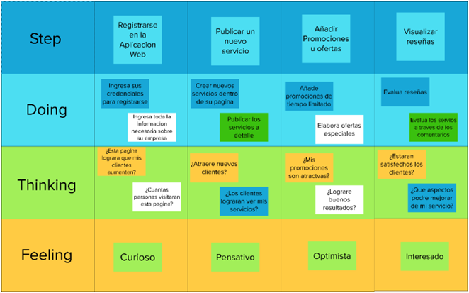
- Turista aventurero:  
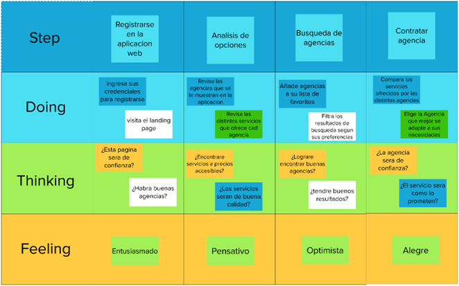

## 3.2. User Stories.

A continuación, se especificarán los epics y los user stories con el objetivo de expresar las necesidades del usuario en funcionalidades para la aplicación.

- Epics:  
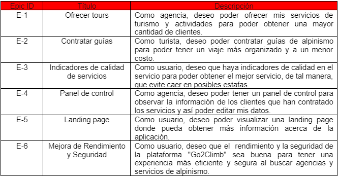

| Epic / Story ID | Título                                                                                      | Descripción                                                                                                                                                                                                                                                                        | Criterios de Aceptación                                                                                                                                                                                                                                                                                                                                                                                                                                                                                                                                                                                                                                                                                                                                                              | Relacionado con (Epic ID) |
|-----------------|---------------------------------------------------------------------------------------------|------------------------------------------------------------------------------------------------------------------------------------------------------------------------------------------------------------------------------------------------------------------------------------|--------------------------------------------------------------------------------------------------------------------------------------------------------------------------------------------------------------------------------------------------------------------------------------------------------------------------------------------------------------------------------------------------------------------------------------------------------------------------------------------------------------------------------------------------------------------------------------------------------------------------------------------------------------------------------------------------------------------------------------------------------------------------------------|---------------------------|
| US001           | Añadir servicio                                                       | Como agencia deseo agregar mis servicios para que mis clientes sepan más sobre lo que ofrezco                                                                                                                 | SCENARIO 1: Agencia desea añadir un nuevo servicio. Dado que la agencia ha validado sus credenciales en la plataforma Cuando la agencia hace clic en el botón para crear un nuevo servicio. SCENARIO 2: Agencia desea programar la creación de un nuevo servicio Dado que la agencia ha validado sus credenciales en la plataforma Y quiere programar la creación de un servicio Cuando presione en agregar servicio E ingrese la información del servicio SCENARIO 3: Agencia desea añadir un nuevo servicio, pero no completa todos los campos del formulario Dado que la agencia se encuentra en el formulario de creación de un nuevo servicio Cuando la agencia no completa todos los campos requeridos Entonces la aplicación web le resalta los campos que aún faltan completar en color rojo y no le permite crear dicho servicio.                                                                                                                                                                                                     | EP001                     |
| US002           | Personalizar viaje                                                     | Como turista deseo personalizar el viaje que haré con una agencia, modificando aspectos del viaje para tener una mejor experiencia                                                                                                             | SCENARIO 1: Turista quiera comprar varios paquetes para disfrutar del servicio en grupo. Dado que se encuentra en el inicio de la plataforma. Cuando seleccione un servicio de interés. Y presione en el botón llamado “personas” Entonces se mostrará una lista de opciones donde podrá seleccionar la cantidad de personas que desean adquirir los paquetes.  SCENARIO 2: Turista quiere proponer una fecha para la realización del servicio adquirido Dado que se encuentra en el inicio de la plataforma Cuando seleccione un servicio de interés Y presión en el botón llamado “fecha de salida” Entonces se abrirá un menú donde podrá indicar la fecha en que quiere realizar su viaje. SCENARIO 3: Turista quiere reservar un viaje, pero no completa algunos campos obligatorios.Dado que se encuentra en el menú de reserva de una agencia Cuando no complete algunos campos obligatorios como número de personas o fecha del viaje Entonces la aplicación web le resalta en rojo dichos campos y no le permite concluir con la reserva                                                                                                                                                                                                                                                                                                          | EP002                     |
| US003           | Visualizar reseña Real                                                  | Como agencia deseo visualizar las reseñas que tiene mi negocio para saber que puedo mejorar o agregar.                                                                                   | SCENARIO 1: Agencia quiere ver las reseñas de sus serviciosDado que la agencia ya ha cumplido con varios servicios Y los turistas han realizado reseñas sobre alguno de sus servicios Cuando la agencia ingrese a su perfil Entonces en la parte final podrá visualizar la reseña que los usuarios han realizado en base a su experiencia.   SCENARIO 2: Agencia no tiene reseña de sus servicios Dado que la agencia aun no cuenta con servicios realizados Cuando ingrese a su perfil Y se encuentre en la sección de reseñas Entonces el sitio le indica que el servicio aun no cuenta con reseñas.                                                                                                                                                                                                                                                | EP003                     |
| US004           | Ver ofertas                                               | Como turista deseo ver ofertas y paquetes recomendados de diferentes agencias para escoger la mejor opción que se acomode a lo que necesito.                                                                                        | SCENARIO 1: Turista quiere ver paquetes en ofertas Dado que el turista quiere emprender un nuevo viaje Y entra a la aplicación web Cuando entre a la página principal de la aplicación web Entonces el sitio le muestra en la primera sección las ofertas disponibles.   SCENARIO 2: Turista quiere ver los paquetes que le recomienda la aplicación web Dado que el turista quiere emprender un nuevo viaje Y entra a la aplicación web Cuando entre a la página principal de la aplicación web Entonces el sitio le muestra secciones donde hallará paquetes en base a su popularidad, cercanía y viajes anteriores.                                                                                                                                                                              | EP003                     |
| US005           | Crear ofertas                                                      | Como agencia deseo crear ofertas y descuentos de mis servicios para atraer a más clientes.                              | SCENARIO 1: Agencia ingresa la información completa para crear la oferta Dado que he validado mis credenciales Y me encuentro en mi perfil Cuando de click en el botón agregar servicio Y complete los datos del servicio Entonces debajo del precio habrá un botón el cual habilitará el formulario para ingresar una oferta.    SCENARIO 2: Agencia no ingresa la información completa para crear la oferta Dado que he valido mis credenciales Y me encuentro en mi perfil Cuando de click en el botón agregar servicio  Y habilite el formulario de oferta y no ingrese la información solicitada Entonces se hará un foco de color rojo en los campos que falte rellenar.                                                                                                                                                                        | EP001                     |
| US006           | Buscar agencias                                                               | Como turista deseo buscar agencias haciendo uso de varios filtros para escoger la mejor agencia según lo que necesito.                                                                                         | SCENARIO 1: Turista desea filtrar su búsqueda por el nombre del servicio Dado que el turista quiere realizar un viaje en alguna agencia Cuando el turista hace clic en “Buscar” Y escriba el nombre del servicio de interés Entonces le aparecerá las distintas agencias que ofrecen estos servicios juntos con sus precios y valoraciones.   SCENARIO 2: Turista desea filtrar su búsqueda por un intervalo de precios Dado que el turista quiere realizar un viaje con alguna agencia Y solo quiera ver las opciones con unos determinados precios Cuando escriba el servicio que quiera, le dé a buscar e ingrese los precios mínimos y máximos Entonces aparecerá los servicios que ofrecen precios en dicho intervalo.  SCENARIO 3: Turista desea filtrar su búsqueda por la valoración del servicio Dado que el turista quiere realizar un viaje con alguna agencia Y solo quiera ver las opciones con determinadas calificaciones por servicio Cuando escriba el servicio que quiera, le dé a buscar e ingrese la valoración deseada  Entonces aparecerá los servicios que estén en el rango de valoración seleccionada por el filtro. SCENARIO 4: Turista desea filtrar su búsqueda por la valoración de la agencia que la ofrece Dado que el turista quiere realizar un viaje con alguna agencia Y solo quiera ver las opciones con determinadas calificaciones por agencia organizadora Cuando escriba el servicio que quiera, le dé a buscar e ingrese la valoración deseada  Entonces aparecerá los servicios que estén en el rango de valoración seleccionada por el filtro.                                                                                                                                                                                                                                           | EP002                     |
| US007           | Ver valoraciones                                                             | Como turista deseo ver las valoraciones de otros usuarios con cada agencia para saber si la agencia es segura o de confianza.                                                                                                  | SCENARIO 1: Ver valoraciones de una agencia que tiene calificaciones Dado que el turista desea ver valoraciones de alguna agencia Y hace click en el sitio de la agencia Entonces en la sección de reseñas podrá visualizar la valoración que tiene dicha agencia. SCENARIO 2: Ver valoraciones de una agencia que aún no tiene calificaciones Dado que el turista desea ver valoraciones de alguna agencia Y hace click en el sitio de la agencia Entonces en la sección de reseñas podrá visualizar las puntuaciones en el nivel más bajo (0.0 estrellas).                                                                                                                                        | EP003                     |
| US008           | Editar página de negocio                                                          | Como agencia deseo editar la página de mi negocio para colocar toda mi información y los medios de contacto.                                                                 | SCENARIO 1: Agencia quiere editar su información e ingresa todos los campos obligatorios Dado que la agencia ha cambiado la información Y quiere dar a conocer a sus clientes sobre estos nuevos cambios Cuando ingrese a la página de su negocio Y le da clic en “Editar información”  Entonces la agencia podrá editar los distintos campos de datos que haya cambiado su negocio. SCENARIO 2:  Agencia quiere editar su información y no ingresa todos los campos obligatorios Dado que la agencia ha dado click a editar información Cuando edite la información deseada Y le haya faltado ingresar algún valor de un campo obligatorio Entonces el sistema le muestra un foco de color rojo en la casilla donde falta ingresar información.                                                                                                                                                                                                  | EP004                    |
| US009           | Cambiar plan de suscripción                                               | Como agencia deseo cambiar mi plan de suscripción para ofrecer más servicios a mis clientes.                                                                    | SCENARIO 1: Agencia desea cambiar de plan de suscripción e ingrese todos los campos Dado que la agencia ha validado sus credenciales Y posea actualmente un plan de suscripción Cuando haga click en cambiar plan E ingrese la información de pago y seleccione el nuevo plan Entonces el sistema mostrara un mensaje de confirmación del cambio del plan. SCENARIO 2: Agencia desea cambiar de plan de suscripción, pero no ingresa todos los campos Dado que la agencia ha validado sus credenciales Y posea actualmente un plan de suscripción Cuando haga click en cambiar plan  Y le falta ingresar o seleccionar algún campo Entonces el sistema le mostrara el error con un color rojo.                                      | EP004                   |
| US010           | Crear promociones                                                            | CComo agencia deseo crear campañas de promoción para llegar a más clientes.                                                                       | SCENARIO 1: Agencia quiere promocionar un servicio nuevo Dado que la agencia quiere llegar a más clientes  Y decida promocionar un servicio nuevo Cuando le da click en la opción de añadir servicio E ingresa la información solicitada y presione en “Continuar” Entonces el sistema le mostrará el formulario para poder promocionar el servicio. SCENARIO 2:  Agencia quiere promocionar un servicio anteriormente creado Dado que la agencia quiere llegar a más clientes Y decida promocionar un servicio que ya ha creado Cuando le da click en editar el servicio de interés Y presione en continuarEntonces podrá visualizar el formulario el cual tendrá que rellenar para promocionar el servicio.                                                                                                                                                                 | EP001                     |
| US011           | Calificar servicio                                                         | Como turista deseo calificar el servicio que contraté para mostrar mi agrado o desagrado y más usuarios sepan sobre el mismo                                                                              | SCENARIO 1: Turista desea calificar un servicio que aún no ha sido calificado por él o ella Dado que el viaje del turista ha finalizado Y quiere calificar el servicio que se le brindó Cuando ingrese a la sección de “Servicios contratados” Y presione en “Calificar servicio” Entonces el turista podrá visualizar el formulario para calificar el servicio contratado.  Escenario 2: Turista desea calificar un servicio que ya ha sido calificado por él o ella Dado que el viaje del turista ha finalizado Y quiere calificar nuevamente el servicio Cuando ingrese a la sección de “Servicios contratados” Entonces el sistema muestra el botón de “Calificar servicio” bloqueado.                                                                                                                                                                                                                                | EP002                    |
| US012           | Monitorear clientes                                                        | Como agencia deseo tener control del estado del servicio ofrecido a mis clientes para indicar cuando un servicio se ha cumplido satisfactoriamente.                                                                                                 | SCENARIO 1: Agencia posee clientes en estado de pendiente. Dado que la agencia se encuentra en su perfil Y accede a la sección de clientes Cuando presione sobre el estado de pendiente de un cliente Y lo cambie por activo Entonces se mostrará que el servicio ha iniciado. SCENARIO 2: Agencia posee clientes en estado de activo. Dado que la agencia se encuentra en su perfil Y accede a la sección de clientes Cuando presione sobre el estado de activo de un cliente Y lo cambie por finalizado Entonces se mostrará que el servicio ha concluido satisfactoriamente. SCENARIO 3: Agencia posee clientes en estado de finalizado. Dado que la agencia se encuentra en su perfil Y accede a la sección de clientes Cuando presione sobre el estado de finalizado de un cliente Entonces la aplicación no permitirá realizar el cambio de estado.                                                                                                                                                                              | EP004                     |
| US013           | Ver servicio                                                           | Como turista deseo acceder a los detalles de un servicio ofrecido por una agencia para decidir si adquirirlo o no                                                                                             | SCENARIO 1: Turista cuenta con conexión estable de internet Dado que el turista se encuentra sobre el anuncio de un servicio Cuando presione sobre este Entonces el sistema le mostrará los detalles del servicio incluyendo fotos referenciales y descripción del servicio. SCENARIO 2:  Turista no cuenta con conexión a internet Dado que el turista se encuentra sobre el anuncio de un servicio Cuando presione sobre la agencia que lo distribuye Entonces el sistema mostrará una pantalla de error al establecer conexión de internet.                                                                                                                                                                   | EP003                     |
| US014           | Ver portada                                              | Como usuario deseo visualizar una portada en landing page para poder captar mi atención y sea atractiva al momento de leer el contenido                                                           | SCENARIO 1: Usuario vista la landing page Dado que el usuario entra a la landing page Cuando cargue la landing page Entonces la página mostrará una portada que capte la atención del usuario                                                                                                                                                                               | EP005                    |
| US015           | Información de la aplicación                                          | Como usuario deseo ver información acerca de la aplicación para poder saber las funcionalidades que ofrece la aplicación                                         | SCENARIO 1: Escenario 1: Usuario lee información acerca de la aplicación Dado que el usuario entra a la sección “About Go2Climb” Cuando llegue a la sección de “About Go2Climb” Entonces la página mostrará información acerca de la aplicación                                                                                                                                                                                                                                                                        | EP005                    |
| US016           | Motivos por el cual unirnos                                                 | Como usuario deseo ver motivos por el cual unirnos a la aplicación para poder saber los beneficios que ofrece la aplicación                           | SCENARIO 1: Escenario 1: Usuario lee los beneficios acerca de la aplicación Dado que el usuario entra a la sección “Why you should join” Cuando llegue a la sección de “Why you should join”Entonces la página mostrará los beneficios de la aplicación                                                                                                                                                                    | EP005                     |
| US017           | Redirección a la aplicación                                                | Como usuario deseo que haya un call-to-action para poder entrar a la aplicación                                                                                                | SCENARIO 1: Usuario entra a la aplicación mediante un call-to-action Dado que el usuario entra a la sección “What are you waiting for?” Cuando llegue a la sección de “What are you waiting for?” Entonces la página mostrará un call-to-action que redireccionará aplicación                                                                                                                                                                                        | EP005                     |
| US018           | Footer de la landing page                                             | Como usuario deseo que haya un footer para poder ver las redes sociales y los contactos de la aplicación                                                                                | SCENARIO 1:  Usuario entra al footer de la landing page Dado que el usuario llega al final de la página Cuando llegue al footer de la página Entonces la página mostrará una información de contacto y de redes sociales                                                                                                                                                         | EP005                     |
| US019           | About the product                                            | Como usuario deseo que haya un video acerca de la aplicación para poder ver las funcionalidades que tiene de una manera más visual.                                                                                                    | SCENARIO 1:  Usuario mira la aplicación en un video Dado que el usuario entra a la sección “About the product” Cuando llegue a la sección  de “About the product” Entonces la página mostrará un video acerca de las funcionalidades de la aplicación                                                                                                                                                                                                                                                                                   | EP005                     |
| US020           | Responsive design                                   | Como usuario deseo que la aplicación sea responsiva para poder visualizar la landing page desde cualquier dispositivo.                                                                                    | SCENARIO 1: Usuario entra a la landing page desde cualquier dispositivo Dado que el usuario entra a la landing page Cuando cargue la landing page Entonces la página adecuará el contenido a la pantalla del dispositivo.                                                                                                                        | EP005                    |
| US021           | Acceso al aplicativo (Interoperabilidad y Portabilidad)                                                   | Como usuario de “Go2Climb” Quiero poder utilizar la aplicación desde diferentes navegadores Para poder buscar agencias y servicios de alpinismo sin estar limitado a un navegador.                                                                                                 | SCENARIO 1: Usuario entra a la aplicación mediante un call-to-action Dado que el usuario entra a la sección “What are you waiting for?” Cuando llegue a la sección de “What are you waiting for?” Entonces la página mostrará un call-to-action que redireccionará aplicación                                                                                                                                                                                                                              | EP001                     |
| US022           | Velocidad de carga (Atributo de calidad: rendimiento )                                                   | Como usuario de la plataforma Quiero que la velocidad de carga de la aplicación sea rápida y eficiente, Para poder acceder rápidamente a la información de las agencias y servicios  sin demoras.                                                                                                   | SCENARIO 1: Velocidad de carga en diferentes momentos del día. Dado que soy un usuario de "Go2Climb", Cuando navegue por la plataforma en diferentes momentos del día, Entonces la velocidad de carga se mantendrá constante y será de menos de 3 segundos. SCENARIO 2: Velocidad eficiente ante las  actualizaciones del aplicativo. Dado que soy un usuario de "Go2Climb", Cuando la plataforma presente actualizaciones. Entonces el tiempo de carga no se incrementará.                                                                                                                                                                               | EP006                     |
| US023           | Interfaz interactiva y deductiva (Atributo de calidad: Usabilidad)                                                                            | Como usuario Quiero poder buscar y reservar vuelos y hoteles de manera rápida y sencilla Para que pueda planificar mis viajes sin problemas                                                                               | SCENARIO 1: Un usuario quiere buscar un vuelo de ida y vuelta desde Lima a Nueva York.Dado que estoy en la página de inicio Cuando busco un vuelo de ida y vuelta desde Lima a Nueva York Entonces puedo encontrar y reservar un vuelo de ida y vuelta desde Lima a Nueva York en menos de 5 minutos SCENARIO 2: Un usuario quiere reservar una habitación de hotel en Cancún para dos personas. Dado que estoy en la página de inicio Cuando busco una habitación de hotel en Cancún para dos personas  Entonces puedo encontrar y reservar una habitación de hotel en Cancún para dos personas en menos de 5 minutos                                                                                                                                                                          | EP003                   |
| US024           | Protección de data (Atributo de calidad: Seguridad)                                                           | Como usuario Quiero que mi información personal y financiera esté protegida contra el acceso no autorizado o el robo Para que pueda reservar vuelos y hoteles con confianza                                                                                      | SCENARIO 1: Un usuario quiere reservar un vuelo internacional con su tarjeta de crédito. Dado que quiero reservar un vuelo internacional con mi tarjeta de crédito Cuando ingreso mi información personal y financiera en la aplicación Entonces la aplicación debe cumplir con los estándares de seguridad relevantes, como SSL / TLS, para proteger mi información personal y financiera SCENARIO 2: Un usuario quiere ver su historial de reservas anteriores. Dado que quiero ver mi historial de reservas anteriores Cuando accedo a mi historial de reservas anteriores Entonces puedo ver mi historial de reservas anteriores sin comprometer la seguridad o privacidad de mi información personal.                                                                                                                                                                              | EP006                     |
| US025           | Actualización sencilla (Atributo de calidad: Mantenibilidad)                                                    | Como desarrollador Quiero poder mantener y actualizar la aplicación fácilmente a lo largo del tiempo Para que pueda seguir siendo útil y relevante a medida que cambian las necesidades del negocio                                                                                                                       | SCENARIO 1: Un desarrollador necesita agregar una nueva función a la aplicación. Dado que necesito agregar una nueva función a la aplicación Cuando agrego la nueva función a la aplicación Entonces la nueva función debe agregarse sin afectar la funcionalidad o el rendimiento existentes SCENARIO 2: Un desarrollador necesita actualizar la base de datos subyacente utilizada por la aplicación. Dado que necesito actualizar la base de datos subyacente utilizada por la aplicación Cuando actualizo la base de datos subyacente utilizada por la aplicaciónEntonces puedo actualizarla sin afectar la estabilidad o seguridad existentes.                                                                                         | EP006                     |
| US026           | Comentarios para las actividades                                                       | Como turista de la plataforma, quiero poder compartir mis comentarios y opiniones sobre las actividades proporcionadas por las empresas, para que otros usuarios puedan tomar decisiones informadas sobre su participación en esas actividades.                                                                                                   | SCENARIO 1:Publicar un Comentario en una Actividad Dado que soy un usuario autenticado en la plataforma. Cuando accedo a la página de detalles de una actividad en la plataforma. Entonces debería ver un formulario de comentarios que incluye campos para ingresar un título, un cuerpo descriptivo y una calificación de la actividad. Escenario 2: Ver Comentarios en una Actividad Dado que soy un usuario que está explorando la plataforma. Cuando accedo a la página de detalles de una actividad. Entonces debería ver una lista de comentarios sobre la actividad. Escenario 3: Editar un Comentario Propio Dado que soy un usuario autenticado y he publicado un comentario en una actividad. Cuando accedo a la página de detalles de la actividad y veo mi propio comentario. Entonces debería tener la opción de editar mi comentario.                                                                                                      | EP003                     |
| US027           | Monitorear datos del turista                                                    | Como agencia, quiero saber la situación  en la que se encuentran mis clientes para darles un mejor servicio                                                                                                          | SCENARIO 1: Visualiza datos de actividad en tiempo real Dado que el turista está autenticado en la plataforma, cuando accede a la página de su perfil o área de monitoreo en la aplicación durante una actividad, entonces visualiza los datos de actividad (pasos, latidos del corazón, temperatura y ubicación) en tiempo real de manera clara y comprensible.                                                                                                       | EP002                     |
| US028           | Ver datos de turistas por agencia                                                      | Como agencia quiero visualizar los datos importantes de mis clientes para poder empatizar mejor con ellos                                                                                                   | SCENARIO 1: Acceso a datos de actividad de los turistas Dado que la agencia de turismo está autenticada en la plataforma, cuando un turista ha contratado uno de sus servicios, entonces accede a los datos de actividad del turista (pasos, latidos del corazón, temperatura, ubicación) durante el periodo del servicio.                                                                                            | EP002                     |

- Requisitos no funcionales
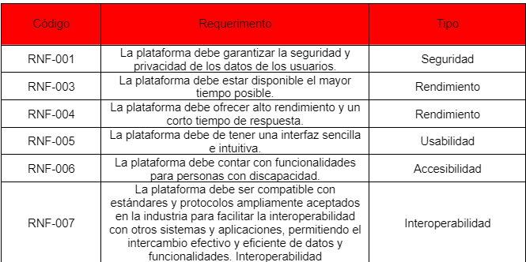

## 3.3. Impact Mapping.

El impact map nos permite analizar los business goal para ciertos User Stories en específico y así formar un Product backlog. De esta manera, vemos cómo podemos solucionar las necesidades de cada usuario con nuestra aplicación.

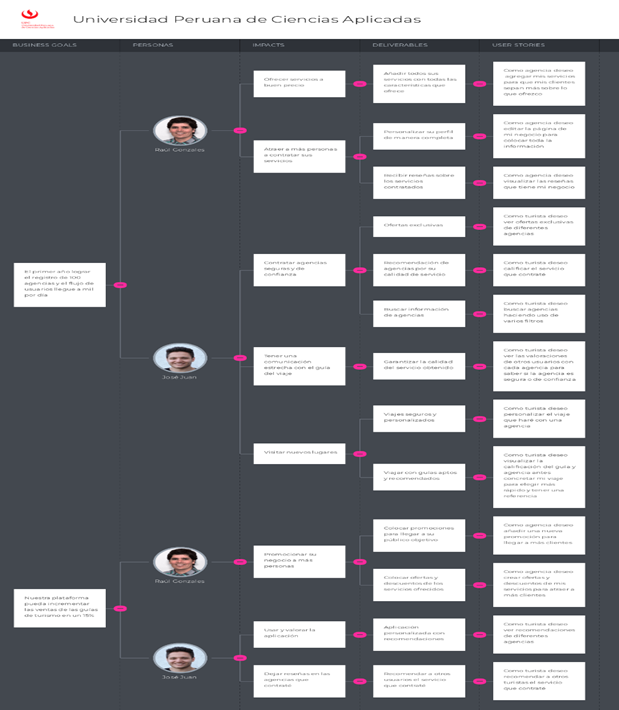

## 3.4. Product Backlog.

### SEGMENTO OBJETIVO – Dueños de Mascotas

| #Orden | Código | Título                                           | Descripción                                                                                                                                                                                  | Story Point (1/2/3/5/8) |
| ------ | ------ | ------------------------------------------------ | -------------------------------------------------------------------------------------------------------------------------------------------------------------------------------------------- | ----------------------- |
| 1      | US-14  | Ver portada                      | Como usuario deseo visualizar una portada en landing page para poder captar mi atención y no me aburra al momento de leer el contenido                           | 3                       |
| 2      | US-15  | Información de la aplicación               | Como usuario deseo ver información acerca de la aplicación para poder saber las funcionalidades que ofrece la aplicación                              | 3                       |
| 3      | US-16  | Motivos por el cual unirnos              | Como usuario deseo ver motivos por el cual unirnos a la aplicación para poder saber los beneficios que ofrece la aplicación                                  | 3                       |
| 4      | US-17  | Redirección a la aplicación                    | Como usuario deseo que haya un call-to-action para poder entrar a la aplicación                                                                   | 3                       |
| 5      | US-18  | Footer de la landing page                 | Como usuario deseo que haya un footer para poder ver las redes sociales y los contactos de la aplicación                                                                           | 3                       |
| 6      | US-19  | About the product                  | Como usuario deseo que haya un video acerca de la aplicación para poder ver las funcionalidades que tiene de una manera más visual.                                                     | 3                       |                       |
| 7      | US-20  | Responsive design               | Como usuario deseo que la aplicación sea responsiva para poder visualizar la landing page desde cualquier dispositivo                                                         | 3                       |
| 8      | US-01  | Añadir servicio | Como agencia deseo agregar mis servicios para que mis clientes sepan más sobre lo que ofrezco.                         | 8                       |
| 9     | US-05  | Crear ofertas                   | Como turista deseo ver ofertas y paquetes recomendados de diferentes agencias para escoger la mejor opción que se acomode a lo que necesito.                                                      | 8                       |
| 10     | US-11  | Monitorear clientes               | Como agencia deseo tener control del estado del servicio ofrecido a mis clientes para indicar cuando un servicio se ha cumplido satisfactoriamente.                                                         | 8                       |
| 11     | US-13  | Ver servicio       | Como turista deseo acceder a los detalles de un servicio ofrecido por una agencia para decidir si adquirirlo o no.                                                  | 5                       |
| 12     | US-06  | Buscar agencias            | Como dueño de una mascota, quiero establecer objetivos de salud para mi mascota, basados en la actividad, el peso y la frecuencia cardíaca, para mejorar y mantener su bienestar.            | 3                       |
| 13     | US-02  | Personalizar viaje            | Como turista deseo personalizar el viaje que haré con una agencia, modificando aspectos del viaje para tener una mejor experiencia.                                                              | 8                       |
| 14     | US-03  | Visualizar reseña                  | Como agencia deseo visualizar las reseñas que tiene mi negocio para saber que puedo mejorar o agregar.                                        | 5                       |
| 15     | US-07  | Ver valoraciones                | Como turista deseo ver las valoraciones de otros usuarios con cada agencia para saber si la agencia es segura o de confianza.| 5                       |
| 16     | US-08  | Editar página de negocio                         | Como agencia deseo editar la página de mi negocio para colocar toda mi información y los medios de contacto.                                     | 3                       |
| 17     | US-05  | Crear ofertas               | Como agencia deseo crear ofertas y descuentos de mis servicios para atraer a más clientes.                                                                        | 3                       |
| 18     | US-11  | Calificar servicio     | Como turista deseo calificar el servicio que contraté para mostrar mi agrado o desagrado y más usuarios sepan sobre el mismo.                                           | 3                       |
| 19     | US-09  | Cambiar plan de suscripción            | Como agencia deseo cambiar mi plan de suscripción para ofrecer más servicios a mis clientes.                                                                            | 8                       |
| 20     | US-10  | Crear promociones             | Como agencia deseo crear campañas de promoción para llegar a más clientes.                                                                          | 5                       |
| 21     | US-21  | Acceso al aplicativo             | Como usuario de “Go2Climb” Quiero poder utilizar la aplicación desde diferentes navegadores Para poder buscar agencias y servicios de alpinismo sin estar limitado a un navegador.                                                                           | 3                       |
| 22     | US-22  | Interfaz interactiva y deductiva            | Como usuario de la plataforma Quiero que la velocidad de carga de la aplicación sea rápida y eficiente, Para poder acceder rápidamente a la información de las agencias y servicios  sin demoras.                                                                         | 3                      |
| 23     | US-23  | Visualización del Historial de Salud             | Como usuario Quiero poder buscar y reservar vuelos y hoteles de manera rápida y sencilla Para que pueda planificar mis viajes sin problemas                                                                            | 3                       |
| 24     | US-24  | Protección de data             | Como usuario Quiero que mi información personal y financiera esté protegida contra el acceso no autorizado o el robo Para que pueda reservar vuelos y hoteles con confianza                                                                            | 5                       |
| 25     | US-25  | Comentarios para las actividades            | Como turista de la plataforma, quiero poder compartir mis comentarios y opiniones sobre las actividades proporcionadas por las empresas, para que otros usuarios puedan tomar decisiones informadas sobre su participación en esas actividades.                                                                            | 5                       |
| 26     | US-26  | Monitorear datos del turista             | Como turista deseo revisar mis datos de actividad (pasos, latidos del corazón, temperatura y ubicación) obtenidos a través de mis botas o reloj durante mi experiencia de alpinismo para poder monitorear mi estado físico y condiciones durante la actividad.                                                                            | 8                       |
| 27     | US-27  | Ver datos de turistas por agencia             | Como agencia de turismo deseo poder acceder a los datos de actividad de los turistas que han utilizado mis servicios, para poder monitorear su progreso y ofrecer recomendaciones de seguridad                                                                           | 8                       |

# Capítulo IV: Solution Software Design
## 4.1. Strategic-Level Domain-Driven Design.
### 4.1.1. Design Purpose.
Para el desarrollo de la aplicación que conectará a alpinistas y personas que practican deportes extremos con agencias que brinden servicios destinados a estas actividades, se busca implementar la arquitectura de microservicios. Esto se debe a que representa una mejor organización de los servicios, facilitando la gestión, el mantenimiento y el desarrollo de las aplicaciones al ser más pequeños y autónomos. Además, permite la resistencia a fallos y la capacidad de escalar la aplicación en función de sus necesidades. Otra parte esencial es la flexibilidad tecnológica que esto representa, ya que cada microservicio puede estar implementado en diversos lenguajes y frameworks

### 4.1.2. Context Mapping.
Esta sección se enfoca en identificar distintos tipos de información clave que guían las decisiones de diseño que son fundamentales para asegurarnos de que la arquitectura del sistema cumpla tanto con los requisitos funcionales como con los de calidad. Aquí explicamos tres tipos principales de inputs que intervienen en el proceso de ADD: los requisitos funcionales, los atributos de calidad y las restricciones de diseño que nos aporta información crucial que moldea la estructura y el comportamiento del sistema.

#### 4.1.2.1. Primary Functionality
Para esta sección utilizaremos los historias de usuario más importantes

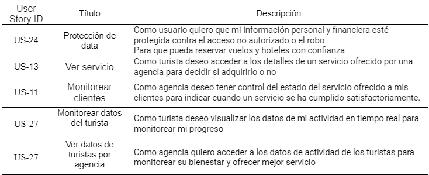 

#### 4.1.2.2. Quality attribute Scenarios
De acuerdo a las user stories seleccionadas, se seleccionaron los atributos de calidad: Seguridad, Disponibilidad, Rendimiento para asegurar que la aplicación cumpla con los estándares de calidad esperados

<table border="1">
  <tr>
    <th>Atributo</th>
    <th>Fuente</th>
    <th>Estimulo</th>
    <th>Artefacto</th>
    <th>Entorno</th>
    <th>Respuesta</th>
    <th>Medida</th>
  </tr>
  <tr>
    <td>Seguridad</td>
    <td>Usuario</td>
    <td>Ingreso de información personal y financiera </td>
    <td>Aplicación web</td>
    <td>Operación normal</td>
    <td>La aplicación debe cifrar la información utilizando estándares de seguridad</td>
    <td>La información personal y financiera es cifrada y transmitida de manera segura, sin ser accesible a terceros no autorizados.</td>
  </tr>
  <tr>
    <td>Disponibilidad</td>
    <td>Turista</td>
    <td>Ingresar al anuncio de un servicio</td>
    <td>Aplicación web</td>
    <td>Conexión estable de internet</td>
    <td>La aplicación debe mostrar los detalles del servicio</td>
    <td>Los detalles del servicio se muestran en menos de 2 segundos, asegurando que la información esté disponible de manera rápida y confiable.</td>
  </tr>
  <tr>
    <td>Rendimiento</td>
    <td>Agencia</td>
    <td>Acceder a l estado de pendiente de un cliente</td>
    <td>Aplicación web</td>
    <td>Operación normal</td>
    <td>La aplicación debe actualizarse y mostrar el estado del servicio en tiempo real</td>
    <td>El estado del servicio se actualiza y se muestra en menos de 1 segundo, permitiendo a la agencia indicar rápidamente cuando un servicio se ha cumplido satisfactoriamente</td>
  </tr>
  <tr>
    <td>Rendimiento</td>
    <td>Turista </td>
    <td>Acceso a la vista perfil o área de monitoreo en la aplicación durante una actividad</td>
    <td>Aplicación web</td>
    <td>Operación normal</td>
    <td>La aplicación muestra los datos de actividad (pasos, latidos del corazón, temperatura y ubicación) en tiempo real de manera clara y comprensible.</td>
    <td>Los datos se actualizan y se muestran en menos de 1 segundo, asegurando una visualización en tiempo real</td>
  </tr>
  <tr>
    <td>Disponibilidad</td>
    <td>Agencia</td>
    <td>Solicitud de acceso a los datos de actividad del turista</td>
    <td>Aplicación web</td>
    <td>Operación normal</td>
    <td>La aplicación proporciona los datos de actividad del turista</td>
    <td>Los datos se proporcionan en menos de 2 segundos, asegurando un acceso rápido y eficiente.</td>
  </tr>
</table>

#### 4.1.2.3. Constraints
<table border="1">
  <tr>
    <th>ID</th>
    <th>Constraints</th>
  </tr>
  <tr>
    <td>CON-01</td>
    <td>Restricciones relacionadas con la disponibilidad y accesos de datos como información de rutas, ubicaciones.</td>
  </tr>
  <tr>
    <td>CON-02</td>
    <td>Limitaciones con la capacidad de escalabilidad de la infraestructura relacionada con el alojamiento de la plataforma.</td>
  </tr>
  <tr>
    <td>CON-03</td>
    <td>Las actividades de alpinismo y montañismo dependen de las condiciones climáticas.</td>
  </tr>
  <tr>
    <td>CON-04</td>
    <td>La plataforma depende de la disponibilidad de las agencias. </td>
  </tr>
  <tr>
    <td>CON-05</td>
    <td>Limitaciones de tiempo del desarrollo de la plataforma.</td>
  </tr>
</table>

### 4.1.3. Architectural Drivers Backlog.

### 4.1.4. Architectural Design Decisions.

### 4.1.5. Quality Attribute Scenario Refinements.

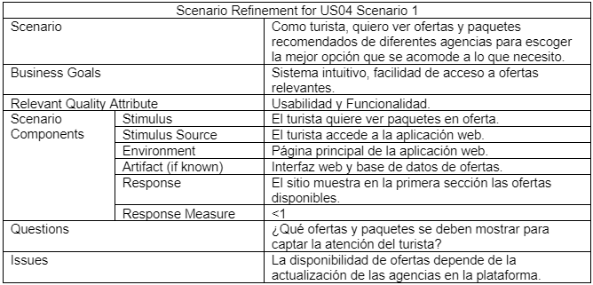 

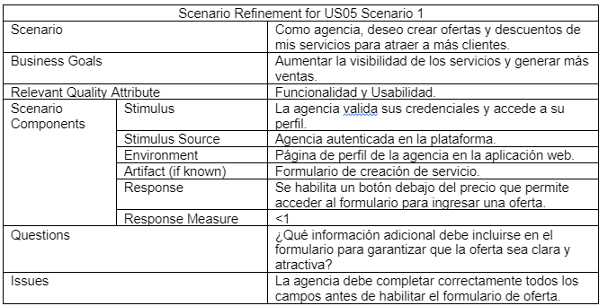 

## 4.2. Tactical-Level Domain-Driven Design

Se aplicó una metodología visual y colaborativa que facilitó la creación de un modelo adecuado para nuestro dominio. A lo largo de este proceso, abordamos las fases de Candidate Context Discovery, Domain Message Flows Modeling y el desarrollo de Bounded Context Canvases.

### 4.2.1. EventStorming

- Unstructured Exploration 
Llevamos a cabo una fase inicial en la que exploramos diversas ideas y conocimientos relacionados con el dominio del negocio. Esto nos permitió establecer las bases necesarias para el modelado en las siguientes fases del proceso.

- Pain Points  
Se identificaron las áreas que representaban desafíos en el flujo de trabajo, permitiendo así enfocarnos en soluciones que optimizaran los procesos y la colaboración efectiva dentro del equipo.

- Timelines 
Desarrollamos varios "timelines" para coordinar y gestionar nuestras actividades clave. Estos nos ayudaron a mantener una visión clara de los hitos importantes y a asegurar que las tareas críticas se alinearan con los plazos establecidos
 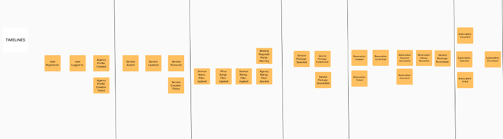
 
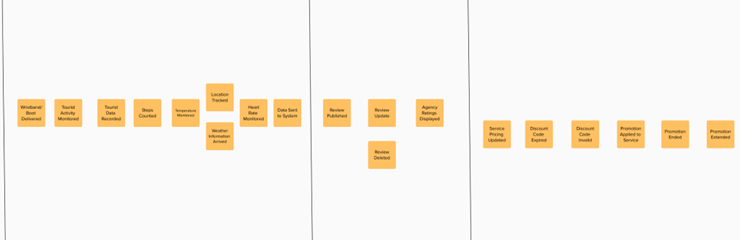

- Pivotal  Points  
Detectamos puntos clave dentro del proyecto que nos permitieron ajustar nuestras decisiones estratégicas en momentos cruciales para garantizar el éxito en la ejecución.

- Commands  
Se identificaron las áreas que representaban desafíos en el flujo de trabajo, permitiendo así enfocarnos en soluciones que optimizaran los procesos y la colaboración efectiva dentro del equipo.
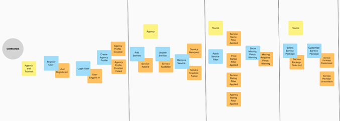

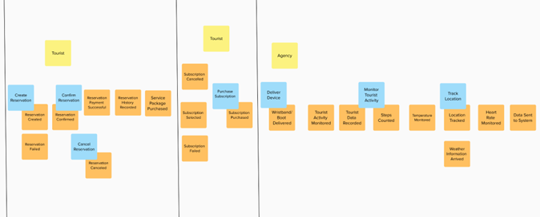

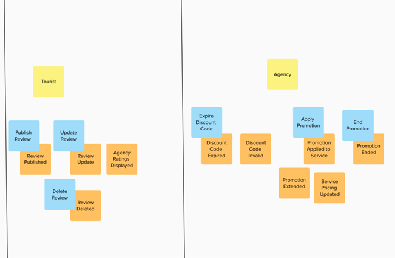

- Policies 
Definimos y aplicamos diversas políticas dentro del sistema que sirvieron como reglas guía para la toma de decisiones y la coherencia en los comportamientos. Estas políticas fueron esenciales para mantener la estabilidad y seguridad en las operaciones.

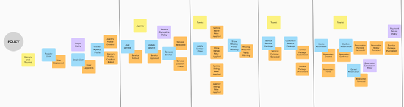

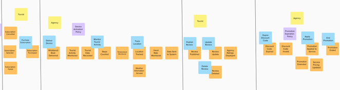

- Read Models 
Definimos y aplicamos diversas políticas dentro del sistema que sirvieron como reglas guía para la toma de decisiones y la coherencia en los comportamientos. Estas políticas fueron esenciales para mantener la estabilidad y seguridad en las operaciones.

- External Systems 
Se identificaron los sistemas externos necesarios para la integración y operación del proyecto, que aportaron fuentes de datos externas o servicios complementarios cruciales para el éxito del sistema

- Aggregates 
Analizamos los elementos y entidades del dominio para identificar aquellos que tienen un significado específico en el contexto, garantizando que las reglas de negocio sean consistentes dentro de estos agregados.

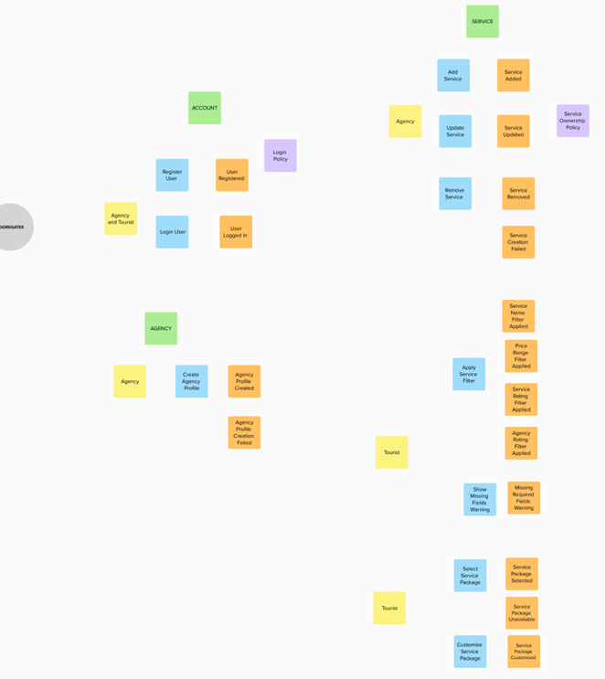

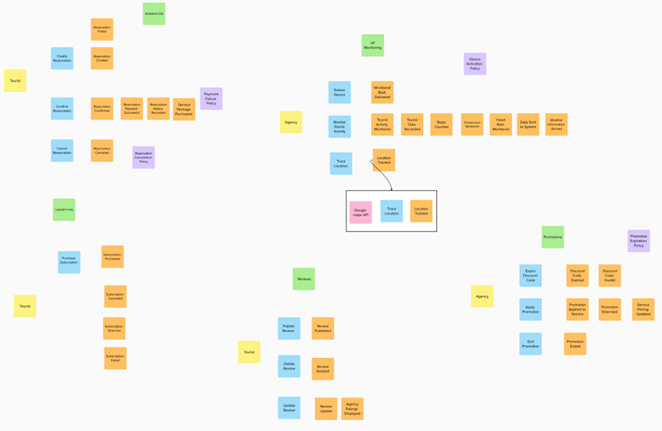

- Bounded Contexts 
Definimos varios "bounded contexts" para delimitar áreas funcionales específicas dentro del sistema, estableciendo fronteras claras entre los diferentes componentes y asegurando una correcta separación de responsabilidades

Enlace: https://app.mural.co/t/psyhelp9597/m/psyhelp9597/1688592463381/cd42d30ff1cc621e5aafb32cc6ec1c2f98d66ff3?sender=uf19e2134468e05a2ff112512 

### 4.2.2. Candidate Context Discovery.

1. Account Context
Este contexto gestiona todo lo relacionado con el registro y la autenticación de los usuarios, ya sean turistas o agencias. Incluye eventos como el registro de nuevos usuarios, el inicio de sesión, y la aplicación de políticas de autenticación.

1. Account Context
Este contexto gestiona todo lo relacionado con el registro y la autenticación de los usuarios, ya sean turistas o agencias. Incluye eventos como el registro de nuevos usuarios, el inicio de sesión, y la aplicación de políticas de autenticación.

2. Agency Context  
Este contexto está enfocado en la creación y gestión de perfiles de agencias. Los eventos relevantes incluyen la creación de perfiles de agencias y el manejo de errores en este proceso. Los elementos clave son: 
- Crear Perfil de Agencia: Proceso de registro de una agencia en el sistema.
- Perfil de Agencia Creado: Confirma la creación exitosa del perfil.
- Fallo en la Creación del Perfil: Maneja errores durante el proceso de registro de la agencia.

3. Service Context
Este es uno de los contextos más importantes, pues gestiona los servicios ofrecidos por las agencias y las acciones relacionadas con estos servicios. Aquí se controlan acciones como la adición, actualización y remoción de servicios, junto con la aplicación de filtros para mejorar la experiencia del usuario:
- Añadir Servicio, Actualizar y Remover Servicio: Gestiona el ciclo de vida de los servicios que las agencias ofrecen.
- Aplicar Filtros de Servicio: Permite a los turistas buscar y filtrar servicios según varios criterios como nombre, precio o calificación.
- Política de Propiedad del Servicio: Define las reglas de propiedad sobre los servicios añadidos. 

4. Reservation Context  
Este contexto cubre la funcionalidad de gestión de reservas, desde la creación de una reserva hasta su confirmación o cancelación. Los eventos incluyen el manejo de pagos y el historial de reservas: 
- Crear, Confirmar y Cancelar Reservas: Procesos de gestión de reservas desde la perspectiva del turista.
- Historial de Reservas y Pagos Exitosos: Rastreo de reservas realizadas y los pagos asociados a las mismas.
- Política de Cancelación de Reservas: Reglas que regulan las cancelaciones de reservas y sus efectos

5. IoT Monitoring Context  
Este contexto está diseñado para manejar la integración de dispositivos IoT que monitorean las actividades de los turistas. Aquí se gestionan eventos como la entrega de dispositivos y el monitoreo de datos en tiempo real:
- Entrega de Dispositivos (Botas, Pulseras): Gestión de los dispositivos que serán usados para monitorear la actividad del turista.
- Monitoreo de Actividades: Seguimiento de la ubicación, pasos, ritmo cardíaco y otros indicadores vitales del turista.
- Política de Activación de Dispositivos: Define las reglas sobre cómo y cuándo se activan los dispositivos IoT. 

6. Subscription Context
Este contexto se enfoca en la gestión de suscripciones dentro del sistema. Los eventos incluyen la compra, renovación y cancelación de suscripciones:
- Compra y Cancelación de Suscripción: Procesos para que los turistas adquieran o cancelen suscripciones a servicios.
- Política de Gestión de Suscripciones: Reglas que guían el comportamiento de las suscripciones. 

7. Review Context
En este contexto se gestiona el sistema de reseñas de los servicios por parte de los turistas. Los eventos clave incluyen la publicación, actualización y eliminación de reseñas: 
- Publicación y Actualización de Reseñas: Permite a los turistas compartir sus experiencias con los servicios ofrecidos.
- Eliminación de Reseñas: Proceso para gestionar la eliminación de reseñas por parte de los usuarios.
- Visualización de Calificaciones de Agencias: Gestión de las calificaciones otorgadas a las agencias por los usuarios

8. Promotions Context
Este contexto está enfocado en la gestión de promociones y descuentos que las agencias ofrecen a los turistas. Los eventos incluyen la aplicación, expiración y finalización de promociones: 
- Aplicar y Expirar Código de Descuento: Gestión de los códigos de descuento aplicados por los turistas.
- Finalización y Extensión de Promociones: Procesos para manejar el ciclo de vida de las promociones ofrecidas por las agencias.
- Política de Expiración de Promociones: Define las reglas que determinan cuándo expiran las promociones.

### 4.2.3. Domain Message Flows Modeling.
- Escenario 1: Registro y autenticación de usuario
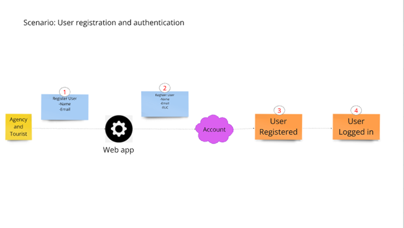

- Escenario 2: Creación de un servicio
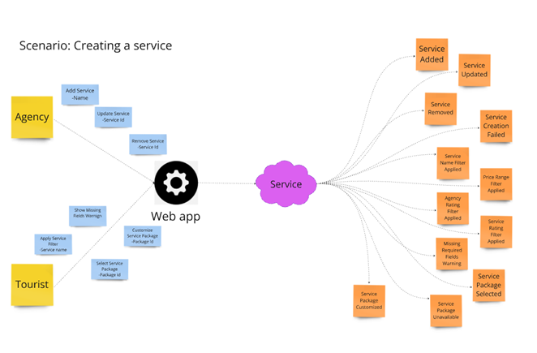

- Escenario 3: Creación y cancelación de una reserva
En este escenario, los turistas utilizan la aplicación web para crear, confirmar o cancelar una reserva. Al solicitar una reserva, el sistema procesa el pago a través de un servicio externo y, tras su confirmación, genera la reserva correspondiente. Si el proceso de creación de la reserva es exitoso o si ocurre algún error, el sistema envía una notificación al turista informándole del estado de su solicitud y actualizando su historial de reservas.
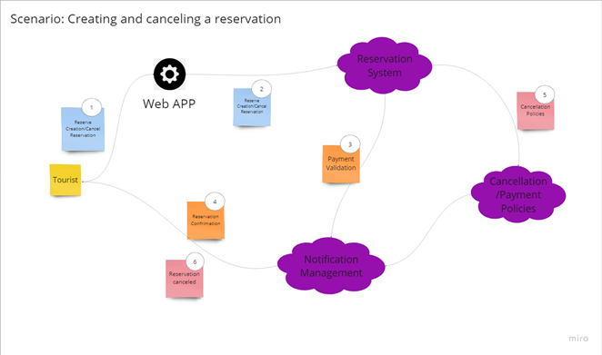

- Escenario 4: Creación de un servicio

- Escenario 5: Creación de un servicio

### 4.2.4. Bounded Context Canvases
- Account Context 
El Bounded Context “Account” gestiona el registro y autenticación de usuarios, asegurando un sistema seguro. Los turistas y agencias autenticados envían solicitudes de registro y login, que el sistema procesa y confirma. Solo los usuarios autenticados pueden acceder a ciertas funcionalidades, siguiendo políticas de seguridad estrictas.

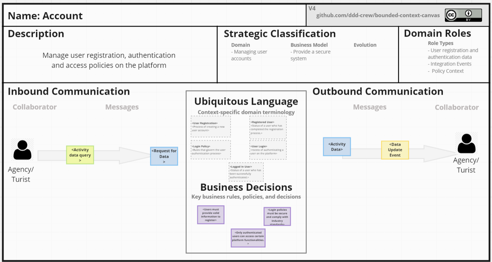
    
- Agency Context 
Este Bounded Context, muestra cómo se comunican los diferentes actores dentro del sistema. Dentro, el turista autenticado en la plataforma envía una solicitud de datos de actividad en tiempo real. Esta solicitud se representa con un ícono de turista y un ícono de solicitud de datos, indicando que el turista está consultando su información de actividad, luego el sistema de servicio procesa esta solicitud y envía los datos de actividad actualizados a la agencia

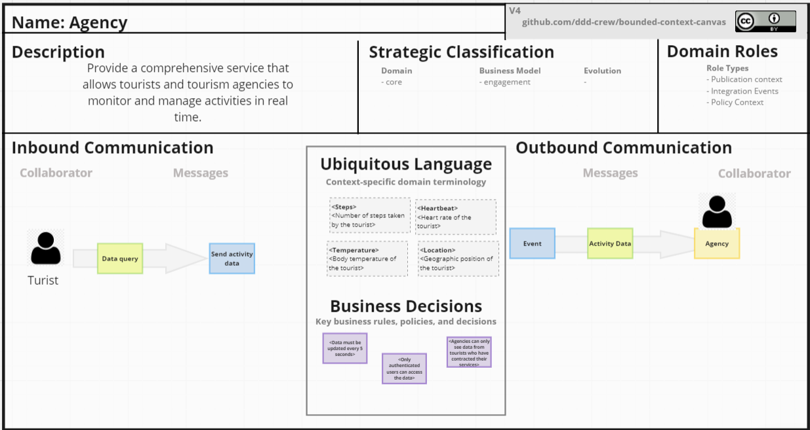
    
- Service Context 
Este Bounded Context muestra cómo interactúan los diferentes actores en la gestión de servicios. Dentro, una agencia autenticada en la plataforma envía una solicitud para añadir, actualizar o remover un servicio. Esta solicitud se representa con un ícono de agencia y un ícono de gestión de servicios, indicando que la agencia está realizando cambios en su catálogo de servicios. Luego, el sistema de servicio procesa la solicitud y actualiza el catálogo, notificando a otros sistemas relevantes sobre los cambios realizados.

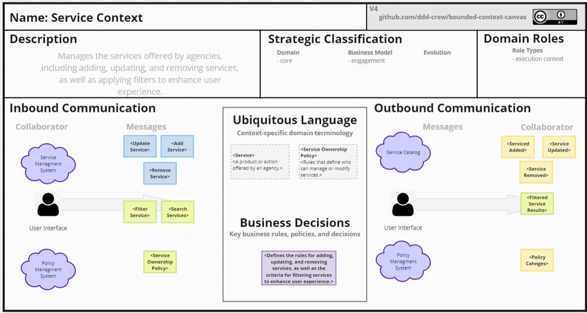
    
- Reservation Context 
Este Bounded Context muestra cómo interactúan los diferentes actores en la gestión de reservas. Dentro, un turista autenticado en la plataforma envía una solicitud para crear, confirmar o cancelar una reserva. Esta solicitud se representa con un ícono de turista y un ícono de gestión de reservas, indicando que el turista está interactuando con el sistema para gestionar su reserva. Luego, el sistema de reservas procesa la solicitud, actualiza el historial de reservas, y envía notificaciones sobre pagos y cambios a otros sistemas relevantes.

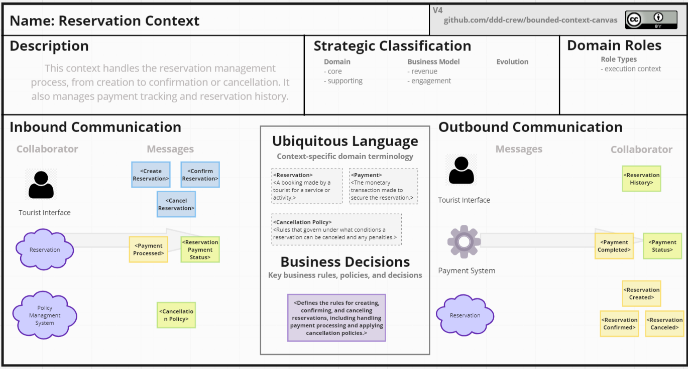
    
- IoT Monitoring Context 
- Subscription Context 
Este Bounded Context muestra cómo interactúan los diferentes actores en la gestión de suscripciones. Dentro, un turista autenticado en la plataforma envía una solicitud para comprar, renovar o cancelar una suscripción. Esta solicitud se representa con un ícono de turista y un ícono de gestión de suscripciones, indicando que el turista está interactuando con el sistema para administrar su suscripción. Luego, el sistema de suscripciones procesa la solicitud, actualiza el historial de suscripciones y notifica a otros sistemas relevantes sobre los cambios realizados.

    
- Review Context
Este contexto se encarga de gestionar las reseñas de los usuarios sobre los paquetes turísticos. Los turistas pueden enviar, editar o eliminar sus reseñas sobre sus experiencias. Estas reseñas son fundamentales para determinar la calificación general de un paquete turístico, influyendo en las decisiones de otros posibles clientes.

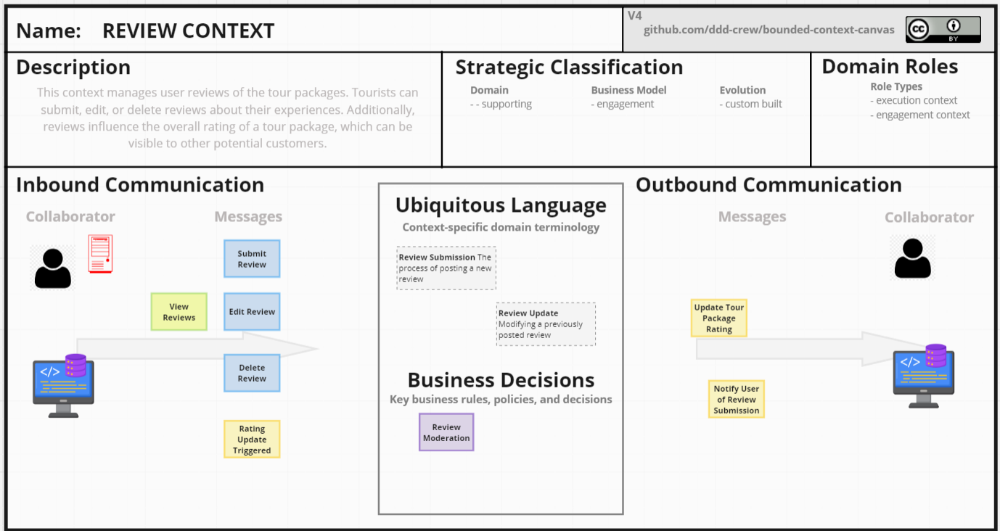
    
- Promotions Context
Este contexto gestiona las promociones y descuentos disponibles para los servicios turísticos ofrecidos en la plataforma. Se encarga de la creación, activación y expiración de promociones, permitiendo que las agencias apliquen códigos de descuento para atraer a más clientes y aumentar el compromiso con los servicios.

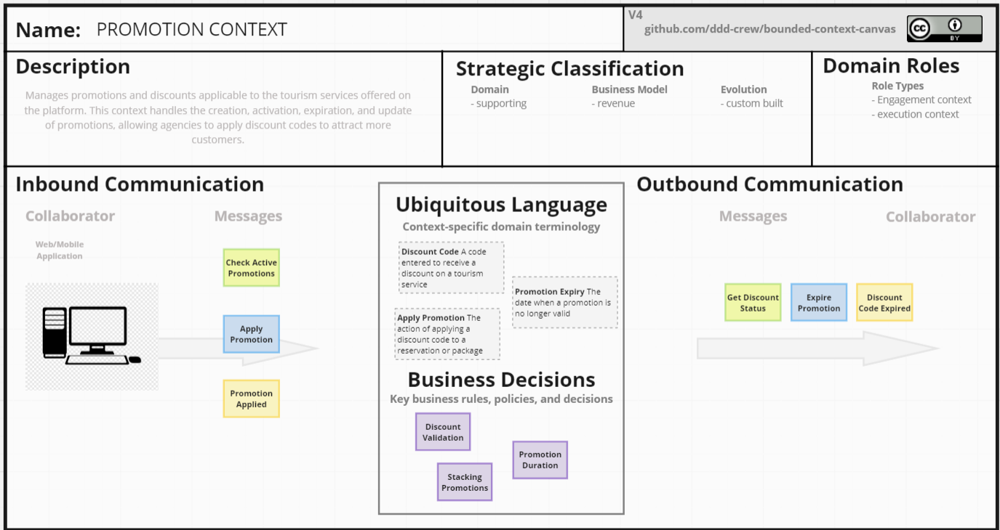
    
### 4.2.5. Context Mapping
Context Mapping es un paso crucial dentro del Domain-Driven Design que se enfoca en entender cómo los diferentes bounded contexts (contextos delimitados) dentro de un sistema interactúan y se conectan entre sí. Este proceso permite identificar las relaciones y dependencias entre los distintos dominios o subdominios que componen el proyecto

## 4.3. Software Architecture

### 4.3.1. Software Architecture System Landscape Diagram. 

### 4.3.2. Software Architecture Context Level Diagrams. 
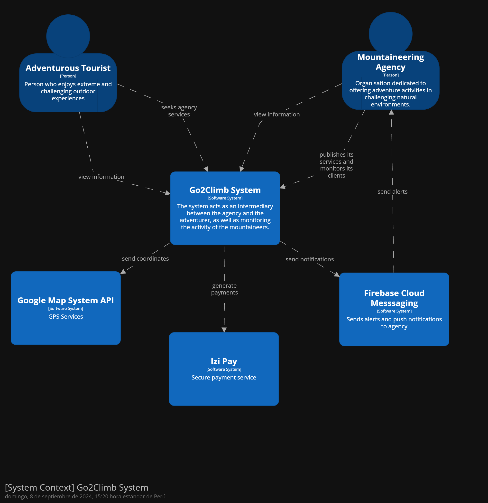

### 4.3.3. Software Architecture Container Level Diagrams. 
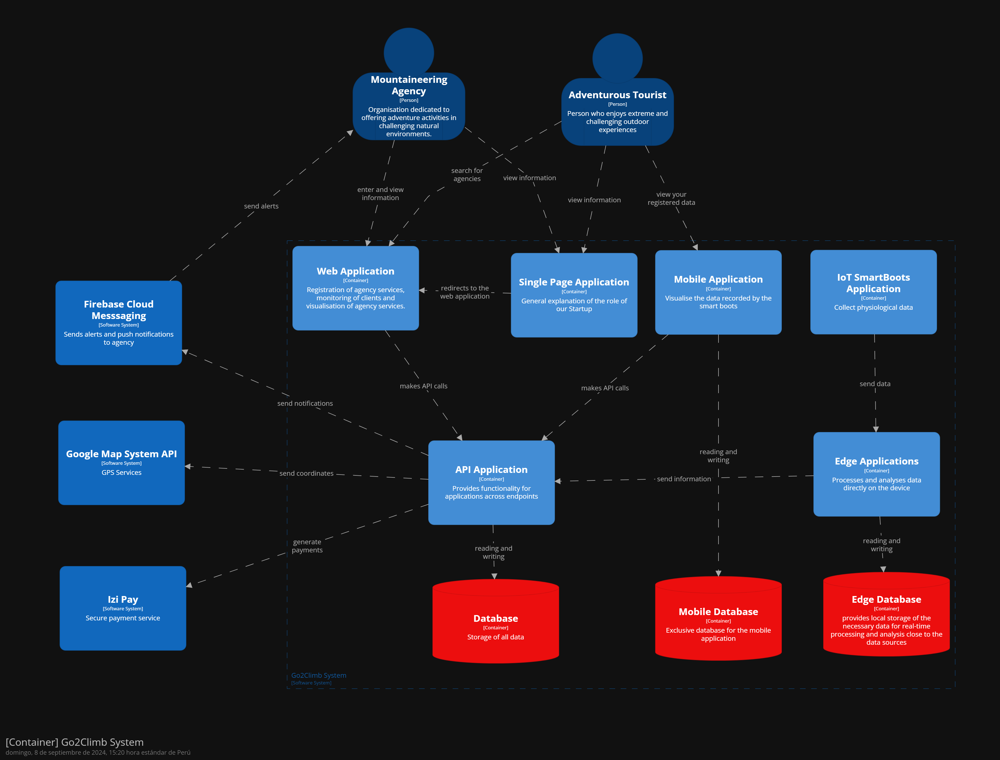

### 4.3.4. Software Architecture Deployment Diagrams 
En el contexto de la aplicación de turismo que integra servicios de montañismo, los contenedores de software están desplegados en la nube de Azure y en dispositivos físicos a través de un sistema IoT (botas y relojes). La arquitectura de despliegue muestra cómo los diferentes componentes interactúan entre sí, destacando las siguientes características:
- Landing Page: Desplegada en la nube de Azure, permite a los usuarios acceder a la aplicación web principal y redirigir hacia ella.
- Aplicación Web y Aplicación Móvil: Desplegadas en Azure Cloud, estas aplicaciones permiten a los usuarios (turistas y agencias) interactuar con los servicios de montañismo, realizar reservas y revisar datos en tiempo real.
- API Application: Desplegada en Azure Cloud, esta aplicación gestiona las interacciones entre la aplicación web/móvil, la base de datos y los dispositivos IoT.
- MySQL Database: La base de datos que almacena información crítica, como detalles de los servicios y los datos de los turistas, también está desplegada en Azure Cloud.
- Sistema IoT: Dispositivos físicos como botas y relojes conectados a la plataforma Azure IoT Cloud, que recopilan datos de los turistas en tiempo real (pasos, latidos del corazón, ubicación, temperatura) y envían esta información a la API para su procesamiento y almacenamiento.
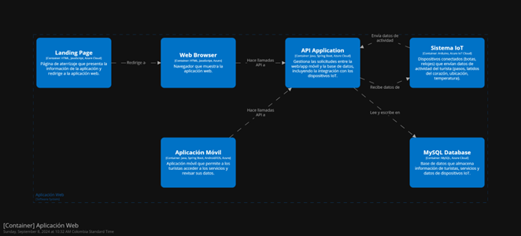

# Capítulo V: Tactital-Level Software Design

## 5.1. Bounded Context Account

### 5.1.1. Domain Layer

- Entidades Principales: Usuario, Rol, Permiso.
- Objetos de Valor: Dirección de Email, Nombre de Usuario.
- Servicios de Dominio: Gestión de Autenticación, Gestión de Roles.
- Repositorios: Repositorio de Usuarios, Repositorio de Roles.

### 5.1.2 Interface Layer

- APIs:
  - POST /usuarios/registro (para registrar nuevos usuarios)
  - POST /usuarios/login (para iniciar sesión)
  - GET /usuarios/{id} (para obtener información del usuario)
- Controladores: UsuarioController (gestiona las operaciones de usuarios).
- Event Handlers: UserCreatedEventHandler (maneja eventos post-creación de usuario).

### 5.1.3 Application Layer

- Servicios de Aplicación:
    - UsuarioService (gestiona la creación, autenticación y actualización de usuarios).
    - SeguridadService (encargado de la seguridad y la encriptación de datos).
- Comandos: CreateUserCommand, UpdateUserCommand.
- Eventos de Dominio: UserCreated, UserUpdated.

### 5.1.4 Infrastructure Layer

- Implementación de Repositorios: UsuarioRepositoryImpl (implementación con acceso a base de datos).
- Integraciones: Servicios de terceros para verificación de email, SMS para autenticación de dos factores.
- Proveedores de Datos: Proveedores para almacenamiento de información de usuario encriptada.

### 5.1.6 Bounded Context Software Architecture Component Level Diagrams

Este diagrama incluiría la conexión entre controladores, servicios de aplicación, y entidades del dominio, así como las interacciones con sistemas externos para autenticación y verificación.

### 5.1.7 Bounded Context Software Architecture Code Level Diagrams
#### 5.1.7.1 Bounded Context Domain Layer Class Diagrams

#### 5.1.7.2 Bounded Context Database Design Diagram

## 5.2 Bounded Context Agency

### 5.2.1 Domain Layer
- Entidades Principales: Agencia, Perfil de Agencia.
- Objetos de Valor: Dirección, Contacto.
- Servicios de Dominio: Gestión de Agencias.
- Repositorios: Repositorio de Agencias.

### 5.2.2 Interface Layer
- APIs:
  - POST /agencias (para crear nuevas agencias)
  - GET /agencias/{id} (para obtener detalles de una agencia)
  - PUT /agencias/{id} (para actualizar una agencia)
- Controladores: AgenciaController (gestiona las operaciones relacionadas con agencias).
- Event Handlers: AgencyProfileUpdatedEventHandler (maneja eventos de actualización de perfiles).

### 5.2.3 Application Layer
- Servicios de Aplicación:
  - AgenciaService (gestiona la creación, actualización y visualización de agencias).
- Comandos: CreateAgencyCommand, UpdateAgencyCommand.
- Eventos de Dominio: AgencyCreated, AgencyUpdated.

### 5.2.4 Infrastructure Layer
- Implementación de Repositorios: AgenciaRepositoryImpl (implementación con acceso a base de datos).
- Integraciones: Servicios de terceros para validación de datos de contacto o ubicación.
- Proveedores de Datos: Proveedores para almacenamiento de información de agencia.

### 5.2.6 Bounded Context Software Architecture Component Level Diagrams

### 5.2.7 Bounded Context Software Architecture Code Level Diagrams
#### 5.2.7.1 Bounded Context Domain Layer Class Diagrams

#### 5.2.7.2 Bounded Context Database Design Diagram

## 5.3 Bounded Context Service
### 5.3.1 Domain Layer
- Entidades Principales: Servicio, Categoría de Servicio.
- Objetos de Valor: Descripción de Servicio, Precio.
- Servicios de Dominio: Gestión de Servicios.
- Repositorios: Repositorio de Servicios.

### 5.3.2 Interface Layer
- POST /servicios (para agregar nuevos servicios)
- GET /servicios/{id} (para obtener detalles de un servicio)
- PUT /servicios/{id} (para actualizar un servicio)
- DELETE /servicios/{id} (para eliminar un servicio)
- Controladores: ServicioController (gestiona las operaciones relacionadas con servicios).
- Event Handlers: ServiceUpdatedEventHandler (maneja eventos de actualización de servicios).

### 5.3.3 Application Layer
- Servicios de Aplicación:
  - ServicioService (gestiona la creación, actualización, eliminación y consulta de servicios).
- Comandos: CreateServiceCommand, UpdateServiceCommand, DeleteServiceCommand.
- Eventos de Dominio: ServiceCreated, ServiceUpdated, ServiceDeleted.

### 5.3.4 Infrastructure Layer
- Implementación de Repositorios: ServicioRepositoryImpl (implementación con acceso a base de datos).
- Integraciones: Integraciones con sistemas de facturación o plataformas de pago para gestionar los precios y transacciones de los servicios.
- Proveedores de Datos: Proveedores para almacenamiento de información de servicio.

### 5.3.6 Bounded Context Software Architecture Component Level Diagrams

### 5.3.7 Bounded Context Software Architecture Code Level Diagrams
#### 5.3.7.1 Bounded Context Domain Layer Class Diagrams

#### 5.3.7.2 Bounded Context Database Design Diagram

## 5.4 Bounded Context Reservation
### 5.4.1 Domain Layer
- Entidades Principales: Reservación, Política de Reservación.
- Objetos de Valor: Fecha de Reservación, Detalles de la Reservación.
- Servicios de Dominio: Gestión de Reservaciones.
- Repositorios: Repositorio de Reservaciones.

### 5.4.2 Interface Layer
- APIs:
  - POST /reservaciones (para crear nuevas reservaciones)
  - GET /reservaciones/{id} (para obtener detalles de una reservación)
  - PUT /reservaciones/{id} (para actualizar una reservación)
  - DELETE /reservaciones/{id} (para cancelar una reservación)
- Controladores: ReservacionController (gestiona las operaciones relacionadas con reservaciones).
- Event Handlers: ReservationUpdatedEventHandler (maneja eventos de actualización de reservaciones).

### 5.4.3 Application Layer
- Servicios de Aplicación:
  - ReservacionService (gestiona la creación, actualización, consulta y cancelación de reservaciones).
- Comandos: CreateReservationCommand, UpdateReservationCommand, DeleteReservationCommand.
- Eventos de Dominio: ReservationCreated, ReservationUpdated, ReservationCancelled

### 5.4.4 Infrastructure Layer
- Implementación de Repositorios: ReservacionRepositoryImpl (implementación con acceso a base de datos).
- Integraciones: Integraciones con sistemas de calendario o plataformas de gestión de eventos para sincronizar reservaciones.
- Proveedores de Datos: Proveedores para almacenamiento de información de reservación

### 5.4.6 Bounded Context Software Architecture Component Level Diagrams

### 5.4.7 Bounded Context Software Architecture Code Level Diagrams
#### 5.4.7.1 Bounded Context Domain Layer Class Diagrams

#### 5.4.7.2 Bounded Context Database Design Diagram

## 5.5 Bounded Context IoT Monitoring
### 5.5.1 Domain Layer
- Entidades Principales: Dispositivo, Evento de Monitoreo.
- Objetos de Valor: Ubicación GPS, Métricas de Sensores (como temperatura, pasos, ritmo cardíaco).
- Servicios de Dominio: Gestión de Dispositivos, Análisis de Datos de Sensores.
- Repositorios: Repositorio de Dispositivos, Repositorio de Eventos de Monitoreo.

### 5.5.2 Interface Layer
- APIs:
  - POST /dispositivos (para registrar nuevos dispositivos IoT)
  - GET /dispositivos/{id} (para obtener datos de un dispositivo)
  - POST /eventos (para registrar eventos de monitoreo)
- Controladores: DispositivoController, EventoMonitoreoController (gestionan las operaciones relacionadas con dispositivos y eventos de monitoreo).
- Event Handlers: DeviceDataReceivedEventHandler (maneja la recepción de datos de dispositivos).

### 5.5.3 Application Layer
- Servicios de Aplicación:
- DispositivoService (gestiona la configuración y el estado de los dispositivos IoT).
- MonitoreoService (analiza los datos recibidos de los dispositivos).
- Comandos: RegisterDeviceCommand, LogEventCommand.
- Eventos de Dominio: DeviceRegistered, MonitoringEventLogged.

### 5.5.4 Infrastructure Layer
- Implementación de Repositorios: DispositivoRepositoryImpl, EventoMonitoreoRepositoryImpl (implementaciones con acceso a base de datos).
- Integraciones: Integraciones con plataformas de IoT para recibir datos de sensores.
- Proveedores de Datos: Almacenes de datos para la persistencia de información de dispositivos y eventos.

### 5.5.6 Bounded Context Software Architecture Component Level Diagrams

### 5.5.7 Bounded Context Software Architecture Code Level Diagrams
#### 5.5.7.1 Bounded Context Domain Layer Class Diagrams

#### 5.5.7.2 Bounded Context Database Design Diagram

## 5.6 Bounded Context Subscription
### 5.6.1 Domain Layer
- Entidades Principales: Suscripción, Plan de Suscripción.
- Objetos de Valor: Fecha de Suscripción, Precio.
- Servicios de Dominio: Gestión de Suscripciones.
- Repositorios: Repositorio de Suscripciones.

### 5.6.2 Interface Layer
- APIs:
  - POST /suscripciones (para crear nuevas suscripciones)
  - GET /suscripciones/{id} (para obtener detalles de una suscripción)
  - PUT /suscripciones/{id} (para actualizar una suscripción)
  - DELETE /suscripciones/{id} (para cancelar una suscripción)
- Controladores: SuscripcionController (gestiona las operaciones relacionadas con suscripciones).
- Event Handlers: SubscriptionUpdatedEventHandler (maneja eventos de actualización de suscripciones).

### 5.6.3 Application Layer
- Servicios de Aplicación:
- SuscripcionService (gestiona la creación, actualización y cancelación de suscripciones).
- PlanService (gestiona la lógica de negocio de los planes de suscripción).
- Comandos: CreateSubscriptionCommand, UpdateSubscriptionCommand, CancelSubscriptionCommand.
- Eventos de Dominio: SubscriptionCreated, SubscriptionUpdated, SubscriptionCancelled

### 5.6.4 Infrastructure Layer
- Implementación de Repositorios: SuscripcionRepositoryImpl, PlanRepositoryImpl (implementaciones con acceso a base de datos).
- Integraciones: Integraciones con plataformas de pago para gestionar pagos recurrentes y renovaciones.
- Proveedores de Datos: Almacenes de datos para la persistencia de información de suscripciones y planes.

### 5.6.6 Bounded Context Software Architecture Component Level Diagrams

### 5.6.7 Bounded Context Software Architecture Code Level Diagrams
#### 5.6.7.1 Bounded Context Domain Layer Class Diagrams

#### 5.6.7.2 Bounded Context Database Design Diagram

# Capitulo VI: Solution UX Design
## 6.1. Style Guidelines
### 6.1.1. General Style Guidelines
### 6.1.2. Web, Mobile & Devices Style Guidelines
## 6.2. Information Architecture
### 6.2.2. Labeling Systems
### 6.2.3. Searching Systems
### 6.2.4. SEO Tags and Meta Tags
### 6.2.5. Navigation Systems
## 6.3. Landing Page UI Design
### 6.3.1. Landing Page Wireframe
- Wireframe Agencia:  

- Wireframe Turista:

### 6.3.2. Landing Page Mock-up
- Mock-up Agencia:  

- Mock-up Turista:

## 6.4. Applications UX/UI Design
### 6.4.1. Applications Wireframes
- Aplicacion web para Agencias
    - Vista Home: Esta la vista al entrar en la aplicacion y es donde se pueden ver todas los servicios que ofrece la agencia.
    
    - Vista Monitoring: En este apartado la agencia puede monitorear la ubicacion de los turistas
    
    - Vista Profile: En esta apartado las agencias pueden ver toda su informacion registrada y tambien pueden editar y guardarla.
    
    - Vista Account: Aqui las agencias pueden editar la informacion de su cuenta, como el correo y la contraseña, además de poder cambiar su foto.
    

- Aplicacion web para Turistas
    - Vista Home: Esta la vista al entrar en la aplicacion y es donde se pueden ver todas los servicios de alpinismo, además de poder buscar mediante filtros.
    
    - Vista Service: En este apartado pueden ver los servicios con mayor detalle, como más fotos, la agencia que lo brinda, su descripcion, 
    
    - Vista Agency: Aqui se puede ver la informacion de las agencias, como ubicacion, RUC, telefono, todos los servicios que ofrecen, su valoracion y comentarios.
    
    - Vista Profile: En esta apartado los turistas pueden ver toda su informacion registrada y tambien pueden editar y guardarla.
    
    - Vista Account: Aqui los turistas pueden editar la informacion de su cuenta, como el correo y la contraseña, además de poder cambiar su foto.
    

-Aplicacion mobil para turistas
    En la aplicacion movil las personas podran sincronizar el modelo de las botas que esten usando con su celular para que puedan ver los datos que estan registrando en tiempo real como la cantidad de pasos, la distancia recorrida y su frecuencia cardiaca. Ademas, podran ver y editar su informacion personal e informacion sobre su cuenta.
      
      

### 6.4.2. Applications Wireflow Diagrams
- Sector Agencia
    - Añadir un nuevo servicio
     
    - Ver y editar un servicio
     
    - Monitorear la ubicacion de los turistas
     
    - Ver y editar información de la agencia
     
    - Ver y editar información de la cuenta
     

- Sector Turista
    - Aplicacion web
     
    - Aplicacion movil
     

# Conclusiones
Outsiders, la Startup encargada de distribuir servicios de turismo a todas las personas del mundo, garantiza a un mejor precio y una experiencia inolvidable, cuenta con un diseño eficiente que permite al sistema de la empresa registrar, guardar y presentar al cliente una mejor visualización de los servicios, a su vez es de fácil interacción para cualquier usuario.
Cabe resaltar que en el desarrollo el proyecto se inició con una idea de negocio y para realizar la implementación se fue presentando previos avances, y para el trabajo final como las entregas realizadas, se pensó que era conveniente revisar y realizar las mejoras continúas, hecho que benefició a gran medida a nuestro servicio, porque es cauteloso, y bien refinado.